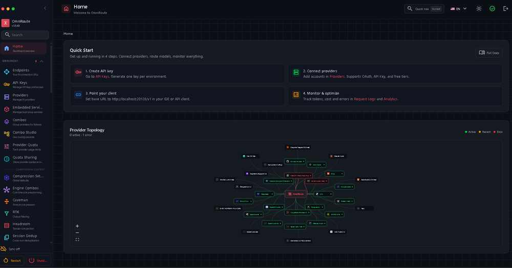
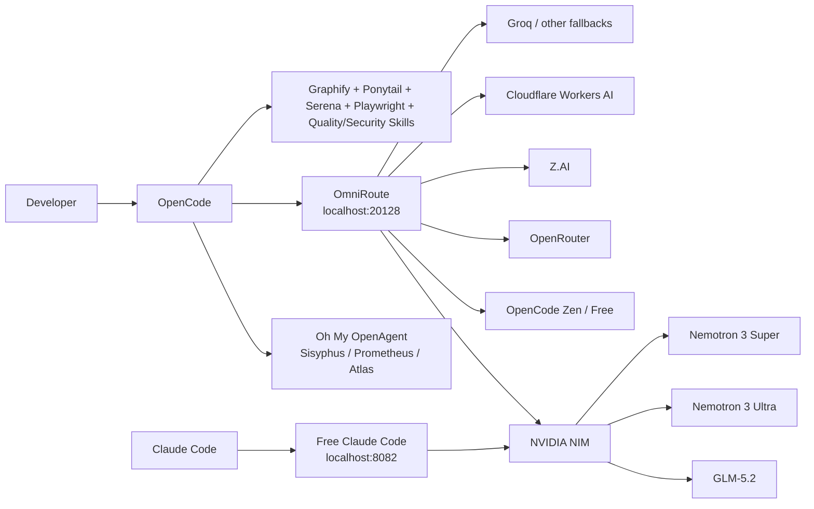
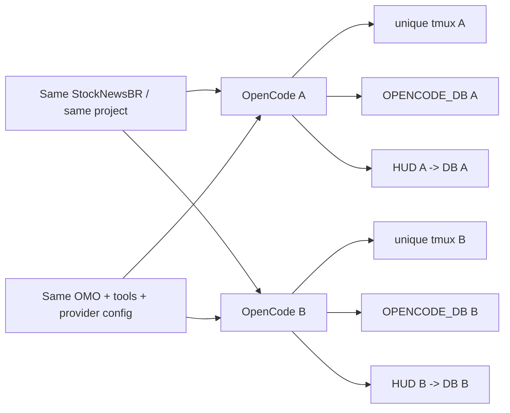
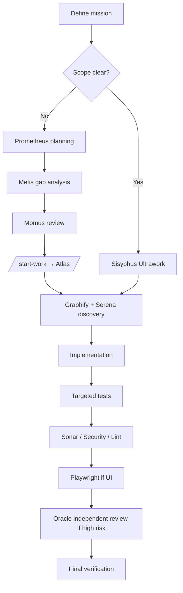

# Stack gratuito de codificación con IA: OpenCode + OmniRoute + NVIDIA NIM

<p align="center">
  <b>🌐 Documentation:</b><br>
  <a href="README.md">🇺🇸 English</a> ·
  <a href="README.pt-BR.md">🇧🇷 Português (Brasil)</a> ·
  🇪🇸 <b>Español</b> ·
  <a href="README.ru.md">🇷🇺 Русский</a>
</p>

> Una configuración práctica y probada en batalla para ejecutar un entorno potente de codificación con IA usando **OpenCode como plataforma principal de codificación**, **OmniRoute como gateway local de IA**, **modelos gratuitos o de nivel gratuito como fallbacks** y **NVIDIA NIM** para modelos pesados como **GLM-5.2** y **Nemotron 3 Ultra**.
>
> Última verificación: **2026-08-12** durante la ventana de lanzamiento de OmniRoute **v3.8.49 → v3.8.50**.



## Por qué existe esta guía

Este repositorio documenta una configuración que requirió mucho ensayo y error, fallas de providers, rutas de modelos obsoletas, problemas de rate limit, errores de configuración y debugging para volverse confiable.

El objetivo es simple: ahorrarle ese dolor a otros desarrolladores.

**¿Quieres el camino más corto? Empieza con [QUICKSTART.md](QUICKSTART.md).**

Esto **no** es un laboratorio de benchmarks que finge que todos los providers son siempre estables. Es una guía de campo reproducible que muestra:

- lo que realmente usamos;
- lo que funcionó de punta a punta;
- lo que solo se configuró pero no se validó como confiable;
- lo que se rompió y cómo lo arreglamos;
- qué modelos valieron la pena para codificación y auditorías;
- cómo construir fallbacks para que la falla de un provider no detenga tu trabajo;
- cómo combinar OpenCode, Oh My OpenAgent, Graphify, Ponytail, Serena, Playwright, SonarQube y skills especializadas sin convertir el entorno en un desastre devorador de contexto.
- cómo eliminamos los terminales OpenCode espejados e hicimos que cada sesión concurrente usara su propia base SQLite y HUD de tokens/contexto manteniendo el mismo proyecto y la configuración de OMO.

## Entorno probado

| Capa | Configuración del laboratorio |
|---|---|
| Host | Windows + WSL/Linux |
| Entorno Linux | WSL basado en Ubuntu |
| Node | 22.22.2 durante la configuración de OmniRoute verificada |
| OmniRoute | Ventana de lanzamiento v3.8.49 → v3.8.50 |
| Dashboard/API de OmniRoute | `127.0.0.1:20128` / `/v1` |
| Cliente de codificación principal | OpenCode |
| Orquestación | Oh My OpenAgent / Sisyphus Ultraworker |
| Compatibilidad opcional con Claude | Free Claude Code en `127.0.0.1:8082` |

La arquitectura **no** requiere una GPU NVIDIA local. NVIDIA NIM en esta guía es un provider de API alojado; tu hardware local afecta principalmente tus cargas de trabajo de editor/build/test, no la inferencia alojada por NVIDIA.

---

## La stack



### Dos caminos útiles

**Camino principal con OpenCode**

```text
OpenCode → OmniRoute → provider/model → automatic fallback → keep coding
```

**Camino de compatibilidad con Claude Code**

```text
Claude Code → Free Claude Code (FCC) → NVIDIA NIM → GLM-5.2 / Nemotron
```

---

## El resultado de mayor valor: GLM-5.2 a través de NVIDIA NIM

GLM-5.2 se convirtió en uno de los modelos más valiosos de esta configuración para codificación de larga duración, arquitectura, trabajo agéntico y razonamiento difícil.

NVIDIA expone actualmente `z-ai/glm-5.2` a través de un endpoint NIM gratuito. NVIDIA lo lista como un modelo insignia de contexto de 1M para codificación, razonamiento, uso de herramientas y flujos de trabajo agénticos.

**Nuestra calificación práctica de codificación:** ★★★★★

Por qué se ganó esa calificación en esta stack:

- excelente comportamiento en tareas de horizonte largo;
- fuerte razonamiento sobre la base de código;
- buen ajuste para orquestación al estilo Sisyphus;
- muy útil para auditorías y arquitectura;
- gran ventana de contexto;
- disponible a través del endpoint compatible con OpenAI de NVIDIA;
- también puede ubicarse detrás de FCC, para que Claude Code lo use sin quedar bloqueado a los modelos de Anthropic.


---

# 1. Lo que realmente validamos

Las calificaciones a continuación son **calificaciones prácticas de campo**, no puntajes científicos de benchmarks. Describen la utilidad en flujos de trabajo de agentes de codificación: exploración de repositorios, implementación, debugging, refactorización, auditorías, pruebas y tareas de larga duración.

## Tarjeta de puntuación de modelos validados en laboratorio

| Modelo / ruta | Ruta del provider | Codificación | Razonamiento / auditoría | Velocidad | Mejor uso | Estado en laboratorio |
|---|---|---:|---:|---:|---|---|
| **GLM-5.2** (`z-ai/glm-5.2`) | NVIDIA NIM | ★★★★★ | ★★★★★ | ★★★☆☆ | Implementaciones grandes, arquitectura, auditorías largas, tareas agénticas difíciles | ✅ De punta a punta |
| **Nemotron 3 Ultra 550B A55B** | NVIDIA NIM | ★★★★☆ | ★★★★★ | ★★★☆☆ | Auditoría profunda, arquitectura, investigación de contexto largo | ✅ De punta a punta |
| **Nemotron 3 Super 120B A12B** | NVIDIA NIM | ★★★★☆ | ★★★★☆ | ★★★★☆ | Fallback general fuerte, codificación, revisiones | ✅ De punta a punta |
| **DeepSeek V4 Flash Free** | OpenCode Zen / OmniRoute | ★★★★☆ | ★★★★☆ | ★★★★★ | Implementación rápida, correcciones, codificación diaria | ✅ De punta a punta; la cuota puede fluctuar |
| **Nemotron 3 Ultra Free** | OpenCode Zen / OmniRoute | ★★★★☆ | ★★★★★ | ★★★☆☆ | Auditorías, investigación, trabajo con mucho razonamiento | ✅ De punta a punta |
| **Ruta gratuita de Nemotron 3 Ultra** | OpenRouter → OmniRoute | ★★★★☆ | ★★★★★ | ★★★☆☆ | Redundancia de provider para razonamiento pesado | ✅ De punta a punta |
| **`auto/best-coding`** | Combo OmniRoute | depende del modelo seleccionado | depende | depende | Fallback automático cuando no quieres elegir manualmente | ✅ De punta a punta |
| **`auto/coding:free`** | Combo OmniRoute | depende del modelo seleccionado | depende | depende | Fallback automático de codificación orientado a $0 | ✅ De punta a punta |

### Importante: no copies rutas antiguas de DeepSeek a ciegas

Durante nuestras pruebas de agosto de 2026, la **ruta NVIDIA DeepSeek V4 Pro devolvió una falla tipo EOL/410**. Una captura de pantalla más antigua de esta guía todavía la muestra en un override de FCC porque esa captura registró el entorno antes de la limpieza.

**No uses esa captura como la configuración actual recomendada.** Prefiere GLM-5.2 o Nemotron 3 Super/Ultra para la ruta NVIDIA.

---

# 2. Catálogo gratuito de OpenCode

La documentación actual de Zen de OpenCode lista los siguientes modelos gratuitos. La disponibilidad se describe explícitamente como por tiempo limitado para varios de ellos, así que siempre ejecuta `/models` en lugar de asumir que esta lista permanecerá sin cambios.


> **Nota sobre la captura:** la imagen del selector es una captura histórica de nuestro laboratorio e incluye modelos que desde entonces han rotado. La tabla siguiente sigue la documentación oficial actual de Zen verificada el 2026-08-12.

| Modelo gratuito de OpenCode | Listado oficial actual en Zen | Ejercitado personalmente en esta stack | Recomendación de codificación |
|---|---:|---:|---|
| DeepSeek V4 Flash Free | ✅ | ✅ | ★★★★☆ — excelente predeterminado rápido |
| MiMo-V2.5 Free | ✅ | Ruta de reserva | Modelo secundario útil de codificación |
| North Mini Code Free | ✅ | Ruta de reserva | Fallback ligero de codificación; verifica antes de trabajo crítico |
| Nemotron 3 Ultra Free | ✅ | ✅ | ★★★★☆ codificación / ★★★★★ auditoría |
| Big Pickle | ✅ | No calificado | Modelo sigiloso: no finjas saber qué es |

> **Regla:** trata un modelo como "funcionando" solo después de que una solicitud real de completion tenga éxito. Que un modelo aparezca en `/models` solo prueba el descubrimiento, no la inferencia exitosa.

> **Nota de privacidad:** varios modelos gratuitos de OpenCode son endpoints de evaluación explícitamente por tiempo limitado, y la documentación actual de Zen de OpenCode dice que los datos de algunos endpoints gratuitos pueden usarse para mejorar modelos/servicios. Los endpoints gratuitos de NVIDIA son servicios de prueba. No envíes datos personales, confidenciales, secretos de producción o datos regulados solo porque un endpoint es gratuito.

---

# 3. Matriz de validación de providers

Esta tabla separa **configurado** de **confiable de punta a punta**. Esa distinción importa.

| Provider | Configurado en nuestro entorno | Confiable de punta a punta | Confiabilidad/valor en laboratorio | Rol gratuito / nivel gratuito | Notas |
|---|---:|---:|---:|---|---|
| **NVIDIA NIM** | ✅ | ✅ | ★★★★★ | Endpoint gratuito pesado central | GLM-5.2, Nemotron Ultra/Super |
| **OpenCode Zen / Free** | ✅ | ✅ | ★★★★★ | Fallback gratuito central de codificación | DeepSeek V4 Flash Free + Nemotron Free |
| **OpenRouter** | ✅ | ✅ | ★★★★☆ | Rutas gratuitas redundantes | Camino Nemotron secundario útil |
| **Z.AI** | ✅ | ✅ para pruebas de fallback | ★★★★☆ | Camino alternativo de GLM | Mantener separado de la ruta NVIDIA |
| **Cloudflare Workers AI** | ✅ después del arreglo | ✅ con Account ID correcto | ★★★★☆ después del arreglo | Pool secundario de nivel gratuito | El `accountId` incorrecto/ausente causó fallas 404/502 |
| **Groq** | ✅ | Configurado, no primario | No calificado a fondo | Provider utilitario rápido | Útil pero no central en esta guía |
| **Fireworks** | ✅ | Configurado, no primario | No calificado a fondo | Opcional | No lo llames gratuito a menos que tu cuenta realmente tenga cuota gratuita |
| **Mistral** | ✅ | Configurado, no primario | No calificado a fondo | Opcional | Misma regla: verifica tu plan actual |
| **DeepSeek directo** | ✅ en la captura de FCC | No es nuestra ruta gratuita preferida | No calificado | Opcional | Prefiere OpenCode Free para V4 Flash en este build |
| OpenCode Go | ✅ | ✅ | ★★★★★ en valor, pero de pago | **De pago**, no forma parte del núcleo gratuito | Mejora opcional de bajo costo |
| Gemini | ❌ en la configuración FCC capturada | — | — | — | Clave faltante en la captura |
| Cerebras | ❌ en la configuración FCC capturada | — | — | — | No forma parte de este build validado |
| Kimi directo | ❌ en la configuración FCC capturada | — | — | — | No forma parte de este build validado |
| LM Studio | Offline | — | — | Local | Inferencia local opcional |
| Ollama | Offline | — | — | Local | Inferencia local opcional |
| llama.cpp | Offline | — | — | Local | Inferencia local opcional |


## Rutas adicionales de nivel gratuito que ejercitamos con éxito

Estas fueron rutas secundarias útiles después de corregir la configuración específica de cada provider. No las clasificamos tan alto como la tabla principal porque recibieron menos trabajo sostenido de repositorio en este laboratorio.

| Modelo / ruta | Provider | Codificación | Rol práctico | Estado en laboratorio |
|---|---|---:|---|---|
| **GLM-4.7 Flash** | Cloudflare Workers AI | ★★★★☆ | Codificación utilitaria / respaldo rápido | ✅ Completion probado tras el arreglo del Account ID |
| **Qwen2.5-Coder-32B-Instruct** | Cloudflare Workers AI | ★★★★☆ | Fallback de codificación | ✅ Completion probado tras el arreglo del Account ID |
| **GPT-OSS-120B** | Cloudflare Workers AI | ★★★★☆ | Razonamiento general / fallback de codificación | ✅ Completion probado tras el arreglo del Account ID |
| **Nemotron 3 120B A12B** | Cloudflare Workers AI | ★★★★☆ | Ruta secundaria de la familia NVIDIA | ✅ Completion probado tras el arreglo del Account ID |

El catálogo y las cuotas del nivel gratuito de Cloudflare pueden cambiar. Trata estas rutas como **rutas de laboratorio conocidas y buenas desde el 2026-08-12**, no como una promesa de disponibilidad gratuita permanente.

---

# 4. Instalar OmniRoute

OmniRoute es el gateway. Le da al resto de la stack un endpoint estable compatible con OpenAI y maneja el enrutamiento de modelos/providers, fallbacks, cuotas, compresión y monitoreo.

Proyecto oficial: [diegosouzapw/OmniRoute](https://github.com/diegosouzapw/OmniRoute)


## Requisitos

Usa una versión de Node.js compatible con la release de OmniRoute que instales. Para la línea de releases v3.8.50, las notas upstream de solución de problemas aceptan explícitamente Node `>=22.22.2 <23` (junto con los rangos compatibles de Node 20/24). Nuestra configuración WSL probada usó Node 22.22.2.

Verifica:

```bash
node --version
npm --version
```

## Instalación

```bash
npm install -g omniroute
omniroute
```

O con pnpm:

```bash
pnpm add -g omniroute@latest --allow-build=better-sqlite3 --allow-build=@swc/core
omniroute
```

Dashboard:

```text
http://localhost:20128
```

API compatible con OpenAI:

```text
http://localhost:20128/v1
```

## Primeros health checks

```bash
curl -I http://127.0.0.1:20128
ss -ltnp | grep ':20128'
omniroute doctor
```

Si creaste una clave de API de cliente de OmniRoute:

```bash
curl http://127.0.0.1:20128/v1/models \
  -H "Authorization: Bearer $OMNIROUTE_API_KEY"
```

Consulta [docs/02-omniroute.md](docs/02-omniroute.md) para la configuración completa y las instrucciones de systemd.

---

# 5. Configurar NVIDIA NIM

URL base oficial del endpoint de NVIDIA:

```text
https://integrate.api.nvidia.com/v1
```

Crea una clave desde NVIDIA Build y expórtala localmente:

```bash
export NVIDIA_API_KEY="YOUR_NVIDIA_KEY"
```

Nunca hagas commit de este valor.

## Smoke-test de GLM-5.2 directamente

```bash
curl https://integrate.api.nvidia.com/v1/chat/completions \
  -H "Authorization: Bearer $NVIDIA_API_KEY" \
  -H "Content-Type: application/json" \
  -d '{
    "model": "z-ai/glm-5.2",
    "messages": [{"role":"user","content":"Reply with exactly: GLM52_OK"}],
    "max_tokens": 32
  }'
```

## Smoke-test de Nemotron Ultra

```bash
curl https://integrate.api.nvidia.com/v1/chat/completions \
  -H "Authorization: Bearer $NVIDIA_API_KEY" \
  -H "Content-Type: application/json" \
  -d '{
    "model": "nvidia/nemotron-3-ultra-550b-a55b",
    "messages": [{"role":"user","content":"Reply with exactly: NEMOTRON_OK"}],
    "max_tokens": 32
  }'
```

Si las llamadas directas a NVIDIA funcionan pero las llamadas a través de OmniRoute fallan, el problema está en la capa de gateway/provider — no en tu cuenta de NVIDIA.

Para re-verificar los tres modelos NVIDIA recomendados e imprimir una tabla Markdown PASS/FAIL:

```bash
./scripts/validate-nvidia-models.sh
```

Consulta [docs/03-nvidia-nim.md](docs/03-nvidia-nim.md).

---

# 6. Construir el combo de fallback de codificación de OmniRoute

La idea principal es **redundancia de provider**. No apuestes una sesión larga de codificación a una sola ruta.

Un diseño de prioridad útil es:

```text
1. NVIDIA → GLM-5.2
2. OpenRouter → Nemotron 3 Ultra free
3. OpenCode Free → DeepSeek V4 Flash Free
4. OpenCode Zen alternate DeepSeek route
5. NVIDIA → Nemotron 3 Super
6. auto/coding:free
7. auto/best-coding
```

Por qué este orden funciona bien:

- GLM-5.2 maneja el trabajo difícil;
- Nemotron Ultra es un excelente fallback de auditoría/razonamiento;
- DeepSeek V4 Flash mantiene rápida la codificación diaria;
- Nemotron Super es un fallback NVIDIA equilibrado;
- las rutas automáticas de OmniRoute son la red de seguridad final.

**No** reutilices IDs de provider/modelo de otra máquina a ciegas. Usa los IDs de modelo devueltos por tu propio:

```bash
curl http://127.0.0.1:20128/v1/models \
  -H "Authorization: Bearer $OMNIROUTE_API_KEY"
```

Los prefijos de provider pueden diferir entre OmniRoute, FCC y las APIs directas de provider.

Puedes validar cualquier ruta candidata con completions reales e imprimir una tabla Markdown:

```bash
./scripts/validate-omniroute-models.sh \
  auto/coding:free \
  auto/best-coding \
  YOUR_OTHER_ROUTE_ID
```

Esta es la forma más segura de mantener honesta la tabla de "funcionando" del README después de actualizaciones de provider.

---

# 7. Usar OpenCode como plataforma principal de codificación


Instala OpenCode:

```bash
curl -fsSL https://opencode.ai/install | bash
```

Para Windows, esta guía usa **WSL** porque es el entorno que realmente probamos de punta a punta. Windows nativo puede funcionar, pero los comandos y la gestión de servicios a continuación asumen Linux/WSL.

## Conectar OpenCode directamente a OmniRoute

OpenCode admite providers personalizados compatibles con OpenAI.

Crea o fusiona esto en `~/.config/opencode/opencode.json`:

```json
{
  "$schema": "https://opencode.ai/config.json",
  "provider": {
    "omniroute": {
      "npm": "@ai-sdk/openai-compatible",
      "name": "OmniRoute",
      "options": {
        "baseURL": "http://127.0.0.1:20128/v1",
        "apiKey": "{env:OMNIROUTE_API_KEY}"
      },
      "models": {
        "auto/best-coding": {
          "name": "OmniRoute Best Coding"
        },
        "auto/coding:free": {
          "name": "OmniRoute Free Coding"
        }
      }
    }
  }
}
```

Luego:

```bash
export OMNIROUTE_API_KEY="YOUR_OMNIROUTE_CLIENT_KEY"
opencode
```

Dentro de OpenCode:

```text
/models
```

### Configurar OpenCode Free / Zen directamente

Mantén una ruta directa de OpenCode Free incluso si OmniRoute es tu gateway principal. Te da una ruta de emergencia útil cuando se está reparando una configuración de gateway/provider.

```text
/connect
```

Selecciona **OpenCode Zen**, completa el flujo de cuenta/clave de API y luego:

```text
/models
```

Elige un modelo marcado como **Free** y envía un completion minúsculo real. En este build, **DeepSeek V4 Flash Free** fue nuestra elección rápida de codificación y **Nemotron 3 Ultra Free** fue la elección más fuerte de auditoría/razonamiento. El catálogo gratuito es volátil, así que usa el selector actual en lugar de una captura antigua.

Si prefieres no mantener la clave de cliente de OmniRoute en una variable de entorno, usa el flujo `/connect` de OpenCode y asegúrate de que el ID del provider personalizado coincida con `omniroute`.

### Por qué OpenCode es el front end aquí

OpenCode nos dio:

- una UX de codificación limpia y nativa de terminal;
- providers personalizados compatibles con OpenAI;
- plugins;
- soporte de MCP;
- cambio de modelos;
- agentes;
- integración fácil con Oh My OpenAgent;
- la capacidad de mantener OmniRoute detrás de un único endpoint local.

Consulta [docs/04-opencode.md](docs/04-opencode.md).

---

# 8. Añadir Oh My OpenAgent y Sisyphus Ultraworker


Oh My OpenAgent convierte a OpenCode de una herramienta de codificación de agente único en un entorno de orquestación multiagente.

Instala:

```bash
bunx oh-my-openagent install
```

**Deja que el instalador registre el plugin de OpenCode por ti.** El proyecto está en una transición de renombrado/compatibilidad: la configuración actual de OpenCode prefiere la entrada de plugin `oh-my-openagent`, mientras que las entradas antiguas `oh-my-opencode` todavía pueden aparecer. No pegues a ciegas un nombre de plugin obsoleto de un dotfile antiguo; ejecuta el instalador y luego verifica con:

```bash
bunx oh-my-openagent doctor --verbose
```

Luego inicia OpenCode y usa:

```text
ultrawork
```

o:

```text
ulw
```

## Los agentes que importan

| Agente | Rol | Cuándo usarlo | Por qué importa |
|---|---|---|---|
| **Sisyphus — Ultraworker** | Orquestador principal | Misiones bien definidas, auditorías, correcciones, implementación | Planifica/delega/ejecuta y sigue avanzando hasta la finalización |
| **Hephaestus** | Worker profundo autónomo | Tareas orientadas a objetivos que necesitan investigación + ejecución de punta a punta | Bueno cuando quieres que un worker sea dueño de la tarea en lugar de seguir una receta |
| **Prometheus — Plan Builder** | Planificador estratégico | Trabajo grande, ambiguo o crítico | Entrevista para obtener requisitos y aclara el alcance antes de los cambios de código |
| **Atlas — Plan Executor** | Ejecuta planes de Prometheus | Planes grandes aprobados | Ejecuta `/start-work`, trabaja las tareas planificadas sistemáticamente |
| **Oracle** | Consultor read-only de alto QI | Arquitectura, seguridad, debugging difícil | Segunda opinión independiente sin tocar el código |
| **Explore** | Exploración rápida de repositorios | Encontrar símbolos, patrones, llamadores | Ahorra tokens frente a leer todo |
| **Librarian** | Investigación de docs externos / OSS | APIs, comportamiento de frameworks, ejemplos de implementación | Fundamenta los cambios en documentación actual y evidencia externa |
| **Metis** | Consultor de planes / analizador de brechas | Antes de finalizar planes complejos | Encuentra requisitos faltantes, suposiciones y casos límite |
| **Momus** | Crítico de planes / revisor | Validación de planes y resultados | Exige criterios de éxito explícitos y evidencia |
| **Multimodal Looker** | Especialista visual | Capturas de pantalla, diagramas, artefactos de UI | Añade comprensión de imágenes/PDF al trabajo de ingeniería |
| **Sisyphus-Junior** | Ejecutor de categoría delegada | Subtareas pequeñas y acotadas generadas por la orquestación | Ejecuta una asignación enfocada sin bucles recursivos de delegación |

Oh My OpenAgent actual también inyecta MCPs/herramientas de runtime útiles como búsqueda web, consulta de documentación, búsqueda de código público, herramientas LSP y un grafo de código local. Estos MCPs inyectados por plugin pueden **no** aparecer en el `mcp list` estático de OpenCode; usa el comando doctor de OmO para verificar qué está realmente activo.

### Un mapeo práctico de agentes de la stack gratuita

La configuración actual de OmO admite overrides de modelo por agente en `~/.omo/omo.jsonc`. Un punto de partida útil para esta arquitectura es:

```jsonc
{
  "agents": {
    "sisyphus": {
      "model": "omniroute/auto/best-coding",
      "fallback_models": [
        "opencode/nemotron-3-ultra-free",
        "opencode/deepseek-v4-flash-free"
      ]
    },
    "oracle": {
      "model": "opencode/nemotron-3-ultra-free"
    },
    "explore": {
      "model": "opencode/deepseek-v4-flash-free"
    },
    "librarian": {
      "model": "opencode/deepseek-v4-flash-free"
    }
  }
}
```

Esto funciona mejor cuando tu combo `auto/best-coding` de OmniRoute pone **NVIDIA GLM-5.2 primero**. Entonces Sisyphus recibe la ruta pesada para el trabajo difícil, mientras Explore/Librarian usan modelos gratuitos más rápidos y Oracle recibe un modelo gratuito orientado al razonamiento.

**No copies IDs de modelo a ciegas.** Primero confirma los IDs exactos de provider/modelo que muestra `/models` de OpenCode en tu máquina. El [`examples/omo.free-stack.example.jsonc`](examples/omo.free-stack.example.jsonc) incluido es una plantilla, no una configuración universal.

### Nuestra regla operativa

```text
Clear task → Sisyphus
Large/ambiguous task → Prometheus → /start-work → Atlas
Hard architecture/debugging → Oracle
Repository discovery → Explore + Graphify + Serena
```

### Por qué esto importó en auditorías reales

La mayor mejora no fue que un modelo se volviera perfecto de repente. Fue la **división del trabajo**:

- la exploración podía ejecutarse separada de la implementación;
- un consultor de arquitectura podía permanecer read-only;
- el planificador podía forzar claridad de alcance;
- la ejecución podía ocurrir después de revisar un plan;
- la revisión y las pruebas independientes podían ocurrir después de la implementación;
- los fallbacks de provider mantenían vivo el flujo de trabajo cuando un modelo alcanzaba la cuota o fallaba.

Esa combinación mejoró materialmente las auditorías largas de repositorios porque redujo el modo clásico de falla en el que un contexto gigante de agente intenta buscar, razonar, editar, probar y recordar todo por sí mismo.

Consulta [docs/05-omo-agents.md](docs/05-omo-agents.md).

---

# 9. Añadir Graphify, Ponytail y Serena

Estas tres herramientas resuelven problemas diferentes. Son complementarias.

## Graphify — entender la base de código como un grafo

Graphify analiza el código localmente en un grafo de conocimiento y puede responder preguntas de arquitectura/dependencias sin hacer grep repetido en todo el repositorio.

Instala la CLI y luego prefiere una **integración de OpenCode con alcance de proyecto**:

```bash
uv tool install graphifyy
graphify install --project --platform opencode
```

Construye el grafo dentro de OpenCode:

```text
/graphify .
```

Luego haz que la guía del grafo sea persistente para ese proyecto:

```bash
graphify opencode install --project
```

Uso de alto valor:

```text
Which modules call this function?
What tests cover this code path?
What components depend on this provider?
Show the path from API route → service → database.
```

### Un arreglo que vale la pena conocer

Las rutas de integración global de OpenCode han cambiado entre versiones de Graphify/OpenCode. Si Graphify aparece instalado pero OpenCode nunca lo usa, prefiere una **instalación local al proyecto** y confirma que el `AGENTS.md` generado / los archivos de plugin de OpenCode estén realmente dentro de tu proyecto.

## Ponytail — disciplina YAGNI / diffs pequeños

Fusiona Ponytail en el array `plugin` existente en `opencode.json`:

```json
{
  "plugin": ["@dietrichgebert/ponytail"]
}
```

Si Oh My OpenAgent ya está instalado, **mantén la entrada de plugin creada por su instalador** y agrega Ponytail; no reemplaces todo el array de plugins con el ejemplo de una línea anterior.

Ponytail refuerza un comportamiento de ingeniería muy valioso: **no construyas más de lo que el problema requiere**.

En la práctica nos ayudó a empujar a los agentes hacia:

- diffs más pequeños;
- reutilización en lugar de abstracciones duplicadas;
- menos arquitectura especulativa;
- menos capas auxiliares innecesarias;
- decisiones YAGNI explícitas.

## Serena — navegación semántica de código

Serena le da al agente de codificación una recuperación semántica al estilo IDE: búsqueda de símbolos, referencias, declaraciones y edición estructurada.

Esto es especialmente útil en repositorios maduros donde el grep de texto plano produce demasiado ruido.

### División de trabajo recomendada

```text
Graphify → dependency/architecture map
Serena   → symbol-level semantic navigation
Explore  → fast broad search
Ponytail → keep the eventual fix small
```

Esa combinación puede ahorrar mucho contexto.

Consulta [docs/06-tools-and-plugins.md](docs/06-tools-and-plugins.md).

---

# 10. Skills especializadas y MCPs que aportaron valor real

No instalamos herramientas aleatorias solo porque existían. La stack útil se organizó en torno a **rendimiento, seguridad, base de datos, backend, TypeScript, calidad de UI, pruebas y calidad de código**.

## Stack de herramientas de alto valor

| Herramienta / skill | Qué aporta | Dónde ayudó más |
|---|---|---|
| **NVIDIA SkillSpector** | Escanea skills de agentes en busca de seguridad antes de confiar en ellas | Reduce el riesgo de supply chain de skills aleatorias |
| **Playwright MCP** | Automatización de navegador e interacción estructurada con el navegador | Validación de UI de punta a punta y revisión de sitio en vivo |
| **SonarQube MCP / plugins de agente** | Bugs, vulnerabilidades, code smells, quality gates | Verificación independiente de calidad/seguridad |
| **Vercel React Best Practices** | Patrones de rendimiento React/Next | Auditorías de rendimiento de front-end |
| **Vercel Web Design Guidelines** | Verificaciones de UI, accesibilidad, rendimiento, UX | Revisión visual/front-end |
| **FastAPI / Python specialist** | Guía de implementación específica de FastAPI | Arquitectura de backend y corrección de API |
| **Database optimizer** | Razonamiento de query/schema/índices | Trabajo con PostgreSQL y rendimiento |
| **Performance engineer** | Profiling e investigación de rendimiento | Misiones de confiabilidad/rendimiento |
| **Error detective** | Debugging sistemático | Fallas difíciles de runtime |
| **TypeScript specialist** | Experiencia en TypeScript/Next.js | Correcciones de front-end/sistema de tipos |
| **Security Reviewer** | Revisión de secretos, inyección y ejecución insegura | Auditorías de seguridad |
| **AST Tech Debt Scanner** | Detección estructural de deuda técnica | Descubrimiento en refactorización/auditoría |
| **Brooks-Lint** | Disciplina de ingeniería/lint | Reducción de complejidad innecesaria |
| **env-doctor** | Diagnóstico de entorno | Debugging de incompatibilidad de dependencias/runtime |

## Inventario completo: herramientas que realmente instalamos, ejercitamos o mantuvimos en la stack de trabajo

Esta es la parte que desearíamos haber tenido cuando empezamos. La tabla siguiente separa **lo que realmente se usó/validó en nuestro entorno** de las sugerencias opcionales del ecosistema. No leas "instalado" como "debe estar habilitado en cada sesión": varios MCPs y skills se cargan intencionalmente solo cuando una misión los necesita.

### Orquestación central OpenCode / OMO

| Componente | Tipo | Validación / uso | Qué hizo por nosotros |
|---|---|---|---|
| **Oh My OpenAgent (OMO)** | Plugin de agente/orquestación de OpenCode | ✅ Usado continuamente | Delegación de agentes, división planificación/ejecución, enrutamiento de especialistas |
| **Sisyphus — Ultraworker** | Agente OMO principal | ✅ Agente de trabajo principal | Implementación directa, auditorías, correcciones, orquestación |
| **Prometheus — Plan Builder** | Agente OMO | ✅ Usado en misiones grandes/ambiguas | Convierte una misión difusa en un plan de implementación explícito |
| **Atlas — Plan Executor** | Agente OMO | ✅ Usado después de la planificación | Ejecuta planes aprobados de Prometheus a través de `/start-work` |
| **Oracle** | Consultor OMO | ✅ Usado | Segunda opinión read-only para arquitectura/debugging/hallazgos de alto riesgo |
| **Explore** | Agente de búsqueda OMO | ✅ Usado intensamente | Descubrimiento rápido de repositorios sin quemar el contexto del agente principal |
| **Librarian** | Agente de investigación OMO | ✅ Usado donde importaban los docs externos | Investigación de documentación / OSS separada de la implementación |
| **Metis** | Consultor de planificación OMO | ✅ Usado en el flujo de planificación | Análisis de brechas/suposiciones/casos límite |
| **Momus** | Crítico OMO | ✅ Usado en el flujo de revisión de planes | Desafía la completitud del plan y los criterios de prueba |
| **Multimodal Looker** | Agente visual OMO | ✅ Ruta de visión probada | Capturas de pantalla, artefactos de UI e inspección visual |
| **Sisyphus-Junior** | Worker OMO delegado | ✅ Disponible/usado para delegación acotada | Subtareas pequeñas y limitadas sin orquestación recursiva |
| **Hephaestus** | Worker autónomo OMO | ◐ Disponible en la stack | Worker profundo autónomo útil; no es necesario para la receta central |

### Capa de comprensión de código y "diff pequeño y seguro"

| Herramienta | Tipo | Validación / uso | Por qué se quedó |
|---|---|---|---|
| **Graphify** | Skill de OpenCode / grafo de código local | ✅ Instalado y usado como ayuda de arquitectura/dependencias | Razonamiento de llamadores/callees y blast radius; reduce la lectura a ciegas del repositorio completo |
| **Serena** | MCP | ✅ Conectado y usado | Navegación de símbolos/referencias/declaraciones y recuperación precisa de código |
| **Ponytail** | Plugin/reglas de OpenCode | ✅ Instalado/configurado; verifica el perfil activo | YAGNI, reutilización, presión por diff seguro mínimo, anti-overengineering |
| **codegraph** | Herramienta de grafo de código OMO/runtime | ✅ Conectado en sesiones de trabajo | Contexto ligero de grafo de código local; **separado de Graphify** |
| **LSP tooling** | Herramienta OMO/runtime | ✅ Conectado en sesiones de trabajo | Diagnósticos de símbolos/tipos del language server |
| **grep_app** | Herramienta de búsqueda OMO/runtime | ✅ Conectado en sesiones de trabajo | Búsqueda rápida de código público / patrones |
| **websearch (Exa)** | Herramienta de investigación OMO/runtime | ✅ Conectado en sesiones de trabajo | Investigación externa actual sin contaminar el contexto de implementación |
| **Context7** | Herramienta de documentación OMO/runtime | ✅ Conectado en sesiones de trabajo | Consulta de documentación actual de bibliotecas/frameworks |
| **TradingView** | MCP/herramienta específica del proyecto | ✅ Conectado en nuestras sesiones de StockNewsBR | Investigación de mercado/dominio; opcional para stacks generales de codificación |

> **Graphify vs `codegraph`:** no son lo mismo. En nuestra stack, `codegraph` podía ser inyectado por la capa de herramientas OMO/runtime, mientras que Graphify era un flujo de trabajo de grafo de proyecto instalado por separado. Mantén esa distinción al solucionar problemas.

### Paquete de especialistas que validamos y mantuvimos

| Skill / herramienta exacta | Tipo | Validación / uso | Mejor uso |
|---|---|---|---|
| **NVIDIA SkillSpector** | Herramienta de seguridad | ✅ Instalado/validado | Escanear skills de agentes de terceros antes de confiar en ellas |
| **ws-fastapi-pro** | Skill especializada | ✅ Instalado/usado | Arquitectura FastAPI, inyección de dependencias, corrección de API |
| **ws-database-optimizer** | Skill especializada | ✅ Instalado/usado | Queries SQL/PostgreSQL, índices, esquema y concurrencia |
| **ws-performance-engineer** | Skill especializada | ✅ Instalado/usado | Investigaciones de rendimiento y cuellos de botella de confiabilidad |
| **ws-error-detective** | Skill especializada | ✅ Instalado/usado | Debugging estructurado de causa raíz |
| **ws-typescript-pro** | Skill especializada | ✅ Instalado/usado | Trabajo de tipos y arquitectura TypeScript/Next.js |
| **Vercel React Best Practices** | Skill de agente | ✅ Instalado/validado | Revisión de rendimiento y renderizado React/Next |
| **Vercel Web Design Guidelines** | Skill de agente | ✅ Instalado/validado | Revisión de UI/UX/accesibilidad/diseño |
| **Playwright MCP** | MCP | ✅ Conectado/usado | Prueba a nivel de navegador y validación E2E |
| **SonarQube MCP / plugins de agente** | MCP / tooling de calidad | ✅ Usado en el flujo de auditoría | Evidencia independiente de bugs/vulnerabilidades/code smells/quality gates |

### Arsenal de auditoría/revisión que usamos

| Nombre exacto | Tipo | Validación / uso | Propósito |
|---|---|---|---|
| **code-reviewer** | Skill de revisión | ✅ Instalado/usado | Revisión de código estructurada e independiente |
| **code-review** | Skill de revisión | ✅ Instalado/usado | Segundo estilo de revisión / pase de revisión read-only |
| **Security Reviewer** | Skill de seguridad | ✅ Instalado/usado | Secretos, inyección, subprocess/eval inseguro, patrones web peligrosos |
| **AST Tech Debt Scanner** | Skill/script de análisis estático | ✅ Instalado/usado | Deuda estructural y patrones sospechosos |
| **Brooks-Lint** | Skill de disciplina de ingeniería | ✅ Instalado/usado | Presión de complejidad y revisión anti-overengineering |
| **env-doctor** | Skill de entorno | ✅ Instalado/usado | Diagnóstico de incompatibilidad runtime/dependencias/entorno |
| **codex-grade-coding** | Skill de codificación/auditoría | ✅ Parte del arsenal validado | Flujo de trabajo de codificación y revisión de mayor disciplina |
| **Source-Driven Development** | Skill de flujo de trabajo | ✅ Parte del arsenal validado | Fundamentar cambios en evidencia de fuente en lugar de suposiciones |
| **Debugging & Error Recovery** | Skill de flujo de trabajo | ✅ Parte del arsenal validado | Disciplina de debugging con reproducción primero y recuperación |

### Skills específicas del proyecto que resultaron útiles en StockNewsBR

Estos son ejemplos de la **capa de skills personalizadas**, no dependencias que todos deberían instalar:

- **stocknewsbr-ai-regression** — verificaciones de regresión de IA/provider;
- **security-and-hardening** — invariantes de seguridad y guía de hardening específicas del proyecto;
- **documentation-and-adrs** — disciplina de documentación y decisiones de arquitectura;
- **graphify** — guía del proyecto para descubrimiento con grafo primero;
- **ponytail** — reglas del proyecto para YAGNI/reutilización/diffs pequeños.

### Herramientas de auditoría del lado de Gemini que también usamos

Parte de nuestra stack de auditoría se ejecutó desde Gemini en lugar de OpenCode. Se incluyen aquí porque mejoraron materialmente la verificación independiente, pero **no** deben presentarse como plugins nativos de OpenCode a menos que los configures por separado allí:

- **Gemini Docs MCP** — documentación actual de Gemini/API;
- **code-reviewer** y **code-review**;
- **Security Reviewer**;
- **SonarQube MCP**;
- **AST Tech Debt Scanner**;
- **Brooks-Lint**;
- **env-doctor**.

El principio operativo era simple: **un modelo no debería poder buscar, implementar y luego calificar su propio trabajo sin evidencia independiente.**

## Instalar el paquete opcional de herramientas

### Navegación semántica con Serena

Fusiona esto en el objeto `mcp` existente de OpenCode:

```jsonc
{
  "mcp": {
    "serena": {
      "type": "local",
      "command": [
        "uvx",
        "--from",
        "git+https://github.com/oraios/serena",
        "serena",
        "start-mcp-server",
        "--context",
        "opencode"
      ],
      "enabled": true
    }
  }
}
```

### Playwright MCP

```jsonc
{
  "mcp": {
    "playwright": {
      "type": "local",
      "command": ["npx", "-y", "@playwright/mcp@latest"],
      "enabled": true
    }
  }
}
```

Apágalo cuando una misión no necesite navegador; todo MCP siempre activo tiene un costo de contexto.

### NVIDIA SkillSpector

```bash
uv tool install git+https://github.com/NVIDIA/skillspector.git
skillspector scan ./path/to/skill --no-llm
```

Usa el escaneo semántico solo después de decidir qué provider externo tiene permitido recibir el contenido de las skills.

### Skills Vercel React/UI

```bash
npx skills add vercel-labs/agent-skills
```

Selecciona las skills de React Best Practices y Web Design que realmente necesitas.

### Agentes/skills especialistas de wshobson para OpenCode

```bash
gh repo clone wshobson/agents ~/agents
cd ~/agents
make install-opencode
```

Revisa el catálogo instalado e invoca especialistas de dominio selectivamente, en lugar de cargar todo el marketplace en cada tarea.

### SonarQube MCP

Mantén las credenciales en variables de entorno, nunca en Git:

```bash
export SONARQUBE_TOKEN="YOUR_TOKEN"
export SONARQUBE_ORG="YOUR_ORGANIZATION"
```

Un ejemplo listo para merge de Serena, Playwright y SonarQube está incluido en:

```text
examples/opencode.mcp-tools.example.jsonc
```

Las notas completas de instalación/configuración están en [docs/06-tools-and-plugins.md](docs/06-tools-and-plugins.md).

### La lección clave

No cargues todas las skills en cada tarea. Usa **divulgación progresiva**:

```text
Security mission  → Security Reviewer + SonarQube + SkillSpector
Performance       → performance engineer + DB optimizer + Graphify
FastAPI backend   → FastAPI specialist + Serena + tests
Next.js UI        → TypeScript + React Best Practices + Web Design + Playwright
Architecture      → Oracle + Graphify + Serena
Minimal bug fix   → Explore + Serena + Ponytail
```

Aquí es donde la stack de herramientas aportó más valor en auditorías serias: un agente/herramienta descubre el problema, otro implementa de forma estrecha, y herramientas independientes prueban el resultado en lugar de confiar en que un único modelo busque, edite y se califique a sí mismo.

---

# 11. Free Claude Code + NVIDIA NIM

Free Claude Code (FCC) es un proxy que mantiene el flujo de trabajo del cliente Claude Code mientras enruta las solicitudes a otros providers.

Proyecto oficial: [Alishahryar1/free-claude-code](https://github.com/Alishahryar1/free-claude-code)

Instala en Linux/macOS:

```bash
curl -fsSL "https://raw.githubusercontent.com/Alishahryar1/free-claude-code/main/scripts/install.sh" | sh
```

Inicia:

```bash
fcc-server
```

La UI de administración normalmente se abre en:

```text
http://127.0.0.1:8082/admin
```

Pega tu `NVIDIA_NIM_API_KEY`, haz clic en **Validate** y luego en **Apply**.


## Enrutamiento de modelos actual recomendado

La captura a continuación muestra una configuración anterior. Ahora reemplazaríamos los overrides obsoletos de DeepSeek NVIDIA.


Punto de partida recomendado:

| Nivel FCC | Ruta recomendada |
|---|---|
| Default | `nvidia_nim/z-ai/glm-5.2` |
| Opus override | `nvidia_nim/nvidia/nemotron-3-ultra-550b-a55b` |
| Sonnet override | `nvidia_nim/z-ai/glm-5.2` |
| Haiku override | `nvidia_nim/nvidia/nemotron-3-super-120b-a12b` |

Thinking:

- Thinking global: habilitado
- Opus: habilitado
- Sonnet: habilitado
- Haiku: deshabilitado o conservador

Luego lanza Claude Code a través de FCC:

```bash
fcc-claude
```

O selecciona un modelo explícitamente:

```bash
fcc-claude --model "nvidia_nim/z-ai/glm-5.2"
```

Consulta [docs/07-fcc-nvidia.md](docs/07-fcc-nvidia.md).

---

# 12. Configuraciones estables de runtime

Nuestro runtime FCC capturado usó:

| Configuración | Valor usado |
|---|---:|
| Provider rate limit | 3 |
| Provider rate window | 5 |
| Provider max concurrency | 3 |
| HTTP read timeout | 900 s |
| HTTP write timeout | 120 s |
| HTTP connect timeout | 30 s |
| Port | 8082 |


### Mejora de seguridad

La captura usa `0.0.0.0` como host del servidor. Eso es útil cuando intencionalmente necesitas acceso LAN/container, pero para una configuración normal de una sola máquina prefiere:

```text
127.0.0.1
```

No expongas tu gateway local de IA a la red a menos que sepas exactamente por qué lo necesitas.

---

# 13. Aislamiento de multi-sesión en OpenCode: cero espejado + contadores honestos por sesión

Uno de los bugs más desagradables que encontramos no tenía nada que ver con el modelo de IA: abrir un segundo terminal de OpenCode podía parecer **espejar** al primero.

La causa confirmada era un wrapper de recuperación tmux personalizado que se adjuntaba a una sesión gestionada `oc-*` que ya estaba adjunta. La corrección crítica fue:

```bash
if [[ "$attached" != "0" ]]; then
  continue
fi
```

Luego también endurecimos el aislamiento de estado. Cada sesión concurrente de OpenCode recibe su propia ruta SQLite a través de `OPENCODE_DB`, mientras que el HUD personalizado de tokens/contexto lee **exactamente esa misma base**.

También usamos un **contador de contexto opcional dentro de la TUI** (🧠 línea de progreso/estado) para que la presión de contexto fuera visible dentro de cada pantalla de OpenCode. Ese contador mide el uso de contexto de la sesión — **no el consumo de rate limit del provider**. El patrón de implementación/prueba a nivel de código fuente está documentado en el deep-dive.

### Cómo se ven los contadores separados en la práctica


Esta captura de nuestra workstation muestra tres clientes de agentes de codificación lado a lado: **Gemini**, una sesión de **Codex** y **OpenCode + Oh My OpenAgent / Sisyphus Ultraworker**. Cada UI reporta el contexto de forma diferente, que es exactamente por qué **no** tratamos un porcentaje visible o un conteo de tokens como una cuota universal de provider.

La regla útil es simple: **el contador debe pertenecer a la sesión que estás mirando**. Para terminales OpenCode concurrentes, eso significa que el proceso OpenCode y su HUD deben resolver al mismo `OPENCODE_DB` por sesión; terminales OpenCode diferentes deben resolver a archivos de base diferentes.



Los dos invariantes son:

```text
inside one terminal:    process DB == HUD DB
between two terminals:  session A DB != session B DB
```

Eso da el resultado completo:

**sesiones independientes + bases independientes + contadores individuales + mismo proyecto + mismo OMO + cero espejado.**

Se incluye un diagnóstico read-only:

```bash
bash scripts/verify-opencode-session-isolation.sh
```

Documento completo: [docs/13-opencode-session-isolation.md](docs/13-opencode-session-isolation.md).

---

# 14. Las correcciones que más tiempo ahorraron

## Corrección 1 — Separar "modelo descubierto" de "modelo que realmente funciona"

Siempre prueba un completion.

```bash
curl http://127.0.0.1:20128/v1/models ...
```

es solo descubrimiento.

Un `POST /v1/chat/completions` real prueba la inferencia.

## Corrección 2 — Nunca depender de un solo provider

Un modelo hermoso es inútil cuando su provider está en cooldown, con cuota limitada, mal configurado o temporalmente caído.

Usa un combo.

## Corrección 3 — Cloudflare necesita el Account ID real

Vimos fallas tipo 404/502 cuando los datos específicos del provider Workers AI faltaban o tenían un account ID inválido.

Usa el Account ID real de Cloudflare y vuelve a probar la lista de modelos y un completion.

## Corrección 4 — Los IDs antiguos de modelos NVIDIA pueden morir

DeepSeek V4 Pro fue un ejemplo real en nuestro entorno. Había funcionado y luego se convirtió en una ruta inválida.

**Lección:** los IDs de modelo no son infraestructura permanente.

## Corrección 5 — Mantener rutas GLM independientes

Si GLM-5.2 está disponible desde NVIDIA y Z.AI, mantenlos como rutas de provider separadas. Eso es redundancia real, no dos alias apuntando al mismo upstream.

## Corrección 6 — Usar herramientas de contexto pequeño antes de lecturas crudas del repositorio

Graphify + Serena + Explore reducen drásticamente la necesidad de comportamiento amplio de `grep/find/read-everything`.

## Corrección 7 — Añadir una capa YAGNI

Ponytail fue valioso porque los agentes poderosos adoran crear infraestructura. Una regla de ingeniería senior que dice "reutiliza, diff mínimo, no inventes abstracciones" es sorprendentemente eficaz.

## Corrección 8 — Auditar las propias herramientas del agente

Instalar un `SKILL.md` aleatorio puede añadir efectivamente instrucciones de confianza a tu agente de codificación. SkillSpector nos dio un punto de control formal antes de confiar en nuevas skills.

## Corrección 9 — La verificación en navegador supera a "se ve correcto en el código"

Playwright MCP hizo el trabajo de front-end mucho más confiable porque el agente podía verificar el comportamiento en un navegador real.

## Corrección 10 — Los quality gates independientes importan

SonarQube, las pruebas, el linting y la revisión de seguridad detectaron problemas que un agente de implementación exitoso podía pasar por alto.

## Corrección 11 — No confundir la clave de cliente de OmniRoute con las claves de provider

OmniRoute tiene dos capas diferentes de credenciales:

```text
Provider credential -> OmniRoute talks to NVIDIA/OpenRouter/etc.
OmniRoute client key -> OpenCode/your IDE talks to OmniRoute.
```

La clave creada en **API Keys / Endpoints** de OmniRoute protege el gateway local. No es tu credencial de NVIDIA/OpenRouter. Mezclar estas dos capas crea un debugging 401/403 muy confuso.

## Corrección 12 — Las regresiones de combo específicas de versión son reales

El proyecto OmniRoute documentó una regresión v3.8.49 donde las conversaciones largas de `/v1/responses` podían terminar en `503 Maximum combo retry limit reached`. Si una actualización del gateway rompe de repente una sesión larga que estaba sana, registra la versión exacta, prueba directo con el provider, prueba otro combo/`auto` y revisa las releases/issues actuales antes de reescribir tu configuración.

## Corrección 13 — Preferir un servicio sobre un terminal olvidado

Ejecutar OmniRoute bajo un servicio `systemd` de usuario nos dio un punto estable de reinicio/registro. Cuando el gateway desaparece, `systemctl --user status` y `journalctl --user` son mucho más fáciles de razonar que adivinar qué terminal antiguo lo lanzó.

---

# 15. Flujo de trabajo sugerido para una misión seria de codificación



### Estructura de prompt de ejemplo

```text
MISSION
Fix <specific problem> with the smallest production-safe diff.

MODEL
Prefer GLM-5.2 for difficult reasoning; allow configured OmniRoute fallbacks.

AGENTS
Sisyphus Ultraworker as main agent.
Use Explore for repository discovery.
Use Oracle only for architecture/debugging second opinion.

TOOLS
Use Graphify first for dependency/caller mapping.
Use Serena for symbol-level navigation.
Use Ponytail rules: YAGNI, reuse, smallest diff.
Use Playwright for UI verification if applicable.
Use Sonar/Security review before final verdict.

VERIFICATION
Run targeted tests, then the repository quality gate.
Do not claim success from code inspection alone.
```

Hay recetas más concretas para auditorías completas, bugs de producción, rendimiento, seguridad, FastAPI, trabajo de UI y fallas de provider en [docs/11-audit-recipes.md](docs/11-audit-recipes.md).

---

# 16. Reglas de seguridad antes de publicar tu propia configuración

Nunca hagas commit de:

```text
NVIDIA_API_KEY
NVIDIA_NIM_API_KEY
OPENROUTER_API_KEY
OPENCODE_API_KEY
ZAI_API_KEY
GROQ_API_KEY
FIREWORKS_API_KEY
OMNIROUTE_API_KEY
```

Usa `.env.example` solo con valores ficticios.

El `.gitignore` incluido bloquea archivos comunes de secretos/base de datos.

Antes de publicar capturas de pantalla, revísalas manualmente en busca de:

- claves de API;
- bearer tokens;
- account IDs que consideres privados;
- nombres de usuario/rutas que no quieras públicos;
- pestañas del navegador con información personal.

Consulta [docs/09-security.md](docs/09-security.md).

---

# 17. Mapa del repositorio

```text
.
├── README.md
├── QUICKSTART.md
├── docs/
│   ├── 01-architecture.md
│   ├── 02-omniroute.md
│   ├── 03-nvidia-nim.md
│   ├── 04-opencode.md
│   ├── 05-omo-agents.md
│   ├── 06-tools-and-plugins.md
│   ├── 07-fcc-nvidia.md
│   ├── 08-troubleshooting.md
│   ├── 09-security.md
│   ├── 10-sources.md
│   ├── 11-audit-recipes.md
│   ├── 12-claude-code-field-guide.md
│   └── 13-opencode-session-isolation.md
├── examples/
│   ├── opencode.omniroute.example.json
│   ├── opencode.mcp-tools.example.jsonc
│   ├── omo.free-stack.example.jsonc
│   └── systemd/omniroute.service.example
├── scripts/
│   ├── health-check.sh
│   ├── install-omniroute-service.sh
│   ├── test-nvidia.sh
│   ├── test-omniroute.sh
│   ├── validate-nvidia-models.sh
│   ├── validate-omniroute-models.sh
│   └── verify-opencode-session-isolation.sh
└── assets/screenshots/
```

---

# 18. Recomendación rápida

Si solo copias una filosofía de configuración de este repositorio, usa esta:

```text
OpenCode
  + Oh My OpenAgent / Sisyphus
  + Graphify / Serena / Ponytail
  ↓
OmniRoute
  1. GLM-5.2 via NVIDIA NIM
  2. Nemotron 3 Ultra via alternate provider
  3. DeepSeek V4 Flash Free via OpenCode
  4. Nemotron 3 Super via NVIDIA
  5. OmniRoute free auto fallback
```

Eso te da una combinación fuerte de **calidad, velocidad, redundancia y bajo costo** sin forzar cada tarea por el mismo modelo.

---

## 🚀 Hecho por StockNewsBR

Esta guía de campo open-source nació del trabajo de ingeniería detrás de **[StockNewsBR](https://stocknewsbr.com/)** — una plataforma de inteligencia de trading con IA diseñada para ayudar a los traders a tomar decisiones más rápidas y mejor informadas.

StockNewsBR reúne **9 sistemas especializados de IA**, inteligencia financiera en tiempo real, analítica avanzada de mercado, modelos cuantitativos y **cálculos inspirados en computación cuántica** para analizar noticias, sentimiento, contexto de mercado, riesgo y oportunidades de trading.

### Lo que estamos construyendo

- 🧠 **9 sistemas especializados de IA trabajando juntos**
- 📈 Inteligencia de mercado con IA y soporte a la decisión
- 📰 Noticias financieras en tiempo real y análisis de sentimiento
- 📊 Evaluación de contexto de mercado y riesgo
- ⚡ Razonamiento multi-modelo y validación independiente
- 🧮 Analítica cuantitativa e inspirada en computación cuántica
- 🌐 Plataforma web en **[StockNewsBR.com](https://stocknewsbr.com/)**
- ✈️ Integración con Telegram para alertas y flujos de trabajo de traders
- 📱 Lanzamientos planeados en **Google Play** y **Apple App Store**

Nuestro objetivo no es reemplazar al trader. Es darle al trader una **ventaja de información más fuerte** combinando múltiples perspectivas de IA, datos en tiempo real, validación independiente y analítica avanzada en una sola plataforma.

> **StockNewsBR — inteligencia con IA para traders que quieren mejor información antes de tomar la decisión.**

**Próximamente:** Web + Telegram + Google Play + Apple App Store.

> StockNewsBR proporciona herramientas analíticas e información, no resultados de trading garantizados ni asesoramiento financiero.

---

## Fuentes / proyectos upstream

Esta guía es documentación comunitaria independiente. Los proyectos a continuación son dueños de sus respectivos software y documentación:

- [OmniRoute](https://github.com/diegosouzapw/OmniRoute)
- [OpenCode](https://opencode.ai/docs/)
- [OpenCode Zen](https://opencode.ai/docs/zen/)
- [NVIDIA NIM / GLM-5.2](https://build.nvidia.com/z-ai/glm-5.2)
- [NVIDIA Nemotron 3 Ultra](https://build.nvidia.com/nvidia/nemotron-3-ultra-550b-a55b)
- [NVIDIA Nemotron 3 Super](https://build.nvidia.com/nvidia/nemotron-3-super-120b-a12b)
- [Free Claude Code](https://github.com/Alishahryar1/free-claude-code)
- [Oh My OpenAgent](https://github.com/code-yeongyu/oh-my-openagent)
- [Graphify](https://github.com/Graphify-Labs/graphify)
- [Ponytail](https://github.com/DietrichGebert/ponytail)
- [Serena](https://github.com/oraios/serena)
- [NVIDIA SkillSpector](https://github.com/NVIDIA/SkillSpector)
- [Playwright MCP](https://github.com/microsoft/playwright-mcp)
- [SonarQube MCP Server](https://github.com/SonarSource/sonarqube-mcp-server)
- [Vercel Agent Skills](https://github.com/vercel-labs/agent-skills)
- [wshobson/agents](https://github.com/wshobson/agents)

## Aviso legal

Los niveles gratuitos, la disponibilidad de modelos, los rate limits y los nombres de providers cambian con frecuencia. Las palabras **free** y **working** en este repositorio describen el estado observado o documentado en la fecha de verificación indicada arriba. Siempre verifica los términos actuales del provider upstream y ejecuta tu propio smoke test antes de depender de una ruta.
