# Free AI Coding Stack: OpenCode + OmniRoute + NVIDIA NIM

<p align="center">
  <b>🌐 Documentation:</b><br>
  🇺🇸 <b>English</b> ·
  <a href="README.pt-BR.md">🇧🇷 Português (Brasil)</a> ·
  <a href="README.es.md">🇪🇸 Español</a> ·
  <a href="README.ru.md">🇷🇺 Русский</a>
</p>

> A practical, battle-tested setup for running a powerful AI coding environment with **OpenCode as the main coding platform**, **OmniRoute as the local AI gateway**, **free or free-tier models as fallbacks**, and **NVIDIA NIM** for heavyweight models such as **GLM-5.2** and **Nemotron 3 Ultra**.
>
> Last verified: **2026-08-12** during the OmniRoute **v3.8.49 → v3.8.50** release window.

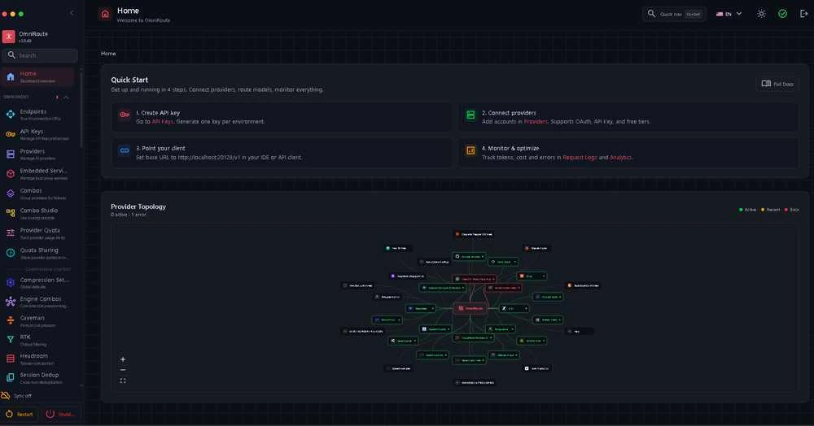

## Why this guide exists

This repository documents a setup that took a lot of trial, error, provider failures, stale model routes, rate-limit problems, config mistakes, and debugging to make reliable.

The goal is simple: save other developers that pain.

**Want the shortest path? Start with [QUICKSTART.md](QUICKSTART.md).**

This is **not** a benchmark lab pretending every provider is always stable. It is a reproducible field guide showing:

- what we actually used;
- what worked end-to-end;
- what was only configured but not trusted;
- what broke and how we fixed it;
- which models were worth using for coding and audits;
- how to build fallbacks so one provider failure does not stop your work;
- how to combine OpenCode, Oh My OpenAgent, Graphify, Ponytail, Serena, Playwright, SonarQube and specialist skills without turning the environment into a context-hungry mess.
- how we eliminated mirrored OpenCode terminals and made each concurrent session use its own SQLite DB and token/context HUD while keeping the same project and OMO configuration.

## Tested environment

| Layer | Lab setup |
|---|---|
| Host | Windows + WSL/Linux |
| Linux environment | Ubuntu-based WSL |
| Node | 22.22.2 during the verified OmniRoute setup |
| OmniRoute | v3.8.49 → v3.8.50 release window |
| OmniRoute dashboard/API | `127.0.0.1:20128` / `/v1` |
| Main coding client | OpenCode |
| Orchestration | Oh My OpenAgent / Sisyphus Ultraworker |
| Optional Claude compatibility | Free Claude Code on `127.0.0.1:8082` |

The architecture does **not** require a local NVIDIA GPU. NVIDIA NIM in this guide is a hosted API provider; your local hardware mainly affects your editor/build/test workloads, not NVIDIA-hosted inference.

---

## The stack

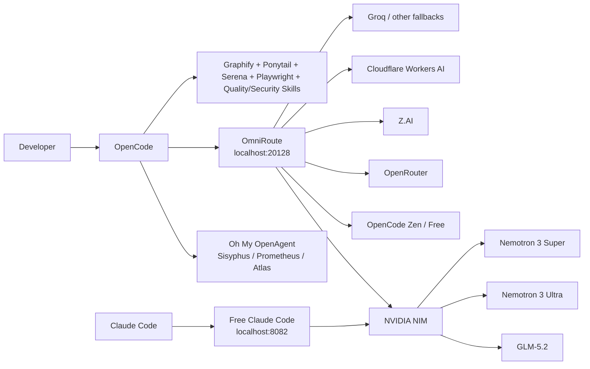

### Two useful paths

**Primary OpenCode path**

```text
OpenCode → OmniRoute → provider/model → automatic fallback → keep coding
```

**Claude Code compatibility path**

```text
Claude Code → Free Claude Code (FCC) → NVIDIA NIM → GLM-5.2 / Nemotron
```

---

## The highest-value result: GLM-5.2 through NVIDIA NIM

GLM-5.2 became one of the most valuable models in this setup for long-running coding, architecture, agentic work, and difficult reasoning.

NVIDIA currently exposes `z-ai/glm-5.2` through a free NIM endpoint. NVIDIA lists it as a 1M-context flagship model for coding, reasoning, tool use and agentic workflows.

**Our practical coding score:** ★★★★★

Why it earned that score in this stack:

- excellent long-horizon task behavior;
- strong codebase reasoning;
- good fit for Sisyphus-style orchestration;
- very useful for audits and architecture;
- large context window;
- available through NVIDIA's OpenAI-compatible endpoint;
- can also sit behind FCC, so Claude Code can use it without being locked to Anthropic models.

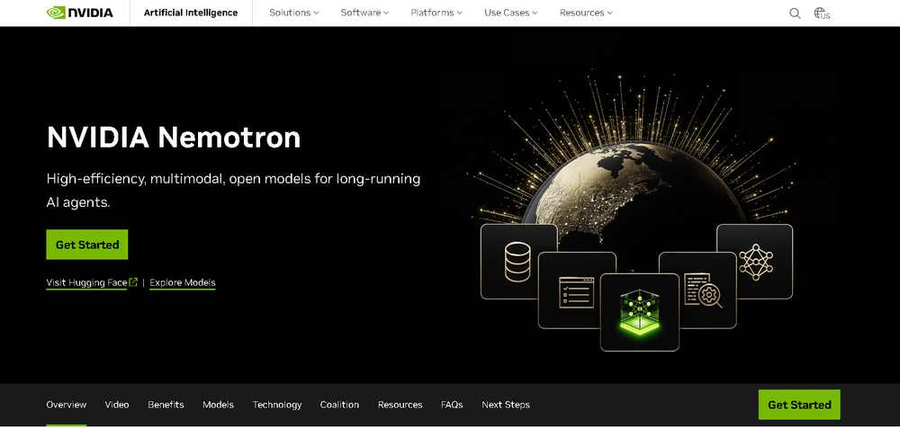

---

# 1. What we actually validated

The ratings below are **practical field ratings**, not scientific benchmark scores. They describe usefulness in coding-agent workflows: repository exploration, implementation, debugging, refactoring, audits, tests and long-running tasks.

## Lab-validated model scorecard

| Model / route | Provider path | Coding | Reasoning / audit | Speed | Best use | Lab status |
|---|---|---:|---:|---:|---|---|
| **GLM-5.2** (`z-ai/glm-5.2`) | NVIDIA NIM | ★★★★★ | ★★★★★ | ★★★☆☆ | Large implementations, architecture, long audits, difficult agentic tasks | ✅ End-to-end |
| **Nemotron 3 Ultra 550B A55B** | NVIDIA NIM | ★★★★☆ | ★★★★★ | ★★★☆☆ | Deep audit, architecture, long-context investigation | ✅ End-to-end |
| **Nemotron 3 Super 120B A12B** | NVIDIA NIM | ★★★★☆ | ★★★★☆ | ★★★★☆ | Strong general fallback, coding, reviews | ✅ End-to-end |
| **DeepSeek V4 Flash Free** | OpenCode Zen / OmniRoute | ★★★★☆ | ★★★★☆ | ★★★★★ | Fast implementation, fixes, daily coding | ✅ End-to-end; quota can fluctuate |
| **Nemotron 3 Ultra Free** | OpenCode Zen / OmniRoute | ★★★★☆ | ★★★★★ | ★★★☆☆ | Audits, investigation, reasoning-heavy work | ✅ End-to-end |
| **Nemotron 3 Ultra free route** | OpenRouter → OmniRoute | ★★★★☆ | ★★★★★ | ★★★☆☆ | Provider redundancy for heavy reasoning | ✅ End-to-end |
| **`auto/best-coding`** | OmniRoute combo | depends on selected model | depends | depends | Automatic fallback when you do not want to choose manually | ✅ End-to-end |
| **`auto/coding:free`** | OmniRoute combo | depends on selected model | depends | depends | $0-oriented automatic coding fallback | ✅ End-to-end |

### Important: do not blindly copy old DeepSeek routes

During our August 2026 testing, the **NVIDIA DeepSeek V4 Pro route returned an EOL/410-style failure**. An older screenshot in this guide still shows it in an FCC override because that screenshot captured the environment before cleanup.

**Do not use that screenshot as the recommended current config.** Prefer GLM-5.2 or Nemotron 3 Super/Ultra for the NVIDIA path.

---

# 2. OpenCode free catalog

OpenCode's current Zen documentation lists the following free models. Availability is explicitly described as limited-time for several of them, so always run `/models` rather than assuming this list will stay unchanged.

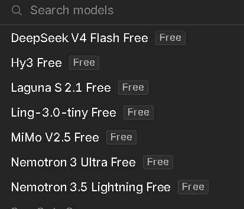

> **Screenshot note:** the picker image is a historical capture from our lab and includes models that have since rotated. The table below follows the current official Zen documentation checked on 2026-08-12.

| OpenCode free model | Current official Zen listing | Personally exercised in this stack | Coding recommendation |
|---|---:|---:|---|
| DeepSeek V4 Flash Free | ✅ | ✅ | ★★★★☆ — excellent fast default |
| MiMo-V2.5 Free | ✅ | Reserve route | Useful secondary coding model |
| North Mini Code Free | ✅ | Reserve route | Lightweight coding fallback; verify before critical work |
| Nemotron 3 Ultra Free | ✅ | ✅ | ★★★★☆ coding / ★★★★★ audit |
| Big Pickle | ✅ | Not rated | Stealth model: do not pretend to know what it is |

> **Rule:** treat a model as "working" only after a real completion request succeeds. A model appearing in `/models` only proves discovery, not successful inference.

> **Privacy note:** several OpenCode free models are explicitly limited-time evaluation endpoints, and OpenCode's current Zen documentation says data from some free endpoints may be used to improve models/services. NVIDIA free endpoints are trial services. Do not send personal, confidential, production-secret or regulated data merely because an endpoint is free.

---

# 3. Provider validation matrix

This table separates **configured** from **trusted end-to-end**. That distinction matters.

| Provider | Configured in our environment | End-to-end trusted | Lab reliability/value | Free / free-tier role | Notes |
|---|---:|---:|---:|---|---|
| **NVIDIA NIM** | ✅ | ✅ | ★★★★★ | Core heavyweight free endpoint | GLM-5.2, Nemotron Ultra/Super |
| **OpenCode Zen / Free** | ✅ | ✅ | ★★★★★ | Core free coding fallback | DeepSeek V4 Flash Free + Nemotron Free |
| **OpenRouter** | ✅ | ✅ | ★★★★☆ | Redundant free routes | Useful secondary Nemotron path |
| **Z.AI** | ✅ | ✅ for fallback testing | ★★★★☆ | Alternative GLM path | Keep separate from NVIDIA route |
| **Cloudflare Workers AI** | ✅ after fix | ✅ after correct Account ID | ★★★★☆ after fix | Secondary free-tier pool | Wrong/missing `accountId` caused 404/502 failures |
| **Groq** | ✅ | Configured, not primary | Not deeply rated | Fast utility provider | Useful but not central to this guide |
| **Fireworks** | ✅ | Configured, not primary | Not deeply rated | Optional | Do not call it free unless your account actually has free quota |
| **Mistral** | ✅ | Configured, not primary | Not deeply rated | Optional | Same rule: verify your current plan |
| **DeepSeek direct** | ✅ in FCC screenshot | Not our preferred free path | Not rated | Optional | Prefer OpenCode Free for V4 Flash in this build |
| OpenCode Go | ✅ | ✅ | ★★★★★ value, but paid | **Paid**, not part of the free core | Optional low-cost upgrade |
| Gemini | ❌ in captured FCC setup | — | — | — | Missing key in screenshot |
| Cerebras | ❌ in captured FCC setup | — | — | — | Not part of this validated build |
| Kimi direct | ❌ in captured FCC setup | — | — | — | Not part of this validated build |
| LM Studio | Offline | — | — | Local | Optional local inference |
| Ollama | Offline | — | — | Local | Optional local inference |
| llama.cpp | Offline | — | — | Local | Optional local inference |

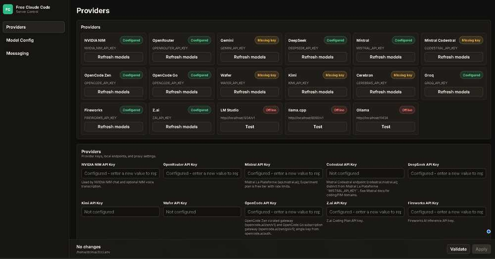

## Additional free-tier routes we successfully exercised

These were useful secondary routes after provider-specific setup was corrected. We do **not** rank them as highly as the primary table because they received less sustained repository work in this lab.

| Model / route | Provider | Coding | Practical role | Lab status |
|---|---|---:|---|---|
| **GLM-4.7 Flash** | Cloudflare Workers AI | ★★★★☆ | Fast backup / utility coding | ✅ Completion tested after Account ID fix |
| **Qwen2.5-Coder-32B-Instruct** | Cloudflare Workers AI | ★★★★☆ | Coding fallback | ✅ Completion tested after Account ID fix |
| **GPT-OSS-120B** | Cloudflare Workers AI | ★★★★☆ | General reasoning / coding fallback | ✅ Completion tested after Account ID fix |
| **Nemotron 3 120B A12B** | Cloudflare Workers AI | ★★★★☆ | NVIDIA-family secondary route | ✅ Completion tested after Account ID fix |

The Cloudflare free-tier catalog and quotas can change. Treat these as **known-good lab routes from 2026-08-12**, not a promise of permanent free availability.

---

# 4. Install OmniRoute

OmniRoute is the gateway. It gives the rest of the stack one stable OpenAI-compatible endpoint and handles model/provider routing, fallbacks, quotas, compression and monitoring.

Official project: [diegosouzapw/OmniRoute](https://github.com/diegosouzapw/OmniRoute)

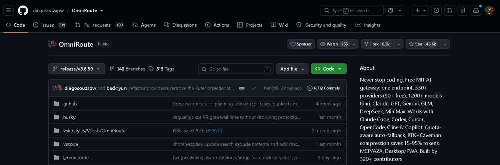

## Requirements

Use a Node.js version supported by the OmniRoute release you install. For the v3.8.50 release line, the upstream troubleshooting notes explicitly accept Node `>=22.22.2 <23` (along with supported Node 20/24 ranges). Our tested WSL setup used Node 22.22.2.

Check:

```bash
node --version
npm --version
```

## Install

```bash
npm install -g omniroute
omniroute
```

Or with pnpm:

```bash
pnpm add -g omniroute@latest --allow-build=better-sqlite3 --allow-build=@swc/core
omniroute
```

Dashboard:

```text
http://localhost:20128
```

OpenAI-compatible API:

```text
http://localhost:20128/v1
```

## First health checks

```bash
curl -I http://127.0.0.1:20128
ss -ltnp | grep ':20128'
omniroute doctor
```

If you created an OmniRoute client API key:

```bash
curl http://127.0.0.1:20128/v1/models \
  -H "Authorization: Bearer $OMNIROUTE_API_KEY"
```

See [docs/02-omniroute.md](docs/02-omniroute.md) for the complete setup and systemd instructions.

---

# 5. Configure NVIDIA NIM

Official NVIDIA endpoint base URL:

```text
https://integrate.api.nvidia.com/v1
```

Create a key from NVIDIA Build, then export it locally:

```bash
export NVIDIA_API_KEY="YOUR_NVIDIA_KEY"
```

Never commit this value.

## Smoke-test GLM-5.2 directly

```bash
curl https://integrate.api.nvidia.com/v1/chat/completions \
  -H "Authorization: Bearer $NVIDIA_API_KEY" \
  -H "Content-Type: application/json" \
  -d '{
    "model": "z-ai/glm-5.2",
    "messages": [{"role":"user","content":"Reply with exactly: GLM52_OK"}],
    "max_tokens": 32
  }'
```

## Smoke-test Nemotron Ultra

```bash
curl https://integrate.api.nvidia.com/v1/chat/completions \
  -H "Authorization: Bearer $NVIDIA_API_KEY" \
  -H "Content-Type: application/json" \
  -d '{
    "model": "nvidia/nemotron-3-ultra-550b-a55b",
    "messages": [{"role":"user","content":"Reply with exactly: NEMOTRON_OK"}],
    "max_tokens": 32
  }'
```

If direct NVIDIA calls work but OmniRoute calls fail, the problem is in the gateway/provider layer — not your NVIDIA account.

To re-check all three recommended NVIDIA models and print a Markdown PASS/FAIL table:

```bash
./scripts/validate-nvidia-models.sh
```

See [docs/03-nvidia-nim.md](docs/03-nvidia-nim.md).

---

# 6. Build the OmniRoute coding fallback combo

The main idea is **provider redundancy**. Do not bet a long coding session on one route.

A useful priority design is:

```text
1. NVIDIA → GLM-5.2
2. OpenRouter → Nemotron 3 Ultra free
3. OpenCode Free → DeepSeek V4 Flash Free
4. OpenCode Zen alternate DeepSeek route
5. NVIDIA → Nemotron 3 Super
6. auto/coding:free
7. auto/best-coding
```

Why this order works well:

- GLM-5.2 handles difficult work;
- Nemotron Ultra is an excellent audit/reasoning fallback;
- DeepSeek V4 Flash keeps day-to-day coding fast;
- Nemotron Super is a balanced NVIDIA fallback;
- OmniRoute's auto routes are the final safety net.

Do **not** blindly reuse provider/model IDs from another machine. Use the model IDs returned by your own:

```bash
curl http://127.0.0.1:20128/v1/models \
  -H "Authorization: Bearer $OMNIROUTE_API_KEY"
```

Provider prefixes can differ between OmniRoute, FCC and direct provider APIs.

You can validate any candidate routes with real completions and print a Markdown table:

```bash
./scripts/validate-omniroute-models.sh \
  auto/coding:free \
  auto/best-coding \
  YOUR_OTHER_ROUTE_ID
```

This is the safest way to keep the README's “working” table honest after provider updates.

---

# 7. Use OpenCode as the main coding platform

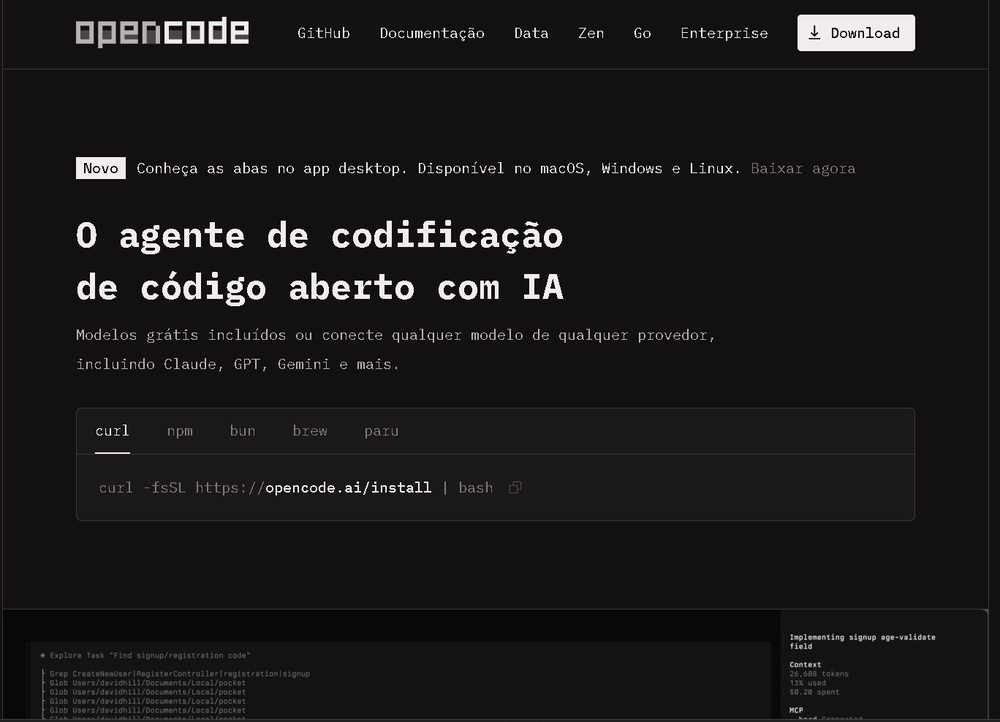

Install OpenCode:

```bash
curl -fsSL https://opencode.ai/install | bash
```

For Windows, this guide uses **WSL** because that is the environment we actually tested end-to-end. Native Windows may work, but commands and service management below assume Linux/WSL.

## Connect OpenCode directly to OmniRoute

OpenCode supports custom OpenAI-compatible providers.

Create or merge this into `~/.config/opencode/opencode.json`:

```json
{
  "$schema": "https://opencode.ai/config.json",
  "provider": {
    "omniroute": {
      "npm": "@ai-sdk/openai-compatible",
      "name": "OmniRoute",
      "options": {
        "baseURL": "http://127.0.0.1:20128/v1",
        "apiKey": "{env:OMNIROUTE_API_KEY}"
      },
      "models": {
        "auto/best-coding": {
          "name": "OmniRoute Best Coding"
        },
        "auto/coding:free": {
          "name": "OmniRoute Free Coding"
        }
      }
    }
  }
}
```

Then:

```bash
export OMNIROUTE_API_KEY="YOUR_OMNIROUTE_CLIENT_KEY"
opencode
```

Inside OpenCode:

```text
/models
```

### Set up OpenCode Free / Zen directly

Keep a direct OpenCode Free path even if OmniRoute is your main gateway. It gives you a useful emergency route when a gateway/provider configuration is being repaired.

```text
/connect
```

Select **OpenCode Zen**, finish the account/API-key flow, then:

```text
/models
```

Choose a model marked **Free** and send a real tiny completion. In this build, **DeepSeek V4 Flash Free** was our fast coding choice and **Nemotron 3 Ultra Free** was the stronger audit/reasoning choice. The free catalog is volatile, so use the current picker rather than an old screenshot.

If you prefer not to keep the OmniRoute client key in an environment variable, use OpenCode's `/connect` flow and make sure the custom provider ID matches `omniroute`.

### Why OpenCode is the front end here

OpenCode gave us:

- a clean terminal-native coding UX;
- custom OpenAI-compatible providers;
- plugins;
- MCP support;
- model switching;
- agents;
- easy integration with Oh My OpenAgent;
- the ability to keep OmniRoute behind a single local endpoint.

See [docs/04-opencode.md](docs/04-opencode.md).

---

# 8. Add Oh My OpenAgent and Sisyphus Ultraworker

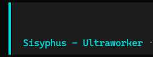

Oh My OpenAgent turns OpenCode from a single-agent coding tool into a multi-agent orchestration environment.

Install:

```bash
bunx oh-my-openagent install
```

**Let the installer register the OpenCode plugin for you.** The project is in a rename/compatibility transition: current OpenCode config prefers the `oh-my-openagent` plugin entry, while older `oh-my-opencode` entries can still appear. Do not blindly paste a stale plugin name from an old dotfile; run the installer and then verify with:

```bash
bunx oh-my-openagent doctor --verbose
```

Then start OpenCode and use:

```text
ultrawork
```

or:

```text
ulw
```

## The agents that matter

| Agent | Role | When to use it | Why it matters |
|---|---|---|---|
| **Sisyphus — Ultraworker** | Primary orchestrator | Well-defined missions, audits, fixes, implementation | Plans/delegates/executes and keeps driving toward completion |
| **Hephaestus** | Autonomous deep worker | Goal-oriented tasks that need research + end-to-end execution | Good when you want a worker to own the task instead of following a recipe |
| **Prometheus — Plan Builder** | Strategic planner | Big, ambiguous or critical work | Interviews for requirements and clarifies scope before code changes |
| **Atlas — Plan Executor** | Executes Prometheus plans | Large approved plans | Runs `/start-work`, works through planned tasks systematically |
| **Oracle** | Read-only high-IQ consultant | Architecture, security, difficult debugging | Independent second opinion without touching code |
| **Explore** | Fast repository exploration | Finding symbols, patterns, callers | Saves tokens vs reading everything |
| **Librarian** | External docs / OSS research | APIs, framework behavior, implementation examples | Grounds changes in current documentation and external evidence |
| **Metis** | Plan consultant / gap analyzer | Before finalizing complex plans | Finds missing requirements, assumptions and edge cases |
| **Momus** | Plan critic / reviewer | Plan and result validation | Pushes for explicit success criteria and evidence |
| **Multimodal Looker** | Visual specialist | Screenshots, diagrams, UI artifacts | Adds image/PDF understanding to engineering work |
| **Sisyphus-Junior** | Delegated category executor | Small scoped subtasks spawned by orchestration | Executes a focused assignment without recursive delegation loops |

Current Oh My OpenAgent also injects useful runtime MCP/tooling such as web search, documentation lookup, public-code search, LSP tooling and a local code graph. These plugin-injected MCPs may **not** appear in OpenCode's static `mcp list`; use the OmO doctor command to verify what is actually active.

### A practical free-stack agent mapping

The current OmO config supports per-agent model overrides in `~/.omo/omo.jsonc`. A useful starting point for this architecture is:

```jsonc
{
  "agents": {
    "sisyphus": {
      "model": "omniroute/auto/best-coding",
      "fallback_models": [
        "opencode/nemotron-3-ultra-free",
        "opencode/deepseek-v4-flash-free"
      ]
    },
    "oracle": {
      "model": "opencode/nemotron-3-ultra-free"
    },
    "explore": {
      "model": "opencode/deepseek-v4-flash-free"
    },
    "librarian": {
      "model": "opencode/deepseek-v4-flash-free"
    }
  }
}
```

This works best when your OmniRoute `auto/best-coding` combo puts **NVIDIA GLM-5.2 first**. Then Sisyphus gets the heavyweight path for hard work, while Explore/Librarian use faster free models and Oracle gets a reasoning-oriented free model.

**Do not copy model IDs blindly.** First confirm the exact provider/model IDs shown by OpenCode `/models` on your machine. The included [`examples/omo.free-stack.example.jsonc`](examples/omo.free-stack.example.jsonc) is a template, not a universal config.

### Our operating rule

```text
Clear task → Sisyphus
Large/ambiguous task → Prometheus → /start-work → Atlas
Hard architecture/debugging → Oracle
Repository discovery → Explore + Graphify + Serena
```

### Why this mattered in real audits

The biggest improvement was not that one model suddenly became perfect. It was **division of labor**:

- exploration could run separately from implementation;
- an architecture consultant could stay read-only;
- the planner could force scope clarity;
- execution could happen after a plan was reviewed;
- independent review and testing could happen after implementation;
- provider fallbacks kept the workflow alive when one model hit quota or failed.

That combination materially improved long repository audits because it reduced the classic failure mode where one giant agent context tries to search, reason, edit, test and remember everything by itself.

See [docs/05-omo-agents.md](docs/05-omo-agents.md).

---

# 9. Add Graphify, Ponytail and Serena

These three tools solve different problems. They are complementary.

## Graphify — understand the codebase as a graph

Graphify parses code locally into a knowledge graph and can answer architecture/dependency questions without repeatedly grepping the whole repository.

Install the CLI, then prefer a **project-scoped OpenCode integration**:

```bash
uv tool install graphifyy
graphify install --project --platform opencode
```

Build the graph inside OpenCode:

```text
/graphify .
```

Then make the graph guidance persistent for that project:

```bash
graphify opencode install --project
```

High-value use:

```text
Which modules call this function?
What tests cover this code path?
What components depend on this provider?
Show the path from API route → service → database.
```

### One fix worth knowing

Global OpenCode integration paths have changed across Graphify/OpenCode versions. If Graphify appears installed but OpenCode never uses it, prefer a **project-local installation** and confirm the generated `AGENTS.md` / OpenCode plugin files are actually inside your project.

## Ponytail — YAGNI / small-diff discipline

Merge Ponytail into the existing `plugin` array in `opencode.json`:

```json
{
  "plugin": ["@dietrichgebert/ponytail"]
}
```

If Oh My OpenAgent is already installed, **keep its installer-created plugin entry** and append Ponytail; do not replace the entire plugin array with the one-line example above.

Ponytail reinforces a very valuable engineering behavior: **do not build more than the problem requires**.

In practice it helped us push agents toward:

- smaller diffs;
- reuse instead of duplicate abstractions;
- less speculative architecture;
- fewer unnecessary helper layers;
- explicit YAGNI decisions.

## Serena — semantic code navigation

Serena gives the coding agent IDE-like semantic retrieval: symbol lookup, references, declarations and structured editing.

This is especially useful on mature repositories where plain text grep produces too much noise.

### Recommended division of labor

```text
Graphify → dependency/architecture map
Serena   → symbol-level semantic navigation
Explore  → fast broad search
Ponytail → keep the eventual fix small
```

That combination can save a lot of context.

See [docs/06-tools-and-plugins.md](docs/06-tools-and-plugins.md).

---

# 10. Specialist skills and MCPs that brought real value

We did not install random tools just because they existed. The useful stack was organized around **performance, security, database, backend, TypeScript, UI quality, testing and code quality**.

## High-value tooling stack

| Tool / skill | What it adds | Where it helped most |
|---|---|---|
| **NVIDIA SkillSpector** | Security scans agent skills before trusting them | Reduces supply-chain risk from random skills |
| **Playwright MCP** | Browser automation and structured browser interaction | End-to-end UI validation and live site review |
| **SonarQube MCP / agent plugins** | Bugs, vulnerabilities, code smells, quality gates | Independent quality/security verification |
| **Vercel React Best Practices** | React/Next performance patterns | Front-end performance audits |
| **Vercel Web Design Guidelines** | UI, accessibility, performance, UX checks | Visual/front-end review |
| **FastAPI / Python specialist** | FastAPI-specific implementation guidance | Backend architecture and API correctness |
| **Database optimizer** | Query/schema/index reasoning | PostgreSQL and performance work |
| **Performance engineer** | Profiling and performance investigation | Reliability/performance missions |
| **Error detective** | Systematic debugging | Difficult runtime failures |
| **TypeScript specialist** | TypeScript/Next.js expertise | Front-end/type-system fixes |
| **Security Reviewer** | Secrets, injection and unsafe execution review | Security audits |
| **AST Tech Debt Scanner** | Structural technical-debt detection | Refactor/audit discovery |
| **Brooks-Lint** | Engineering/lint discipline | Reducing unnecessary complexity |
| **env-doctor** | Environment diagnosis | Dependency/runtime mismatch debugging |

## Complete inventory: tools we actually installed, exercised or kept in the working stack

This is the part we wish we had when we started. The table below separates **what was actually used/validated in our environment** from optional ecosystem suggestions. Do not read “installed” as “must be enabled in every session”: several MCPs and skills are intentionally loaded only when a mission needs them.

### Core OpenCode / OMO orchestration

| Component | Type | Validation / use | What it did for us |
|---|---|---|---|
| **Oh My OpenAgent (OMO)** | OpenCode agent/orchestration plugin | ✅ Used continuously | Agent delegation, planning/execution split, specialist routing |
| **Sisyphus — Ultraworker** | Primary OMO agent | ✅ Main working agent | Direct implementation, audits, fixes, orchestration |
| **Prometheus — Plan Builder** | OMO agent | ✅ Used for large/ambiguous missions | Converts a fuzzy mission into an explicit implementation plan |
| **Atlas — Plan Executor** | OMO agent | ✅ Used after planning | Executes approved Prometheus plans through `/start-work` |
| **Oracle** | OMO consultant | ✅ Used | Read-only second opinion for architecture/debugging/high-risk findings |
| **Explore** | OMO search agent | ✅ Used heavily | Fast repository discovery without burning the main agent context |
| **Librarian** | OMO research agent | ✅ Used where external docs mattered | Documentation / OSS research separated from implementation |
| **Metis** | OMO planning consultant | ✅ Used in planning workflow | Gap/assumption/edge-case analysis |
| **Momus** | OMO critic | ✅ Used in plan-review workflow | Challenges plan completeness and proof criteria |
| **Multimodal Looker** | OMO visual agent | ✅ Vision path tested | Screenshots, UI artifacts and visual inspection |
| **Sisyphus-Junior** | Delegated OMO worker | ✅ Available/used for scoped delegation | Small bounded subtasks without recursive orchestration |
| **Hephaestus** | OMO autonomous worker | ◐ Available in the stack | Useful autonomous deep worker; not required for the core recipe |

### Code understanding and “small safe diff” layer

| Tool | Type | Validation / use | Why it stayed |
|---|---|---|---|
| **Graphify** | OpenCode skill / local code graph | ✅ Installed and used as an architecture/dependency aid | Caller/callee and blast-radius reasoning; reduces blind full-repo reading |
| **Serena** | MCP | ✅ Connected and used | Symbol/references/declaration navigation and precise code retrieval |
| **Ponytail** | OpenCode plugin/rules | ✅ Installed/configured; verify active profile | YAGNI, reuse, smallest-safe-diff pressure, anti-overengineering |
| **codegraph** | OMO/runtime code-graph tool | ✅ Connected in working sessions | Lightweight local code-graph context; **separate from Graphify** |
| **LSP tooling** | OMO/runtime tool | ✅ Connected in working sessions | Language-server symbol/type diagnostics |
| **grep_app** | OMO/runtime search tool | ✅ Connected in working sessions | Fast public-code / pattern lookup |
| **websearch (Exa)** | OMO/runtime research tool | ✅ Connected in working sessions | Current external research without polluting implementation context |
| **Context7** | OMO/runtime documentation tool | ✅ Connected in working sessions | Current library/framework documentation lookup |
| **TradingView** | Project-specific MCP/tool | ✅ Connected in our StockNewsBR sessions | Market/domain research; optional for general coding stacks |

> **Graphify vs `codegraph`:** these are not the same thing. In our stack, `codegraph` could be injected by the OMO/runtime tool layer, while Graphify was a separately installed project-level graph workflow. Keep that distinction in troubleshooting.

### Specialist pack we validated and kept

| Exact skill / tool | Type | Validation / use | Best use |
|---|---|---|---|
| **NVIDIA SkillSpector** | Security tool | ✅ Installed/validated | Scan third-party agent skills before trusting them |
| **ws-fastapi-pro** | Specialist skill | ✅ Installed/used | FastAPI architecture, dependency injection, API correctness |
| **ws-database-optimizer** | Specialist skill | ✅ Installed/used | SQL/PostgreSQL queries, indexes, schema and concurrency |
| **ws-performance-engineer** | Specialist skill | ✅ Installed/used | Performance investigations and reliability bottlenecks |
| **ws-error-detective** | Specialist skill | ✅ Installed/used | Structured root-cause debugging |
| **ws-typescript-pro** | Specialist skill | ✅ Installed/used | TypeScript/Next.js type and architecture work |
| **Vercel React Best Practices** | Agent skill | ✅ Installed/validated | React/Next performance and rendering review |
| **Vercel Web Design Guidelines** | Agent skill | ✅ Installed/validated | UI/UX/accessibility/design review |
| **Playwright MCP** | MCP | ✅ Connected/used | Browser-level proof and E2E validation |
| **SonarQube MCP / agent plugins** | MCP / quality tooling | ✅ Used in audit workflow | Independent bugs/vulnerabilities/code-smell/quality-gate evidence |

### Audit / review arsenal we used

| Exact name | Type | Validation / use | Purpose |
|---|---|---|---|
| **code-reviewer** | Review skill | ✅ Installed/used | Independent structured code review |
| **code-review** | Review skill | ✅ Installed/used | Second review style / read-only review pass |
| **Security Reviewer** | Security skill | ✅ Installed/used | Secrets, injection, unsafe subprocess/eval, dangerous web patterns |
| **AST Tech Debt Scanner** | Static-analysis skill/script | ✅ Installed/used | Structural debt and suspicious patterns |
| **Brooks-Lint** | Engineering-discipline skill | ✅ Installed/used | Complexity pressure and anti-overengineering review |
| **env-doctor** | Environment skill | ✅ Installed/used | Runtime/dependency/environment mismatch diagnosis |
| **codex-grade-coding** | Coding/audit skill | ✅ Part of the validated arsenal | Higher-discipline coding and review workflow |
| **Source-Driven Development** | Workflow skill | ✅ Part of the validated arsenal | Ground changes in source evidence instead of guesses |
| **Debugging & Error Recovery** | Workflow skill | ✅ Part of the validated arsenal | Reproduction-first debugging and recovery discipline |

### Project-specific skills that proved useful in StockNewsBR

These are examples of the **custom-skill layer** rather than dependencies everybody should install:

- **stocknewsbr-ai-regression** — AI/provider regression checks;
- **security-and-hardening** — project-specific security invariants and hardening guidance;
- **documentation-and-adrs** — documentation and architecture-decision discipline;
- **graphify** — project guidance for graph-first discovery;
- **ponytail** — project rules for YAGNI/reuse/small diffs.

### Gemini-side audit tools we also used

Some of our audit stack ran from Gemini rather than OpenCode. They are included here because they materially improved independent verification, but they should **not** be presented as OpenCode-native plugins unless you separately configure them there:

- **Gemini Docs MCP** — up-to-date Gemini/API documentation;
- **code-reviewer** and **code-review**;
- **Security Reviewer**;
- **SonarQube MCP**;
- **AST Tech Debt Scanner**;
- **Brooks-Lint**;
- **env-doctor**.

The operating principle was simple: **one model should not be allowed to search, implement and then grade its own work without independent evidence.**

## Install the optional tool pack

### Serena semantic navigation

Merge this into the existing OpenCode `mcp` object:

```jsonc
{
  "mcp": {
    "serena": {
      "type": "local",
      "command": [
        "uvx",
        "--from",
        "git+https://github.com/oraios/serena",
        "serena",
        "start-mcp-server",
        "--context",
        "opencode"
      ],
      "enabled": true
    }
  }
}
```

### Playwright MCP

```jsonc
{
  "mcp": {
    "playwright": {
      "type": "local",
      "command": ["npx", "-y", "@playwright/mcp@latest"],
      "enabled": true
    }
  }
}
```

Turn it off when a mission does not need a browser; every always-on MCP has a context cost.

### NVIDIA SkillSpector

```bash
uv tool install git+https://github.com/NVIDIA/skillspector.git
skillspector scan ./path/to/skill --no-llm
```

Use semantic scanning only after deciding which external provider is allowed to receive the skill contents.

### Vercel React/UI skills

```bash
npx skills add vercel-labs/agent-skills
```

Select the React Best Practices and Web Design skills you actually need.

### wshobson specialist agents/skills for OpenCode

```bash
gh repo clone wshobson/agents ~/agents
cd ~/agents
make install-opencode
```

Review the installed catalog and invoke domain specialists selectively rather than loading the whole marketplace into every task.

### SonarQube MCP

Keep credentials in environment variables, never in Git:

```bash
export SONARQUBE_TOKEN="YOUR_TOKEN"
export SONARQUBE_ORG="YOUR_ORGANIZATION"
```

A merge-ready example for Serena, Playwright and SonarQube is included at:

```text
examples/opencode.mcp-tools.example.jsonc
```

The full install/config notes are in [docs/06-tools-and-plugins.md](docs/06-tools-and-plugins.md).

### The key lesson

Do not load every skill into every task. Use **progressive disclosure**:

```text
Security mission  → Security Reviewer + SonarQube + SkillSpector
Performance       → performance engineer + DB optimizer + Graphify
FastAPI backend   → FastAPI specialist + Serena + tests
Next.js UI        → TypeScript + React Best Practices + Web Design + Playwright
Architecture      → Oracle + Graphify + Serena
Minimal bug fix   → Explore + Serena + Ponytail
```

This is where the tool stack delivered the most value in serious audits: one agent/tool discovers the problem, another implements narrowly, and independent tooling proves the result instead of trusting a single model to search, edit and grade itself.

---

# 11. Free Claude Code + NVIDIA NIM

Free Claude Code (FCC) is a proxy that keeps Claude Code's client workflow while routing requests to other providers.

Official project: [Alishahryar1/free-claude-code](https://github.com/Alishahryar1/free-claude-code)

Install on Linux/macOS:

```bash
curl -fsSL "https://raw.githubusercontent.com/Alishahryar1/free-claude-code/main/scripts/install.sh" | sh
```

Start:

```bash
fcc-server
```

Admin UI normally opens at:

```text
http://127.0.0.1:8082/admin
```

Paste your `NVIDIA_NIM_API_KEY`, click **Validate**, then **Apply**.

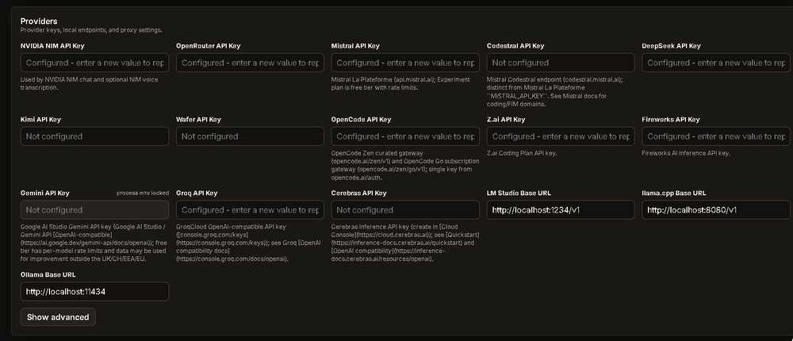

## Recommended current model routing

The screenshot below shows an earlier configuration. We would now replace stale DeepSeek NVIDIA overrides.

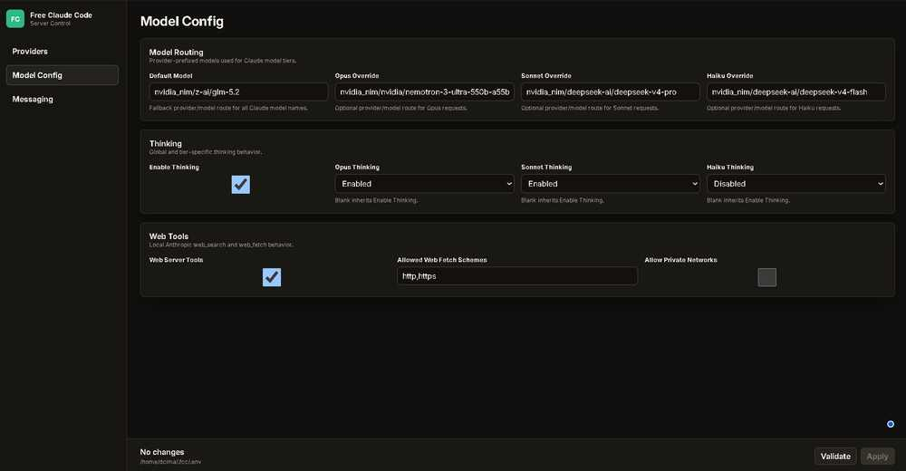

Recommended starting point:

| FCC tier | Recommended route |
|---|---|
| Default | `nvidia_nim/z-ai/glm-5.2` |
| Opus override | `nvidia_nim/nvidia/nemotron-3-ultra-550b-a55b` |
| Sonnet override | `nvidia_nim/z-ai/glm-5.2` |
| Haiku override | `nvidia_nim/nvidia/nemotron-3-super-120b-a12b` |

Thinking:

- Global thinking: enabled
- Opus: enabled
- Sonnet: enabled
- Haiku: disabled or conservative

Then launch Claude Code through FCC:

```bash
fcc-claude
```

Or explicitly select a model:

```bash
fcc-claude --model "nvidia_nim/z-ai/glm-5.2"
```

See [docs/07-fcc-nvidia.md](docs/07-fcc-nvidia.md).

---

# 12. Stable runtime settings

Our captured FCC runtime used:

| Setting | Value used |
|---|---:|
| Provider rate limit | 3 |
| Provider rate window | 5 |
| Provider max concurrency | 3 |
| HTTP read timeout | 900 s |
| HTTP write timeout | 120 s |
| HTTP connect timeout | 30 s |
| Port | 8082 |

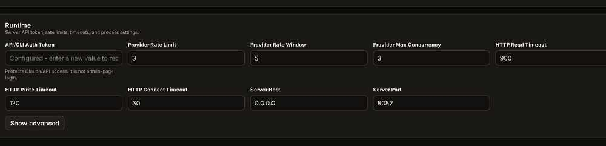

### Security improvement

The screenshot uses `0.0.0.0` as the server host. That is useful when you intentionally need LAN/container access, but for a normal single-machine setup prefer:

```text
127.0.0.1
```

Do not expose your local AI gateway to the network unless you know exactly why you need to.

---

# 13. OpenCode multi-session isolation: zero mirroring + honest per-session counters

One of the nastiest bugs we hit had nothing to do with the AI model: opening a second OpenCode terminal could appear to **mirror** the first one.

The confirmed cause was a custom tmux recovery wrapper attaching to a managed `oc-*` session that was already attached. The critical fix was:

```bash
if [[ "$attached" != "0" ]]; then
  continue
fi
```

Then we hardened state isolation as well. Every concurrent OpenCode session receives its own SQLite path through `OPENCODE_DB`, while the custom token/context HUD reads **that exact same DB**.

We also used an optional **in-TUI context counter** (🧠 progress/status line) so context pressure was visible inside each OpenCode screen. That counter measures session context usage — **not provider rate-limit consumption**. The source-level implementation/test pattern is documented in the deep-dive.

### What separate counters look like in practice

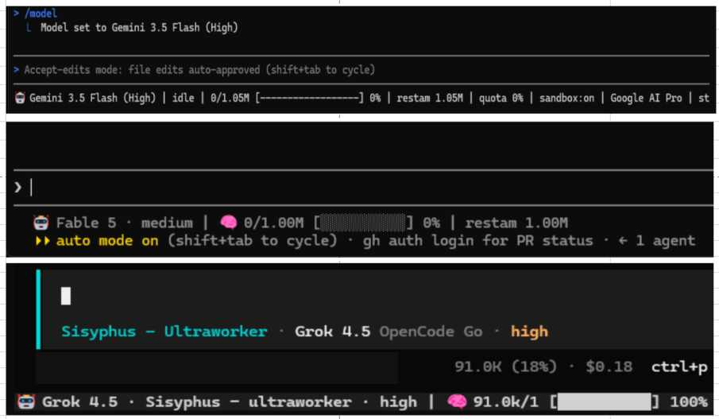

This capture from our workstation shows three coding-agent clients side by side: **Gemini**, a **Codex** session, and **OpenCode + Oh My OpenAgent / Sisyphus Ultraworker**. Each UI reports context differently, which is exactly why we do **not** treat a visible percentage or token count as a universal provider quota.

The useful rule is simple: **the counter must belong to the session you are looking at**. For concurrent OpenCode terminals, that means the OpenCode process and its HUD must resolve to the same per-session `OPENCODE_DB`; different OpenCode terminals must resolve to different DB files.

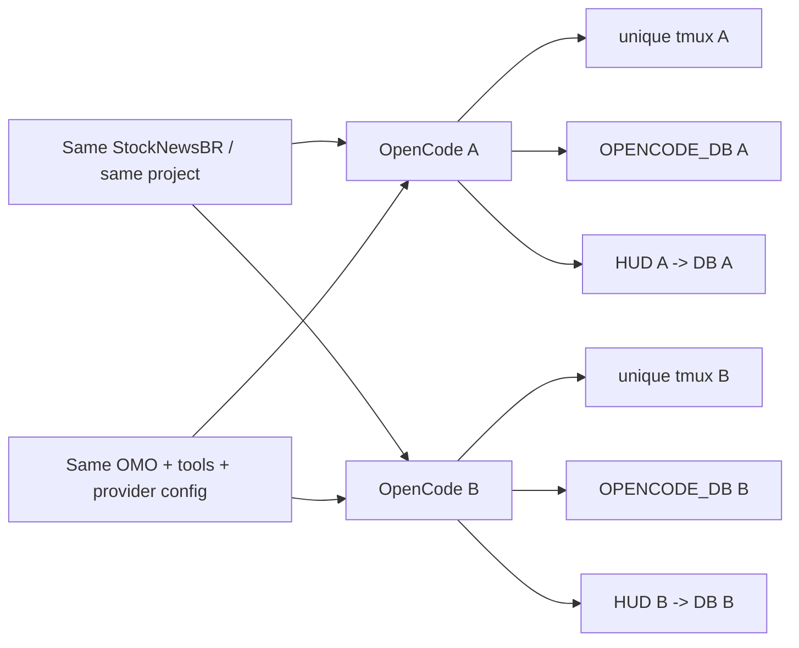

The two invariants are:

```text
inside one terminal:    process DB == HUD DB
between two terminals:  session A DB != session B DB
```

That gives the complete result:

**independent sessions + independent DBs + individual counters + same project + same OMO + zero mirroring.**

A read-only diagnostic is included:

```bash
bash scripts/verify-opencode-session-isolation.sh
```

Full write-up: [docs/13-opencode-session-isolation.md](docs/13-opencode-session-isolation.md).

---

# 14. The fixes that saved the most time

## Fix 1 — Separate “model discovered” from “model actually works”

Always test a completion.

```bash
curl http://127.0.0.1:20128/v1/models ...
```

is only discovery.

A real `POST /v1/chat/completions` proves inference.

## Fix 2 — Never depend on one provider

A beautiful model is useless when its provider is in cooldown, quota-limited, misconfigured or temporarily down.

Use a combo.

## Fix 3 — Cloudflare needs the real Account ID

We saw 404/502-style failures when the Workers AI provider-specific data was missing or had an invalid account ID.

Use the actual Cloudflare Account ID and re-test the model list and a completion.

## Fix 4 — Old NVIDIA model IDs can die

DeepSeek V4 Pro was a real example in our environment. It had worked, then became an invalid route.

**Lesson:** model IDs are not permanent infrastructure.

## Fix 5 — Keep GLM routes independent

If GLM-5.2 is available from NVIDIA and Z.AI, keep them as separate provider routes. That is real redundancy, not two aliases pointing to the same upstream.

## Fix 6 — Use small context tools before raw repository reads

Graphify + Serena + Explore dramatically reduce the need for broad `grep/find/read-everything` behavior.

## Fix 7 — Add a YAGNI layer

Ponytail was valuable because powerful agents love creating infrastructure. A senior engineering rule that says “reuse, smallest diff, don't invent abstractions” is surprisingly effective.

## Fix 8 — Audit the agent tools themselves

Installing a random `SKILL.md` can effectively add trusted instructions to your coding agent. SkillSpector gave us a formal checkpoint before trusting new skills.

## Fix 9 — Browser verification beats “looks correct in code”

Playwright MCP made front-end work much more reliable because the agent could verify the behavior in a real browser.

## Fix 10 — Independent quality gates matter

SonarQube, tests, linting and security review caught problems that a successful implementation agent could miss.

## Fix 11 — Do not confuse the OmniRoute client key with provider keys

OmniRoute has two different credential layers:

```text
Provider credential -> OmniRoute talks to NVIDIA/OpenRouter/etc.
OmniRoute client key -> OpenCode/your IDE talks to OmniRoute.
```

The key created in OmniRoute **API Keys / Endpoints** protects the local gateway. It is not your NVIDIA/OpenRouter credential. Mixing these two layers creates very confusing 401/403 debugging.

## Fix 12 — Version-specific combo regressions are real

The OmniRoute project documented a v3.8.49 regression where long `/v1/responses` conversations could end in `503 Maximum combo retry limit reached`. If a gateway update suddenly breaks a previously healthy long session, record the exact version, test provider-direct, test another combo/`auto`, and check the current release/issues before rewriting your configuration.

## Fix 13 — Prefer a service over a forgotten terminal

Running OmniRoute under a user `systemd` service gave us a stable restart/logging point. When the gateway disappears, `systemctl --user status` and `journalctl --user` are much easier to reason about than guessing which old terminal launched it.

---

# 15. Suggested workflow for a serious coding mission

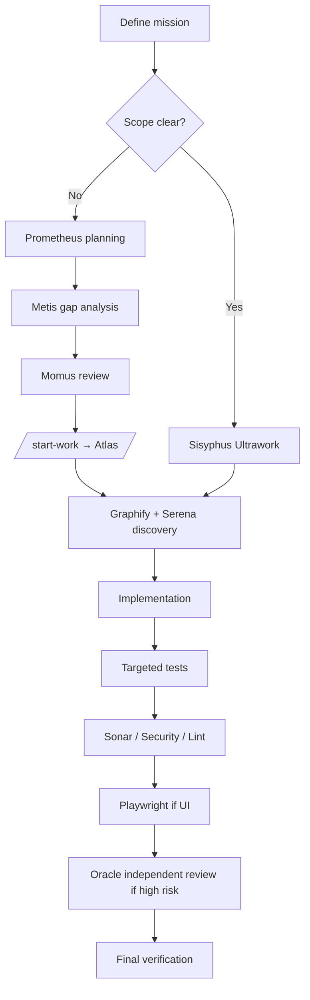

### Example prompt structure

```text
MISSION
Fix <specific problem> with the smallest production-safe diff.

MODEL
Prefer GLM-5.2 for difficult reasoning; allow configured OmniRoute fallbacks.

AGENTS
Sisyphus Ultraworker as main agent.
Use Explore for repository discovery.
Use Oracle only for architecture/debugging second opinion.

TOOLS
Use Graphify first for dependency/caller mapping.
Use Serena for symbol-level navigation.
Use Ponytail rules: YAGNI, reuse, smallest diff.
Use Playwright for UI verification if applicable.
Use Sonar/Security review before final verdict.

VERIFICATION
Run targeted tests, then the repository quality gate.
Do not claim success from code inspection alone.
```

More concrete recipes for full audits, production bugs, performance, security, FastAPI, UI work and provider failures are in [docs/11-audit-recipes.md](docs/11-audit-recipes.md).

---

# 16. Security rules before publishing your own setup

Never commit:

```text
NVIDIA_API_KEY
NVIDIA_NIM_API_KEY
OPENROUTER_API_KEY
OPENCODE_API_KEY
ZAI_API_KEY
GROQ_API_KEY
FIREWORKS_API_KEY
OMNIROUTE_API_KEY
```

Use `.env.example` with fake values only.

The included `.gitignore` blocks common secret/database files.

Before publishing screenshots, check them manually for:

- API keys;
- bearer tokens;
- account IDs you consider private;
- usernames/paths you do not want public;
- browser tabs containing personal information.

See [docs/09-security.md](docs/09-security.md).

---

# 17. Repository map

```text
.
├── README.md
├── QUICKSTART.md
├── docs/
│   ├── 01-architecture.md
│   ├── 02-omniroute.md
│   ├── 03-nvidia-nim.md
│   ├── 04-opencode.md
│   ├── 05-omo-agents.md
│   ├── 06-tools-and-plugins.md
│   ├── 07-fcc-nvidia.md
│   ├── 08-troubleshooting.md
│   ├── 09-security.md
│   ├── 10-sources.md
│   ├── 11-audit-recipes.md
│   ├── 12-claude-code-field-guide.md
│   └── 13-opencode-session-isolation.md
├── examples/
│   ├── opencode.omniroute.example.json
│   ├── opencode.mcp-tools.example.jsonc
│   ├── omo.free-stack.example.jsonc
│   └── systemd/omniroute.service.example
├── scripts/
│   ├── health-check.sh
│   ├── install-omniroute-service.sh
│   ├── test-nvidia.sh
│   ├── test-omniroute.sh
│   ├── validate-nvidia-models.sh
│   ├── validate-omniroute-models.sh
│   └── verify-opencode-session-isolation.sh
└── assets/screenshots/
```

---

# 18. Quick recommendation

If you only copy one configuration philosophy from this repository, use this:

```text
OpenCode
  + Oh My OpenAgent / Sisyphus
  + Graphify / Serena / Ponytail
  ↓
OmniRoute
  1. GLM-5.2 via NVIDIA NIM
  2. Nemotron 3 Ultra via alternate provider
  3. DeepSeek V4 Flash Free via OpenCode
  4. Nemotron 3 Super via NVIDIA
  5. OmniRoute free auto fallback
```

That gives you a strong mix of **quality, speed, redundancy and low cost** without forcing every task through the same model.

---

## 🚀 Built by StockNewsBR

This open-source field guide grew out of the engineering work behind **[StockNewsBR](https://stocknewsbr.com/)** — an AI-powered trading intelligence platform designed to help traders make faster, better-informed decisions.

StockNewsBR brings together **9 specialized AI systems**, real-time financial intelligence, advanced market analytics, quantitative models and **quantum-inspired calculations** to analyze news, sentiment, market context, risk and trading opportunities.

### What we are building

- 🧠 **9 specialized AI systems working together**
- 📈 AI-powered market intelligence and decision support
- 📰 Real-time financial news and sentiment analysis
- 📊 Market-context and risk evaluation
- ⚡ Multi-model reasoning and independent validation
- 🧮 Quantitative and quantum-inspired analytics
- 🌐 Web platform at **[StockNewsBR.com](https://stocknewsbr.com/)**
- ✈️ Telegram integration for alerts and trader workflows
- 📱 **Google Play** and **Apple App Store** releases planned

Our goal is not to replace the trader. It is to give the trader a **stronger information advantage** by combining multiple AI perspectives, real-time data, independent validation and advanced analytics in one platform.

> **StockNewsBR — AI-powered intelligence for traders who want better information before making the decision.**

**Coming soon:** Web + Telegram + Google Play + Apple App Store.

> StockNewsBR provides analytical tooling and information, not guaranteed trading outcomes or financial advice.

---

## Sources / upstream projects

This guide is independent community documentation. The projects below own their respective software and documentation:

- [OmniRoute](https://github.com/diegosouzapw/OmniRoute)
- [OpenCode](https://opencode.ai/docs/)
- [OpenCode Zen](https://opencode.ai/docs/zen/)
- [NVIDIA NIM / GLM-5.2](https://build.nvidia.com/z-ai/glm-5.2)
- [NVIDIA Nemotron 3 Ultra](https://build.nvidia.com/nvidia/nemotron-3-ultra-550b-a55b)
- [NVIDIA Nemotron 3 Super](https://build.nvidia.com/nvidia/nemotron-3-super-120b-a12b)
- [Free Claude Code](https://github.com/Alishahryar1/free-claude-code)
- [Oh My OpenAgent](https://github.com/code-yeongyu/oh-my-openagent)
- [Graphify](https://github.com/Graphify-Labs/graphify)
- [Ponytail](https://github.com/DietrichGebert/ponytail)
- [Serena](https://github.com/oraios/serena)
- [NVIDIA SkillSpector](https://github.com/NVIDIA/SkillSpector)
- [Playwright MCP](https://github.com/microsoft/playwright-mcp)
- [SonarQube MCP Server](https://github.com/SonarSource/sonarqube-mcp-server)
- [Vercel Agent Skills](https://github.com/vercel-labs/agent-skills)
- [wshobson/agents](https://github.com/wshobson/agents)

## Disclaimer

Free tiers, model availability, rate limits and provider names change frequently. The words **free** and **working** in this repository describe the state observed or documented at the verification date above. Always check the upstream provider's current terms and run your own smoke test before depending on a route.