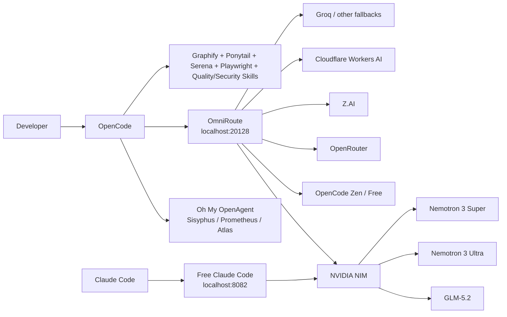
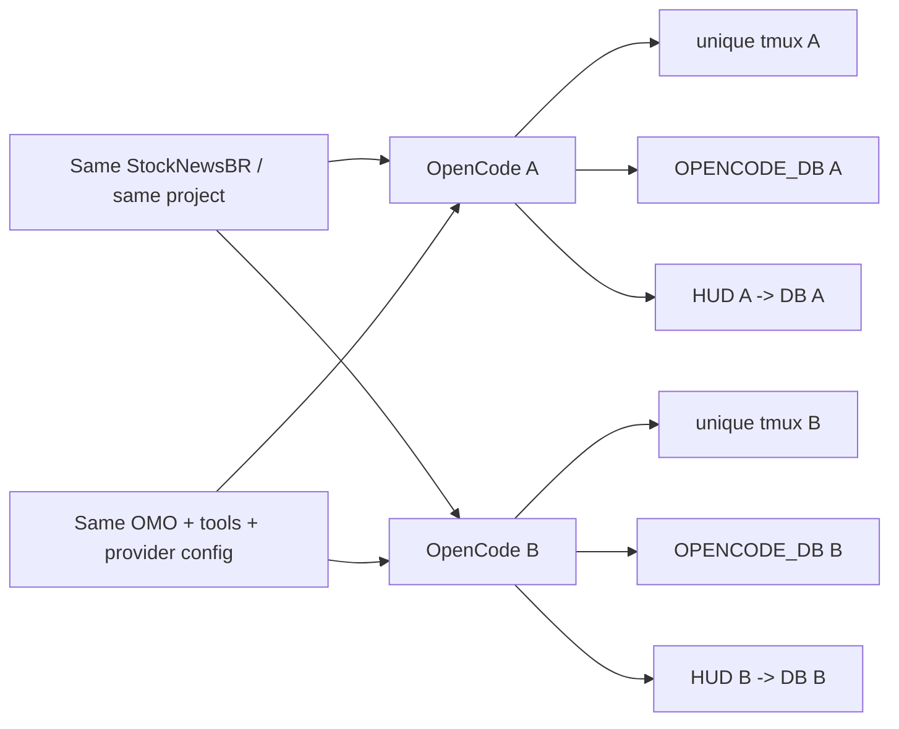
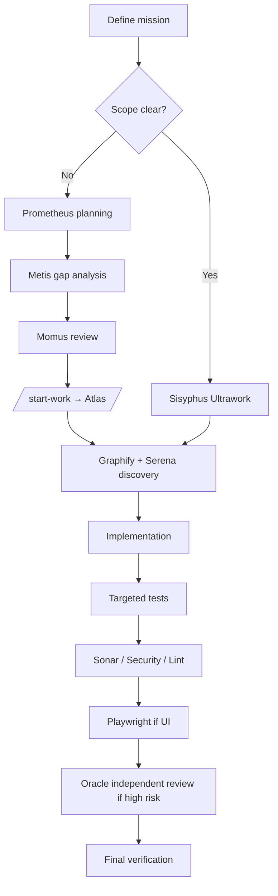

# Stack Gratuito de Codificação com IA: OpenCode + OmniRoute + NVIDIA NIM

<p align="center">
  <b>🌐 Documentation:</b><br>
  <a href="README.md">🇺🇸 English</a> ·
  🇧🇷 <b>Português (Brasil)</b> ·
  <a href="README.es.md">🇪🇸 Español</a> ·
  <a href="README.ru.md">🇷🇺 Русский</a>
</p>

> Uma configuração prática e testada em batalha para rodar um ambiente poderoso de codificação com IA usando **OpenCode como plataforma principal de codificação**, **OmniRoute como gateway local de IA**, **modelos gratuitos ou de camada gratuita como fallbacks** e **NVIDIA NIM** para modelos pesados como **GLM-5.2** e **Nemotron 3 Ultra**.
>
> Última verificação: **2026-08-12** durante a janela de lançamento do OmniRoute **v3.8.49 → v3.8.50**.


## Por que este guia existe

Este repositório documenta uma configuração que exigiu muita tentativa e erro, falhas de provider, rotas de modelo obsoletas, problemas de rate limit, erros de configuração e debugging para se tornar confiável.

O objetivo é simples: poupar outros desenvolvedores dessa dor.

**Quer o caminho mais curto? Comece pelo [QUICKSTART.md](QUICKSTART.md).**

Este **não** é um laboratório de benchmarks fingindo que todo provider é sempre estável. É um guia de campo reproduzível mostrando:

- o que realmente usamos;
- o que funcionou de ponta a ponta;
- o que foi apenas configurado, mas não validado como confiável;
- o que quebrou e como corrigimos;
- quais modelos valeram a pena para codificação e auditorias;
- como construir fallbacks para que a falha de um provider não pare o seu trabalho;
- como combinar OpenCode, Oh My OpenAgent, Graphify, Ponytail, Serena, Playwright, SonarQube e skills especializadas sem transformar o ambiente em uma bagunça faminta por contexto.
- como eliminamos terminais OpenCode espelhados e fizemos cada sessão concorrente usar seu próprio banco SQLite e HUD de tokens/contexto mantendo o mesmo projeto e a configuração do OMO.

## Ambiente testado

| Camada | Configuração do laboratório |
|---|---|
| Host | Windows + WSL/Linux |
| Ambiente Linux | WSL baseado em Ubuntu |
| Node | 22.22.2 durante a configuração OmniRoute verificada |
| OmniRoute | Janela de lançamento v3.8.49 → v3.8.50 |
| Dashboard/API do OmniRoute | `127.0.0.1:20128` / `/v1` |
| Cliente de codificação principal | OpenCode |
| Orquestração | Oh My OpenAgent / Sisyphus Ultraworker |
| Compatibilidade opcional com Claude | Free Claude Code em `127.0.0.1:8082` |

A arquitetura **não** exige uma GPU NVIDIA local. O NVIDIA NIM neste guia é um provider de API hospedado; seu hardware local afeta principalmente suas cargas de trabalho de editor/build/teste, não a inferência hospedada pela NVIDIA.

---

## A stack



### Dois caminhos úteis

**Caminho principal via OpenCode**

```text
OpenCode → OmniRoute → provider/model → automatic fallback → keep coding
```

**Caminho de compatibilidade com Claude Code**

```text
Claude Code → Free Claude Code (FCC) → NVIDIA NIM → GLM-5.2 / Nemotron
```

---

## O resultado de maior valor: GLM-5.2 através do NVIDIA NIM

O GLM-5.2 se tornou um dos modelos mais valiosos desta configuração para codificação de longa duração, arquitetura, trabalho agentic e raciocínio difícil.

A NVIDIA expõe atualmente `z-ai/glm-5.2` por meio de um endpoint NIM gratuito. A NVIDIA o lista como um modelo flagship de contexto de 1M para codificação, raciocínio, uso de ferramentas e workflows agentic.

**Nossa nota prática de codificação:** ★★★★★

Por que ele conquistou essa nota nesta stack:

- excelente comportamento em tarefas de horizonte longo;
- forte raciocínio sobre codebase;
- bom ajuste para orquestração no estilo Sisyphus;
- muito útil para auditorias e arquitetura;
- grande janela de contexto;
- disponível através do endpoint compatível com OpenAI da NVIDIA;
- também pode ficar atrás do FCC, permitindo que o Claude Code o use sem ficar preso aos modelos da Anthropic.


---

# 1. O que realmente validamos

As notas abaixo são **notas práticas de campo**, não pontuações científicas de benchmark. Elas descrevem a utilidade em workflows de agentes de codificação: exploração de repositório, implementação, debugging, refatoração, auditorias, testes e tarefas de longa duração.

## Scorecard de modelos validados em laboratório

| Modelo / rota | Caminho do provider | Codificação | Raciocínio / auditoria | Velocidade | Melhor uso | Status no laboratório |
|---|---|---:|---:|---:|---|---|
| **GLM-5.2** (`z-ai/glm-5.2`) | NVIDIA NIM | ★★★★★ | ★★★★★ | ★★★☆☆ | Implementações grandes, arquitetura, auditorias longas, tarefas agentic difíceis | ✅ Ponta a ponta |
| **Nemotron 3 Ultra 550B A55B** | NVIDIA NIM | ★★★★☆ | ★★★★★ | ★★★☆☆ | Auditoria profunda, arquitetura, investigação de contexto longo | ✅ Ponta a ponta |
| **Nemotron 3 Super 120B A12B** | NVIDIA NIM | ★★★★☆ | ★★★★☆ | ★★★★☆ | Fallback geral forte, codificação, revisões | ✅ Ponta a ponta |
| **DeepSeek V4 Flash Free** | OpenCode Zen / OmniRoute | ★★★★☆ | ★★★★☆ | ★★★★★ | Implementação rápida, correções, codificação diária | ✅ Ponta a ponta; a cota pode oscilar |
| **Nemotron 3 Ultra Free** | OpenCode Zen / OmniRoute | ★★★★☆ | ★★★★★ | ★★★☆☆ | Auditorias, investigação, trabalho com muito raciocínio | ✅ Ponta a ponta |
| **Rota gratuita do Nemotron 3 Ultra** | OpenRouter → OmniRoute | ★★★★☆ | ★★★★★ | ★★★☆☆ | Redundância de provider para raciocínio pesado | ✅ Ponta a ponta |
| **`auto/best-coding`** | Combo OmniRoute | depende do modelo selecionado | depende | depende | Fallback automático quando você não quer escolher manualmente | ✅ Ponta a ponta |
| **`auto/coding:free`** | Combo OmniRoute | depende do modelo selecionado | depende | depende | Fallback automático de codificação orientado a $0 | ✅ Ponta a ponta |

### Importante: não copie rotas antigas do DeepSeek às cegas

Durante nossos testes de agosto de 2026, a **rota NVIDIA DeepSeek V4 Pro retornou uma falha no estilo EOL/410**. Uma captura de tela mais antiga deste guia ainda a mostra em um override do FCC porque aquela captura registrou o ambiente antes da limpeza.

**Não use essa captura de tela como a configuração atual recomendada.** Prefira GLM-5.2 ou Nemotron 3 Super/Ultra para o caminho NVIDIA.

---

# 2. Catálogo gratuito do OpenCode

A documentação atual do Zen do OpenCode lista os seguintes modelos gratuitos. A disponibilidade é descrita explicitamente como por tempo limitado para vários deles, então sempre rode `/models` em vez de assumir que esta lista permanecerá inalterada.


> **Nota sobre a captura:** a imagem do seletor é uma captura histórica do nosso laboratório e inclui modelos que desde então foram rotacionados. A tabela abaixo segue a documentação oficial atual do Zen verificada em 2026-08-12.

| Modelo gratuito do OpenCode | Listagem oficial atual no Zen | Exercitado pessoalmente nesta stack | Recomendação de codificação |
|---|---:|---:|---|
| DeepSeek V4 Flash Free | ✅ | ✅ | ★★★★☆ — excelente padrão rápido |
| MiMo-V2.5 Free | ✅ | Rota reserva | Modelo secundário útil de codificação |
| North Mini Code Free | ✅ | Rota reserva | Fallback de codificação leve; verifique antes de trabalho crítico |
| Nemotron 3 Ultra Free | ✅ | ✅ | ★★★★☆ codificação / ★★★★★ auditoria |
| Big Pickle | ✅ | Não avaliado | Modelo furtivo: não finja saber o que é |

> **Regra:** trate um modelo como "funcionando" somente depois que uma requisição real de completion for bem-sucedida. Um modelo aparecer em `/models` apenas prova a descoberta, não inferência bem-sucedida.

> **Nota de privacidade:** vários modelos gratuitos do OpenCode são endpoints de avaliação explicitamente por tempo limitado, e a documentação atual do Zen do OpenCode afirma que dados de alguns endpoints gratuitos podem ser usados para melhorar modelos/serviços. Os endpoints gratuitos da NVIDIA são serviços de teste. Não envie dados pessoais, confidenciais, segredos de produção ou dados regulados apenas porque um endpoint é gratuito.

---

# 3. Matriz de validação de providers

Esta tabela separa **configurado** de **confiável de ponta a ponta**. Essa distinção importa.

| Provider | Configurado no nosso ambiente | Confiável de ponta a ponta | Confiabilidade/valor no laboratório | Papel gratuito / camada gratuita | Observações |
|---|---:|---:|---:|---|---|
| **NVIDIA NIM** | ✅ | ✅ | ★★★★★ | Endpoint gratuito pesado central | GLM-5.2, Nemotron Ultra/Super |
| **OpenCode Zen / Free** | ✅ | ✅ | ★★★★★ | Fallback gratuito central de codificação | DeepSeek V4 Flash Free + Nemotron Free |
| **OpenRouter** | ✅ | ✅ | ★★★★☆ | Rotas gratuitas redundantes | Caminho Nemotron secundário útil |
| **Z.AI** | ✅ | ✅ para testes de fallback | ★★★★☆ | Caminho alternativo do GLM | Mantenha separado da rota NVIDIA |
| **Cloudflare Workers AI** | ✅ após correção | ✅ após Account ID correto | ★★★★☆ após correção | Pool secundário de camada gratuita | `accountId` errado/ausente causou falhas 404/502 |
| **Groq** | ✅ | Configurado, não primário | Não avaliado profundamente | Provider utilitário rápido | Útil, mas não central neste guia |
| **Fireworks** | ✅ | Configurado, não primário | Não avaliado profundamente | Opcional | Não o chame de gratuito a menos que sua conta tenha cota gratuita de verdade |
| **Mistral** | ✅ | Configurado, não primário | Não avaliado profundamente | Opcional | Mesma regra: verifique seu plano atual |
| **DeepSeek direto** | ✅ na captura do FCC | Não é nosso caminho gratuito preferido | Não avaliado | Opcional | Prefira OpenCode Free para V4 Flash neste build |
| OpenCode Go | ✅ | ✅ | ★★★★★ em valor, mas pago | **Pago**, não faz parte do núcleo gratuito | Upgrade opcional de baixo custo |
| Gemini | ❌ na configuração FCC capturada | — | — | — | Chave ausente na captura |
| Cerebras | ❌ na configuração FCC capturada | — | — | — | Não faz parte deste build validado |
| Kimi direto | ❌ na configuração FCC capturada | — | — | — | Não faz parte deste build validado |
| LM Studio | Offline | — | — | Local | Inferência local opcional |
| Ollama | Offline | — | — | Local | Inferência local opcional |
| llama.cpp | Offline | — | — | Local | Inferência local opcional |


## Rotas adicionais de camada gratuita que exercitamos com sucesso

Estas foram rotas secundárias úteis depois que a configuração específica de cada provider foi corrigida. Não as classificamos tão alto quanto a tabela principal porque receberam menos trabalho sustentado de repositório neste laboratório.

| Modelo / rota | Provider | Codificação | Papel prático | Status no laboratório |
|---|---|---:|---|---|
| **GLM-4.7 Flash** | Cloudflare Workers AI | ★★★★☆ | Codificação utilitária / backup rápido | ✅ Completion testado após correção do Account ID |
| **Qwen2.5-Coder-32B-Instruct** | Cloudflare Workers AI | ★★★★☆ | Fallback de codificação | ✅ Completion testado após correção do Account ID |
| **GPT-OSS-120B** | Cloudflare Workers AI | ★★★★☆ | Raciocínio geral / fallback de codificação | ✅ Completion testado após correção do Account ID |
| **Nemotron 3 120B A12B** | Cloudflare Workers AI | ★★★★☆ | Rota secundária da família NVIDIA | ✅ Completion testado após correção do Account ID |

O catálogo e as cotas da camada gratuita da Cloudflare podem mudar. Trate estas rotas como **rotas de laboratório conhecidas e boas a partir de 2026-08-12**, não uma promessa de disponibilidade gratuita permanente.

---

# 4. Instalar o OmniRoute

O OmniRoute é o gateway. Ele dá ao restante da stack um endpoint estável compatível com OpenAI e lida com roteamento de modelo/provider, fallbacks, cotas, compressão e monitoramento.

Projeto oficial: [diegosouzapw/OmniRoute](https://github.com/diegosouzapw/OmniRoute)


## Requisitos

Use uma versão do Node.js suportada pela release do OmniRoute que você instalar. Para a linha de releases v3.8.50, as notas upstream de solução de problemas aceitam explicitamente Node `>=22.22.2 <23` (junto com faixas suportadas de Node 20/24). Nossa configuração WSL testada usou Node 22.22.2.

Verifique:

```bash
node --version
npm --version
```

## Instalação

```bash
npm install -g omniroute
omniroute
```

Ou com pnpm:

```bash
pnpm add -g omniroute@latest --allow-build=better-sqlite3 --allow-build=@swc/core
omniroute
```

Dashboard:

```text
http://localhost:20128
```

API compatível com OpenAI:

```text
http://localhost:20128/v1
```

## Primeiros health checks

```bash
curl -I http://127.0.0.1:20128
ss -ltnp | grep ':20128'
omniroute doctor
```

Se você criou uma chave de API de cliente do OmniRoute:

```bash
curl http://127.0.0.1:20128/v1/models \
  -H "Authorization: Bearer $OMNIROUTE_API_KEY"
```

Veja [docs/02-omniroute.md](docs/02-omniroute.md) para a configuração completa e instruções de systemd.

---

# 5. Configurar o NVIDIA NIM

URL base oficial do endpoint NVIDIA:

```text
https://integrate.api.nvidia.com/v1
```

Crie uma chave no NVIDIA Build e exporte-a localmente:

```bash
export NVIDIA_API_KEY="YOUR_NVIDIA_KEY"
```

Nunca faça commit deste valor.

## Smoke-test do GLM-5.2 diretamente

```bash
curl https://integrate.api.nvidia.com/v1/chat/completions \
  -H "Authorization: Bearer $NVIDIA_API_KEY" \
  -H "Content-Type: application/json" \
  -d '{
    "model": "z-ai/glm-5.2",
    "messages": [{"role":"user","content":"Reply with exactly: GLM52_OK"}],
    "max_tokens": 32
  }'
```

## Smoke-test do Nemotron Ultra

```bash
curl https://integrate.api.nvidia.com/v1/chat/completions \
  -H "Authorization: Bearer $NVIDIA_API_KEY" \
  -H "Content-Type: application/json" \
  -d '{
    "model": "nvidia/nemotron-3-ultra-550b-a55b",
    "messages": [{"role":"user","content":"Reply with exactly: NEMOTRON_OK"}],
    "max_tokens": 32
  }'
```

Se chamadas diretas à NVIDIA funcionam mas as chamadas via OmniRoute falham, o problema está na camada gateway/provider — não na sua conta NVIDIA.

Para re-verificar os três modelos NVIDIA recomendados e imprimir uma tabela Markdown PASS/FAIL:

```bash
./scripts/validate-nvidia-models.sh
```

Veja [docs/03-nvidia-nim.md](docs/03-nvidia-nim.md).

---

# 6. Construir o combo de fallback de codificação do OmniRoute

A ideia principal é **redundância de provider**. Não aposte uma sessão longa de codificação em uma única rota.

Um design de prioridade útil é:

```text
1. NVIDIA → GLM-5.2
2. OpenRouter → Nemotron 3 Ultra free
3. OpenCode Free → DeepSeek V4 Flash Free
4. OpenCode Zen alternate DeepSeek route
5. NVIDIA → Nemotron 3 Super
6. auto/coding:free
7. auto/best-coding
```

Por que essa ordem funciona bem:

- o GLM-5.2 lida com trabalho difícil;
- o Nemotron Ultra é um excelente fallback de auditoria/raciocínio;
- o DeepSeek V4 Flash mantém a codificação do dia a dia rápida;
- o Nemotron Super é um fallback NVIDIA equilibrado;
- as rotas automáticas do OmniRoute são a rede de segurança final.

**Não** reutilize IDs de provider/modelo de outra máquina às cegas. Use os IDs de modelo retornados pelo seu próprio:

```bash
curl http://127.0.0.1:20128/v1/models \
  -H "Authorization: Bearer $OMNIROUTE_API_KEY"
```

Os prefixos de provider podem diferir entre OmniRoute, FCC e APIs diretas de provider.

Você pode validar qualquer rota candidata com completions reais e imprimir uma tabela Markdown:

```bash
./scripts/validate-omniroute-models.sh \
  auto/coding:free \
  auto/best-coding \
  YOUR_OTHER_ROUTE_ID
```

Esta é a forma mais segura de manter a tabela de "funcionando" do README honesta após atualizações de provider.

---

# 7. Usar o OpenCode como plataforma principal de codificação


Instale o OpenCode:

```bash
curl -fsSL https://opencode.ai/install | bash
```

Para Windows, este guia usa **WSL** porque é o ambiente que realmente testamos de ponta a ponta. Windows nativo pode funcionar, mas os comandos e o gerenciamento de serviços abaixo assumem Linux/WSL.

## Conectar o OpenCode diretamente ao OmniRoute

O OpenCode suporta providers customizados compatíveis com OpenAI.

Crie ou mescle isto em `~/.config/opencode/opencode.json`:

```json
{
  "$schema": "https://opencode.ai/config.json",
  "provider": {
    "omniroute": {
      "npm": "@ai-sdk/openai-compatible",
      "name": "OmniRoute",
      "options": {
        "baseURL": "http://127.0.0.1:20128/v1",
        "apiKey": "{env:OMNIROUTE_API_KEY}"
      },
      "models": {
        "auto/best-coding": {
          "name": "OmniRoute Best Coding"
        },
        "auto/coding:free": {
          "name": "OmniRoute Free Coding"
        }
      }
    }
  }
}
```

Depois:

```bash
export OMNIROUTE_API_KEY="YOUR_OMNIROUTE_CLIENT_KEY"
opencode
```

Dentro do OpenCode:

```text
/models
```

### Configurar o OpenCode Free / Zen diretamente

Mantenha um caminho direto do OpenCode Free mesmo que o OmniRoute seja seu gateway principal. Isso dá uma rota de emergência útil quando uma configuração de gateway/provider está sendo reparada.

```text
/connect
```

Selecione **OpenCode Zen**, conclua o fluxo de conta/chave de API e depois:

```text
/models
```

Escolha um modelo marcado como **Free** e envie um completion minúsculo real. Neste build, o **DeepSeek V4 Flash Free** foi nossa escolha rápida de codificação e o **Nemotron 3 Ultra Free** foi a escolha mais forte de auditoria/raciocínio. O catálogo gratuito é volátil, então use o seletor atual em vez de uma captura antiga.

Se você preferir não manter a chave de cliente do OmniRoute em uma variável de ambiente, use o fluxo `/connect` do OpenCode e garanta que o ID do provider customizado corresponda a `omniroute`.

### Por que o OpenCode é o front end aqui

O OpenCode nos deu:

- uma UX de codificação limpa e nativa de terminal;
- providers customizados compatíveis com OpenAI;
- plugins;
- suporte a MCP;
- troca de modelos;
- agentes;
- integração fácil com o Oh My OpenAgent;
- a capacidade de manter o OmniRoute atrás de um único endpoint local.

Veja [docs/04-opencode.md](docs/04-opencode.md).

---

# 8. Adicionar o Oh My OpenAgent e o Sisyphus Ultraworker


O Oh My OpenAgent transforma o OpenCode de uma ferramenta de codificação de agente único em um ambiente de orquestração multi-agente.

Instale:

```bash
bunx oh-my-openagent install
```

**Deixe o instalador registrar o plugin do OpenCode para você.** O projeto está em uma transição de renomeação/compatibilidade: a configuração atual do OpenCode prefere a entrada de plugin `oh-my-openagent`, enquanto entradas antigas `oh-my-opencode` ainda podem aparecer. Não cole às cegas um nome de plugin obsoleto de um dotfile antigo; rode o instalador e depois verifique com:

```bash
bunx oh-my-openagent doctor --verbose
```

Depois inicie o OpenCode e use:

```text
ultrawork
```

ou:

```text
ulw
```

## Os agentes que importam

| Agente | Papel | Quando usar | Por que importa |
|---|---|---|---|
| **Sisyphus — Ultraworker** | Orquestrador principal | Missões bem definidas, auditorias, correções, implementação | Planeja/delega/executa e continua avançando até a conclusão |
| **Hephaestus** | Worker profundo autônomo | Tarefas orientadas a objetivos que precisam de pesquisa + execução de ponta a ponta | Bom quando você quer que um worker seja dono da tarefa em vez de seguir uma receita |
| **Prometheus — Plan Builder** | Planejador estratégico | Trabalho grande, ambíguo ou crítico | Entrevista para levantar requisitos e esclarece o escopo antes de mudanças de código |
| **Atlas — Plan Executor** | Executa planos do Prometheus | Planos grandes aprovados | Roda `/start-work`, trabalha nas tarefas planejadas sistematicamente |
| **Oracle** | Consultor read-only de alto QI | Arquitetura, segurança, debugging difícil | Segunda opinião independente sem tocar no código |
| **Explore** | Exploração rápida de repositório | Encontrar símbolos, padrões, chamadores | Economiza tokens em comparação a ler tudo |
| **Librarian** | Pesquisa de docs externos / OSS | APIs, comportamento de frameworks, exemplos de implementação | Fundamenta mudanças em documentação atual e evidência externa |
| **Metis** | Consultor de planos / analisador de lacunas | Antes de finalizar planos complexos | Encontra requisitos ausentes, suposições e casos de borda |
| **Momus** | Crítico de planos / revisor | Validação de planos e resultados | Cobra critérios de sucesso explícitos e evidências |
| **Multimodal Looker** | Especialista visual | Capturas de tela, diagramas, artefatos de UI | Adiciona compreensão de imagem/PDF ao trabalho de engenharia |
| **Sisyphus-Junior** | Executor de categoria delegada | Subtarefas pequenas e escopadas geradas pela orquestração | Executa uma atribuição focada sem loops recursivos de delegação |

O Oh My OpenAgent atual também injeta MCPs/ferramentas de runtime úteis, como busca na web, consulta de documentação, busca de código público, ferramentas LSP e um grafo de código local. Esses MCPs injetados por plugin podem **não** aparecer no `mcp list` estático do OpenCode; use o comando doctor do OmO para verificar o que está realmente ativo.

### Um mapeamento prático de agentes da stack gratuita

A configuração atual do OmO suporta overrides de modelo por agente em `~/.omo/omo.jsonc`. Um ponto de partida útil para esta arquitetura é:

```jsonc
{
  "agents": {
    "sisyphus": {
      "model": "omniroute/auto/best-coding",
      "fallback_models": [
        "opencode/nemotron-3-ultra-free",
        "opencode/deepseek-v4-flash-free"
      ]
    },
    "oracle": {
      "model": "opencode/nemotron-3-ultra-free"
    },
    "explore": {
      "model": "opencode/deepseek-v4-flash-free"
    },
    "librarian": {
      "model": "opencode/deepseek-v4-flash-free"
    }
  }
}
```

Isso funciona melhor quando seu combo `auto/best-coding` do OmniRoute coloca **NVIDIA GLM-5.2 primeiro**. Assim, o Sisyphus recebe o caminho pesado para trabalho difícil, enquanto Explore/Librarian usam modelos gratuitos mais rápidos e o Oracle recebe um modelo gratuito orientado a raciocínio.

**Não copie IDs de modelo às cegas.** Primeiro confirme os IDs exatos de provider/modelo mostrados por `/models` do OpenCode na sua máquina. O [`examples/omo.free-stack.example.jsonc`](examples/omo.free-stack.example.jsonc) incluído é um template, não uma configuração universal.

### Nossa regra operacional

```text
Clear task → Sisyphus
Large/ambiguous task → Prometheus → /start-work → Atlas
Hard architecture/debugging → Oracle
Repository discovery → Explore + Graphify + Serena
```

### Por que isso importou em auditorias reais

A maior melhoria não foi um modelo ter ficado perfeito de repente. Foi a **divisão de trabalho**:

- a exploração podia rodar separada da implementação;
- um consultor de arquitetura podia permanecer read-only;
- o planejador podia forçar clareza de escopo;
- a execução podia acontecer depois que um plano fosse revisado;
- revisão e teste independentes podiam acontecer depois da implementação;
- os fallbacks de provider mantinham o workflow vivo quando um modelo atingia a cota ou falhava.

Essa combinação melhorou materialmente auditorias longas de repositório porque reduziu o modo clássico de falha em que um contexto gigante de agente tenta buscar, raciocinar, editar, testar e lembrar tudo sozinho.

Veja [docs/05-omo-agents.md](docs/05-omo-agents.md).

---

# 9. Adicionar Graphify, Ponytail e Serena

Essas três ferramentas resolvem problemas diferentes. Elas são complementares.

## Graphify — entender a codebase como um grafo

O Graphify analisa o código localmente em um grafo de conhecimento e pode responder perguntas de arquitetura/dependências sem fazer grep repetido no repositório inteiro.

Instale a CLI e depois prefira uma **integração OpenCode com escopo de projeto**:

```bash
uv tool install graphifyy
graphify install --project --platform opencode
```

Construa o grafo dentro do OpenCode:

```text
/graphify .
```

Depois torne a orientação do grafo persistente para aquele projeto:

```bash
graphify opencode install --project
```

Uso de alto valor:

```text
Which modules call this function?
What tests cover this code path?
What components depend on this provider?
Show the path from API route → service → database.
```

### Uma correção que vale a pena conhecer

Os caminhos de integração global do OpenCode mudaram entre versões do Graphify/OpenCode. Se o Graphify aparecer instalado mas o OpenCode nunca o usar, prefira uma **instalação local ao projeto** e confirme que o `AGENTS.md` gerado / os arquivos de plugin do OpenCode estão realmente dentro do seu projeto.

## Ponytail — disciplina YAGNI / diffs pequenos

Mescle o Ponytail no array `plugin` existente em `opencode.json`:

```json
{
  "plugin": ["@dietrichgebert/ponytail"]
}
```

Se o Oh My OpenAgent já estiver instalado, **mantenha a entrada de plugin criada pelo instalador** e acrescente o Ponytail; não substitua o array inteiro de plugins pelo exemplo de uma linha acima.

O Ponytail reforça um comportamento de engenharia muito valioso: **não construa mais do que o problema exige**.

Na prática, ele nos ajudou a empurrar os agentes para:

- diffs menores;
- reuso em vez de abstrações duplicadas;
- menos arquitetura especulativa;
- menos camadas auxiliares desnecessárias;
- decisões YAGNI explícitas.

## Serena — navegação semântica de código

A Serena dá ao agente de codificação recuperação semântica no estilo de IDE: busca de símbolos, referências, declarações e edição estruturada.

Isso é especialmente útil em repositórios maduros onde o grep de texto puro produz ruído demais.

### Divisão de trabalho recomendada

```text
Graphify → dependency/architecture map
Serena   → symbol-level semantic navigation
Explore  → fast broad search
Ponytail → keep the eventual fix small
```

Essa combinação pode economizar muito contexto.

Veja [docs/06-tools-and-plugins.md](docs/06-tools-and-plugins.md).

---

# 10. Skills especializadas e MCPs que trouxeram valor real

Não instalamos ferramentas aleatórias só porque existiam. A stack útil foi organizada em torno de **performance, segurança, banco de dados, backend, TypeScript, qualidade de UI, testes e qualidade de código**.

## Stack de ferramentas de alto valor

| Ferramenta / skill | O que acrescenta | Onde mais ajudou |
|---|---|---|
| **NVIDIA SkillSpector** | Escaneia skills de agentes em busca de segurança antes de confiar nelas | Reduz o risco de supply chain de skills aleatórias |
| **Playwright MCP** | Automação de navegador e interação estruturada com o navegador | Validação de UI de ponta a ponta e revisão de site ao vivo |
| **SonarQube MCP / plugins de agente** | Bugs, vulnerabilidades, code smells, quality gates | Verificação independente de qualidade/segurança |
| **Vercel React Best Practices** | Padrões de performance React/Next | Auditorias de performance de front-end |
| **Vercel Web Design Guidelines** | Verificações de UI, acessibilidade, performance, UX | Revisão visual/front-end |
| **FastAPI / Python specialist** | Orientação de implementação específica do FastAPI | Arquitetura de backend e correção de API |
| **Database optimizer** | Raciocínio de query/schema/índices | Trabalho com PostgreSQL e performance |
| **Performance engineer** | Profiling e investigação de performance | Missões de confiabilidade/performance |
| **Error detective** | Debugging sistemático | Falhas difíceis de runtime |
| **TypeScript specialist** | Expertise em TypeScript/Next.js | Correções de front-end/sistema de tipos |
| **Security Reviewer** | Revisão de segredos, injeção e execução insegura | Auditorias de segurança |
| **AST Tech Debt Scanner** | Detecção estrutural de dívida técnica | Descoberta em refatoração/auditoria |
| **Brooks-Lint** | Disciplina de engenharia/lint | Reduzindo complexidade desnecessária |
| **env-doctor** | Diagnóstico de ambiente | Debugging de incompatibilidade de dependência/runtime |

## Inventário completo: ferramentas que realmente instalamos, exercitamos ou mantivemos na stack de trabalho

Esta é a parte que gostaríamos de ter tido quando começamos. A tabela abaixo separa **o que foi realmente usado/validado no nosso ambiente** das sugestões opcionais do ecossistema. Não leia "instalado" como "deve estar habilitado em toda sessão": vários MCPs e skills são carregados intencionalmente apenas quando uma missão precisa deles.

### Orquestração central OpenCode / OMO

| Componente | Tipo | Validação / uso | O que fez por nós |
|---|---|---|---|
| **Oh My OpenAgent (OMO)** | Plugin de agente/orquestração do OpenCode | ✅ Usado continuamente | Delegação de agentes, divisão planejamento/execução, roteamento de especialistas |
| **Sisyphus — Ultraworker** | Agente OMO principal | ✅ Agente de trabalho principal | Implementação direta, auditorias, correções, orquestração |
| **Prometheus — Plan Builder** | Agente OMO | ✅ Usado em missões grandes/ambíguas | Converte uma missão nebulosa em um plano de implementação explícito |
| **Atlas — Plan Executor** | Agente OMO | ✅ Usado após o planejamento | Executa planos aprovados do Prometheus via `/start-work` |
| **Oracle** | Consultor OMO | ✅ Usado | Segunda opinião read-only para arquitetura/debugging/achados de alto risco |
| **Explore** | Agente de busca OMO | ✅ Usado intensamente | Descoberta rápida de repositório sem queimar o contexto do agente principal |
| **Librarian** | Agente de pesquisa OMO | ✅ Usado onde docs externos importavam | Pesquisa de documentação / OSS separada da implementação |
| **Metis** | Consultor de planejamento OMO | ✅ Usado no workflow de planejamento | Análise de lacunas/suposições/casos de borda |
| **Momus** | Crítico OMO | ✅ Usado no workflow de revisão de planos | Desafia a completude do plano e os critérios de prova |
| **Multimodal Looker** | Agente visual OMO | ✅ Caminho de visão testado | Capturas de tela, artefatos de UI e inspeção visual |
| **Sisyphus-Junior** | Worker OMO delegado | ✅ Disponível/usado para delegação escopada | Subtarefas pequenas e limitadas sem orquestração recursiva |
| **Hephaestus** | Worker autônomo OMO | ◐ Disponível na stack | Worker profundo autônomo útil; não é necessário para a receita central |

### Camada de entendimento de código e "diff pequeno e seguro"

| Ferramenta | Tipo | Validação / uso | Por que ficou |
|---|---|---|---|
| **Graphify** | Skill do OpenCode / grafo de código local | ✅ Instalado e usado como auxílio de arquitetura/dependências | Raciocínio de chamadores/callees e blast radius; reduz leitura às cegas do repositório inteiro |
| **Serena** | MCP | ✅ Conectado e usado | Navegação de símbolos/referências/declarações e recuperação precisa de código |
| **Ponytail** | Plugin/regras do OpenCode | ✅ Instalado/configurado; verifique o perfil ativo | YAGNI, reuso, pressão por diff seguro mínimo, anti-overengineering |
| **codegraph** | Ferramenta de grafo de código OMO/runtime | ✅ Conectado em sessões de trabalho | Contexto leve de grafo de código local; **separado do Graphify** |
| **LSP tooling** | Ferramenta OMO/runtime | ✅ Conectado em sessões de trabalho | Diagnósticos de símbolo/tipo do language server |
| **grep_app** | Ferramenta de busca OMO/runtime | ✅ Conectado em sessões de trabalho | Busca rápida de código público / padrões |
| **websearch (Exa)** | Ferramenta de pesquisa OMO/runtime | ✅ Conectado em sessões de trabalho | Pesquisa externa atual sem poluir o contexto de implementação |
| **Context7** | Ferramenta de documentação OMO/runtime | ✅ Conectado em sessões de trabalho | Consulta de documentação atual de bibliotecas/frameworks |
| **TradingView** | MCP/ferramenta específica do projeto | ✅ Conectado nas nossas sessões StockNewsBR | Pesquisa de mercado/domínio; opcional para stacks gerais de codificação |

> **Graphify vs `codegraph`:** não são a mesma coisa. Na nossa stack, o `codegraph` podia ser injetado pela camada de ferramentas OMO/runtime, enquanto o Graphify era um workflow de grafo de projeto instalado separadamente. Mantenha essa distinção na solução de problemas.

### Pacote de especialistas que validamos e mantivemos

| Skill / ferramenta exata | Tipo | Validação / uso | Melhor uso |
|---|---|---|---|
| **NVIDIA SkillSpector** | Ferramenta de segurança | ✅ Instalado/validado | Escanear skills de agentes de terceiros antes de confiar nelas |
| **ws-fastapi-pro** | Skill especializada | ✅ Instalado/usado | Arquitetura FastAPI, injeção de dependência, correção de API |
| **ws-database-optimizer** | Skill especializada | ✅ Instalado/usado | Queries SQL/PostgreSQL, índices, schema e concorrência |
| **ws-performance-engineer** | Skill especializada | ✅ Instalado/usado | Investigações de performance e gargalos de confiabilidade |
| **ws-error-detective** | Skill especializada | ✅ Instalado/usado | Debugging estruturado de causa raiz |
| **ws-typescript-pro** | Skill especializada | ✅ Instalado/usado | Trabalho de tipo e arquitetura TypeScript/Next.js |
| **Vercel React Best Practices** | Skill de agente | ✅ Instalado/validado | Revisão de performance e renderização React/Next |
| **Vercel Web Design Guidelines** | Skill de agente | ✅ Instalado/validado | Revisão de UI/UX/acessibilidade/design |
| **Playwright MCP** | MCP | ✅ Conectado/usado | Prova em nível de navegador e validação E2E |
| **SonarQube MCP / plugins de agente** | MCP / tooling de qualidade | ✅ Usado no workflow de auditoria | Evidência independente de bugs/vulnerabilidades/code smells/quality gates |

### Arsenal de auditoria/revisão que usamos

| Nome exato | Tipo | Validação / uso | Propósito |
|---|---|---|---|
| **code-reviewer** | Skill de revisão | ✅ Instalado/usado | Revisão de código estruturada e independente |
| **code-review** | Skill de revisão | ✅ Instalado/usado | Segundo estilo de revisão / passe de revisão read-only |
| **Security Reviewer** | Skill de segurança | ✅ Instalado/usado | Segredos, injeção, subprocess/eval inseguro, padrões web perigosos |
| **AST Tech Debt Scanner** | Skill/script de análise estática | ✅ Instalado/usado | Dívida estrutural e padrões suspeitos |
| **Brooks-Lint** | Skill de disciplina de engenharia | ✅ Instalado/usado | Pressão de complexidade e revisão anti-overengineering |
| **env-doctor** | Skill de ambiente | ✅ Instalado/usado | Diagnóstico de incompatibilidade de runtime/dependência/ambiente |
| **codex-grade-coding** | Skill de codificação/auditoria | ✅ Parte do arsenal validado | Workflow de codificação e revisão com disciplina superior |
| **Source-Driven Development** | Skill de workflow | ✅ Parte do arsenal validado | Fundamentar mudanças em evidência de fonte em vez de suposições |
| **Debugging & Error Recovery** | Skill de workflow | ✅ Parte do arsenal validado | Disciplina de debugging com reprodução primeiro e recuperação |

### Skills específicas do projeto que se mostraram úteis no StockNewsBR

Estes são exemplos da **camada de skills customizadas**, não dependências que todo mundo deveria instalar:

- **stocknewsbr-ai-regression** — verificações de regressão de IA/provider;
- **security-and-hardening** — invariantes de segurança e orientação de hardening específicas do projeto;
- **documentation-and-adrs** — disciplina de documentação e decisões de arquitetura;
- **graphify** — orientação do projeto para descoberta com grafo primeiro;
- **ponytail** — regras do projeto para YAGNI/reuso/diffs pequenos.

### Ferramentas de auditoria do lado do Gemini que também usamos

Parte da nossa stack de auditoria rodou a partir do Gemini em vez do OpenCode. Elas estão incluídas aqui porque melhoraram materialmente a verificação independente, mas **não** devem ser apresentadas como plugins nativos do OpenCode a menos que você as configure separadamente lá:

- **Gemini Docs MCP** — documentação atual do Gemini/API;
- **code-reviewer** e **code-review**;
- **Security Reviewer**;
- **SonarQube MCP**;
- **AST Tech Debt Scanner**;
- **Brooks-Lint**;
- **env-doctor**.

O princípio operacional era simples: **um modelo não deveria poder buscar, implementar e depois avaliar o próprio trabalho sem evidência independente.**

## Instalar o pacote opcional de ferramentas

### Navegação semântica Serena

Mescle isto no objeto `mcp` existente do OpenCode:

```jsonc
{
  "mcp": {
    "serena": {
      "type": "local",
      "command": [
        "uvx",
        "--from",
        "git+https://github.com/oraios/serena",
        "serena",
        "start-mcp-server",
        "--context",
        "opencode"
      ],
      "enabled": true
    }
  }
}
```

### Playwright MCP

```jsonc
{
  "mcp": {
    "playwright": {
      "type": "local",
      "command": ["npx", "-y", "@playwright/mcp@latest"],
      "enabled": true
    }
  }
}
```

Desligue-o quando uma missão não precisar de navegador; todo MCP sempre ligado tem custo de contexto.

### NVIDIA SkillSpector

```bash
uv tool install git+https://github.com/NVIDIA/skillspector.git
skillspector scan ./path/to/skill --no-llm
```

Use o escaneamento semântico somente depois de decidir qual provider externo tem permissão para receber o conteúdo das skills.

### Skills Vercel React/UI

```bash
npx skills add vercel-labs/agent-skills
```

Selecione as skills React Best Practices e Web Design que você realmente precisa.

### Agentes/skills especialistas wshobson para OpenCode

```bash
gh repo clone wshobson/agents ~/agents
cd ~/agents
make install-opencode
```

Revise o catálogo instalado e invoque especialistas de domínio seletivamente, em vez de carregar o marketplace inteiro em toda tarefa.

### SonarQube MCP

Mantenha as credenciais em variáveis de ambiente, nunca no Git:

```bash
export SONARQUBE_TOKEN="YOUR_TOKEN"
export SONARQUBE_ORG="YOUR_ORGANIZATION"
```

Um exemplo pronto para merge de Serena, Playwright e SonarQube está incluído em:

```text
examples/opencode.mcp-tools.example.jsonc
```

As notas completas de instalação/configuração estão em [docs/06-tools-and-plugins.md](docs/06-tools-and-plugins.md).

### A lição principal

Não carregue toda skill em toda tarefa. Use **divulgação progressiva**:

```text
Security mission  → Security Reviewer + SonarQube + SkillSpector
Performance       → performance engineer + DB optimizer + Graphify
FastAPI backend   → FastAPI specialist + Serena + tests
Next.js UI        → TypeScript + React Best Practices + Web Design + Playwright
Architecture      → Oracle + Graphify + Serena
Minimal bug fix   → Explore + Serena + Ponytail
```

Foi aqui que a stack de ferramentas entregou mais valor em auditorias sérias: um agente/ferramenta descobre o problema, outro implementa de forma estreita, e ferramentas independentes provam o resultado em vez de confiar em um único modelo para buscar, editar e avaliar a si mesmo.

---

# 11. Free Claude Code + NVIDIA NIM

O Free Claude Code (FCC) é um proxy que mantém o workflow do cliente Claude Code enquanto roteia requisições para outros providers.

Projeto oficial: [Alishahryar1/free-claude-code](https://github.com/Alishahryar1/free-claude-code)

Instale no Linux/macOS:

```bash
curl -fsSL "https://raw.githubusercontent.com/Alishahryar1/free-claude-code/main/scripts/install.sh" | sh
```

Inicie:

```bash
fcc-server
```

A UI de administração normalmente abre em:

```text
http://127.0.0.1:8082/admin
```

Cole sua `NVIDIA_NIM_API_KEY`, clique em **Validate** e depois em **Apply**.


## Roteamento de modelo atual recomendado

A captura abaixo mostra uma configuração anterior. Hoje substituiríamos overrides obsoletos do DeepSeek NVIDIA.


Ponto de partida recomendado:

| Camada FCC | Rota recomendada |
|---|---|
| Default | `nvidia_nim/z-ai/glm-5.2` |
| Opus override | `nvidia_nim/nvidia/nemotron-3-ultra-550b-a55b` |
| Sonnet override | `nvidia_nim/z-ai/glm-5.2` |
| Haiku override | `nvidia_nim/nvidia/nemotron-3-super-120b-a12b` |

Thinking:

- Thinking global: habilitado
- Opus: habilitado
- Sonnet: habilitado
- Haiku: desabilitado ou conservador

Depois inicie o Claude Code através do FCC:

```bash
fcc-claude
```

Ou selecione um modelo explicitamente:

```bash
fcc-claude --model "nvidia_nim/z-ai/glm-5.2"
```

Veja [docs/07-fcc-nvidia.md](docs/07-fcc-nvidia.md).

---

# 12. Configurações estáveis de runtime

Nosso runtime FCC capturado usou:

| Configuração | Valor usado |
|---|---:|
| Provider rate limit | 3 |
| Provider rate window | 5 |
| Provider max concurrency | 3 |
| HTTP read timeout | 900 s |
| HTTP write timeout | 120 s |
| HTTP connect timeout | 30 s |
| Port | 8082 |


### Melhoria de segurança

A captura usa `0.0.0.0` como host do servidor. Isso é útil quando você precisa intencionalmente de acesso LAN/container, mas para uma configuração normal de máquina única prefira:

```text
127.0.0.1
```

Não exponha seu gateway local de IA à rede a menos que saiba exatamente por que precisa.

---

# 13. Isolamento de multi-sessão do OpenCode: zero espelhamento + contadores honestos por sessão

Um dos bugs mais desagradáveis que encontramos não tinha nada a ver com o modelo de IA: abrir um segundo terminal do OpenCode podia parecer **espelhar** o primeiro.

A causa confirmada era um wrapper de recuperação tmux customizado anexando a uma sessão gerenciada `oc-*` que já estava anexada. A correção crítica foi:

```bash
if [[ "$attached" != "0" ]]; then
  continue
fi
```

Depois também endurecemos o isolamento de estado. Toda sessão OpenCode concorrente recebe seu próprio caminho SQLite via `OPENCODE_DB`, enquanto o HUD customizado de tokens/contexto lê **exatamente esse mesmo DB**.

Também usamos um **contador de contexto opcional dentro da TUI** (🧠 linha de progresso/status) para que a pressão de contexto ficasse visível dentro de cada tela do OpenCode. Esse contador mede o uso de contexto da sessão — **não o consumo de rate limit do provider**. O padrão de implementação/teste no nível de código-fonte está documentado no deep-dive.

### Como os contadores separados parecem na prática


Esta captura da nossa workstation mostra três clientes de agentes de codificação lado a lado: **Gemini**, uma sessão **Codex** e **OpenCode + Oh My OpenAgent / Sisyphus Ultraworker**. Cada UI reporta contexto de forma diferente, e é exatamente por isso que **não** tratamos uma porcentagem visível ou contagem de tokens como uma cota universal de provider.

A regra útil é simples: **o contador deve pertencer à sessão que você está olhando**. Para terminais OpenCode concorrentes, isso significa que o processo OpenCode e seu HUD devem resolver para o mesmo `OPENCODE_DB` por sessão; terminais OpenCode diferentes devem resolver para arquivos de DB diferentes.



Os dois invariantes são:

```text
inside one terminal:    process DB == HUD DB
between two terminals:  session A DB != session B DB
```

Isso dá o resultado completo:

**sessões independentes + DBs independentes + contadores individuais + mesmo projeto + mesmo OMO + zero espelhamento.**

Um diagnóstico read-only está incluído:

```bash
bash scripts/verify-opencode-session-isolation.sh
```

Escrita completa: [docs/13-opencode-session-isolation.md](docs/13-opencode-session-isolation.md).

---

# 14. As correções que mais economizaram tempo

## Correção 1 — Separar "modelo descoberto" de "modelo que funciona de verdade"

Sempre teste um completion.

```bash
curl http://127.0.0.1:20128/v1/models ...
```

é apenas descoberta.

Um `POST /v1/chat/completions` real prova a inferência.

## Correção 2 — Nunca depender de um único provider

Um modelo bonito é inútil quando seu provider está em cooldown, com cota limitada, mal configurado ou temporariamente fora do ar.

Use um combo.

## Correção 3 — A Cloudflare precisa do Account ID real

Vimos falhas no estilo 404/502 quando os dados específicos do provider Workers AI estavam ausentes ou tinham um account ID inválido.

Use o Account ID real da Cloudflare e re-teste a lista de modelos e um completion.

## Correção 4 — IDs antigos de modelo NVIDIA podem morrer

O DeepSeek V4 Pro foi um exemplo real no nosso ambiente. Ele funcionava, depois virou uma rota inválida.

**Lição:** IDs de modelo não são infraestrutura permanente.

## Correção 5 — Manter rotas GLM independentes

Se o GLM-5.2 está disponível na NVIDIA e na Z.AI, mantenha-os como rotas de provider separadas. Isso é redundância real, não dois aliases apontando para o mesmo upstream.

## Correção 6 — Usar ferramentas de contexto pequeno antes de leituras cruas do repositório

Graphify + Serena + Explore reduzem drasticamente a necessidade de comportamento amplo de `grep/find/read-everything`.

## Correção 7 — Adicionar uma camada YAGNI

O Ponytail foi valioso porque agentes poderosos adoram criar infraestrutura. Uma regra de engenharia sênior que diz "reuse, diff mínimo, não invente abstrações" é surpreendentemente eficaz.

## Correção 8 — Auditar as próprias ferramentas do agente

Instalar um `SKILL.md` aleatório pode efetivamente adicionar instruções confiáveis ao seu agente de codificação. O SkillSpector nos deu um checkpoint formal antes de confiar em novas skills.

## Correção 9 — Verificação no navegador vence "parece correto no código"

O Playwright MCP tornou o trabalho de front-end muito mais confiável porque o agente podia verificar o comportamento em um navegador real.

## Correção 10 — Quality gates independentes importam

SonarQube, testes, linting e revisão de segurança pegaram problemas que um agente de implementação bem-sucedido poderia deixar passar.

## Correção 11 — Não confundir a chave de cliente do OmniRoute com chaves de provider

O OmniRoute tem duas camadas diferentes de credenciais:

```text
Provider credential -> OmniRoute talks to NVIDIA/OpenRouter/etc.
OmniRoute client key -> OpenCode/your IDE talks to OmniRoute.
```

A chave criada em **API Keys / Endpoints** do OmniRoute protege o gateway local. Ela não é sua credencial NVIDIA/OpenRouter. Misturar essas duas camadas cria um debugging 401/403 muito confuso.

## Correção 12 — Regressões de combo específicas de versão são reais

O projeto OmniRoute documentou uma regressão v3.8.49 onde conversas longas de `/v1/responses` podiam terminar em `503 Maximum combo retry limit reached`. Se uma atualização do gateway quebrar de repente uma sessão longa que estava saudável, registre a versão exata, teste direto com o provider, teste outro combo/`auto` e confira as releases/issues atuais antes de reescrever sua configuração.

## Correção 13 — Preferir um serviço a um terminal esquecido

Rodar o OmniRoute sob um serviço `systemd` de usuário nos deu um ponto estável de restart/logging. Quando o gateway desaparece, `systemctl --user status` e `journalctl --user` são muito mais fáceis de raciocinar do que adivinhar qual terminal antigo o iniciou.

---

# 15. Workflow sugerido para uma missão séria de codificação



### Estrutura de prompt de exemplo

```text
MISSION
Fix <specific problem> with the smallest production-safe diff.

MODEL
Prefer GLM-5.2 for difficult reasoning; allow configured OmniRoute fallbacks.

AGENTS
Sisyphus Ultraworker as main agent.
Use Explore for repository discovery.
Use Oracle only for architecture/debugging second opinion.

TOOLS
Use Graphify first for dependency/caller mapping.
Use Serena for symbol-level navigation.
Use Ponytail rules: YAGNI, reuse, smallest diff.
Use Playwright for UI verification if applicable.
Use Sonar/Security review before final verdict.

VERIFICATION
Run targeted tests, then the repository quality gate.
Do not claim success from code inspection alone.
```

Receitas mais concretas para auditorias completas, bugs de produção, performance, segurança, FastAPI, trabalho de UI e falhas de provider estão em [docs/11-audit-recipes.md](docs/11-audit-recipes.md).

---

# 16. Regras de segurança antes de publicar sua própria configuração

Nunca faça commit de:

```text
NVIDIA_API_KEY
NVIDIA_NIM_API_KEY
OPENROUTER_API_KEY
OPENCODE_API_KEY
ZAI_API_KEY
GROQ_API_KEY
FIREWORKS_API_KEY
OMNIROUTE_API_KEY
```

Use `.env.example` apenas com valores fictícios.

O `.gitignore` incluído bloqueia arquivos comuns de segredos/banco de dados.

Antes de publicar capturas de tela, verifique-as manualmente em busca de:

- chaves de API;
- bearer tokens;
- account IDs que você considera privados;
- nomes de usuário/caminhos que você não quer públicos;
- abas do navegador contendo informações pessoais.

Veja [docs/09-security.md](docs/09-security.md).

---

# 17. Mapa do repositório

```text
.
├── README.md
├── QUICKSTART.md
├── docs/
│   ├── 01-architecture.md
│   ├── 02-omniroute.md
│   ├── 03-nvidia-nim.md
│   ├── 04-opencode.md
│   ├── 05-omo-agents.md
│   ├── 06-tools-and-plugins.md
│   ├── 07-fcc-nvidia.md
│   ├── 08-troubleshooting.md
│   ├── 09-security.md
│   ├── 10-sources.md
│   ├── 11-audit-recipes.md
│   ├── 12-claude-code-field-guide.md
│   └── 13-opencode-session-isolation.md
├── examples/
│   ├── opencode.omniroute.example.json
│   ├── opencode.mcp-tools.example.jsonc
│   ├── omo.free-stack.example.jsonc
│   └── systemd/omniroute.service.example
├── scripts/
│   ├── health-check.sh
│   ├── install-omniroute-service.sh
│   ├── test-nvidia.sh
│   ├── test-omniroute.sh
│   ├── validate-nvidia-models.sh
│   ├── validate-omniroute-models.sh
│   └── verify-opencode-session-isolation.sh
└── assets/screenshots/
```

---

# 18. Recomendação rápida

Se você copiar apenas uma filosofia de configuração deste repositório, use esta:

```text
OpenCode
  + Oh My OpenAgent / Sisyphus
  + Graphify / Serena / Ponytail
  ↓
OmniRoute
  1. GLM-5.2 via NVIDIA NIM
  2. Nemotron 3 Ultra via alternate provider
  3. DeepSeek V4 Flash Free via OpenCode
  4. Nemotron 3 Super via NVIDIA
  5. OmniRoute free auto fallback
```

Isso dá uma combinação forte de **qualidade, velocidade, redundância e baixo custo** sem forçar toda tarefa pelo mesmo modelo.

---

## 🚀 Feito por StockNewsBR

Este guia de campo open-source nasceu do trabalho de engenharia por trás do **[StockNewsBR](https://stocknewsbr.com/)** — uma plataforma de inteligência de trading com IA projetada para ajudar traders a tomar decisões mais rápidas e melhores informadas.

O StockNewsBR reúne **9 sistemas especializados de IA**, inteligência financeira em tempo real, análises avançadas de mercado, modelos quantitativos e **cálculos inspirados em computação quântica** para analisar notícias, sentimento, contexto de mercado, risco e oportunidades de trading.

### O que estamos construindo

- 🧠 **9 sistemas especializados de IA trabalhando juntos**
- 📈 Inteligência de mercado com IA e suporte à decisão
- 📰 Notícias financeiras em tempo real e análise de sentimento
- 📊 Avaliação de contexto de mercado e risco
- ⚡ Raciocínio multi-modelo e validação independente
- 🧮 Análises quantitativas e inspiradas em computação quântica
- 🌐 Plataforma web em **[StockNewsBR.com](https://stocknewsbr.com/)**
- ✈️ Integração com Telegram para alertas e workflows de traders
- 📱 Lançamentos planejados no **Google Play** e **Apple App Store**

Nosso objetivo não é substituir o trader. É dar ao trader uma **vantagem de informação mais forte** combinando múltiplas perspectivas de IA, dados em tempo real, validação independente e análises avançadas em uma única plataforma.

> **StockNewsBR — inteligência com IA para traders que querem melhor informação antes de tomar a decisão.**

**Em breve:** Web + Telegram + Google Play + Apple App Store.

> O StockNewsBR fornece ferramentas analíticas e informação, não resultados de trading garantidos ou aconselhamento financeiro.

---

## Fontes / projetos upstream

Este guia é documentação comunitária independente. Os projetos abaixo são donos de seus respectivos softwares e documentações:

- [OmniRoute](https://github.com/diegosouzapw/OmniRoute)
- [OpenCode](https://opencode.ai/docs/)
- [OpenCode Zen](https://opencode.ai/docs/zen/)
- [NVIDIA NIM / GLM-5.2](https://build.nvidia.com/z-ai/glm-5.2)
- [NVIDIA Nemotron 3 Ultra](https://build.nvidia.com/nvidia/nemotron-3-ultra-550b-a55b)
- [NVIDIA Nemotron 3 Super](https://build.nvidia.com/nvidia/nemotron-3-super-120b-a12b)
- [Free Claude Code](https://github.com/Alishahryar1/free-claude-code)
- [Oh My OpenAgent](https://github.com/code-yeongyu/oh-my-openagent)
- [Graphify](https://github.com/Graphify-Labs/graphify)
- [Ponytail](https://github.com/DietrichGebert/ponytail)
- [Serena](https://github.com/oraios/serena)
- [NVIDIA SkillSpector](https://github.com/NVIDIA/SkillSpector)
- [Playwright MCP](https://github.com/microsoft/playwright-mcp)
- [SonarQube MCP Server](https://github.com/SonarSource/sonarqube-mcp-server)
- [Vercel Agent Skills](https://github.com/vercel-labs/agent-skills)
- [wshobson/agents](https://github.com/wshobson/agents)

## Aviso legal

Camadas gratuitas, disponibilidade de modelos, rate limits e nomes de providers mudam com frequência. As palavras **free** e **working** neste repositório descrevem o estado observado ou documentado na data de verificação acima. Sempre verifique os termos atuais do provider upstream e rode seu próprio smoke test antes de depender de uma rota.
