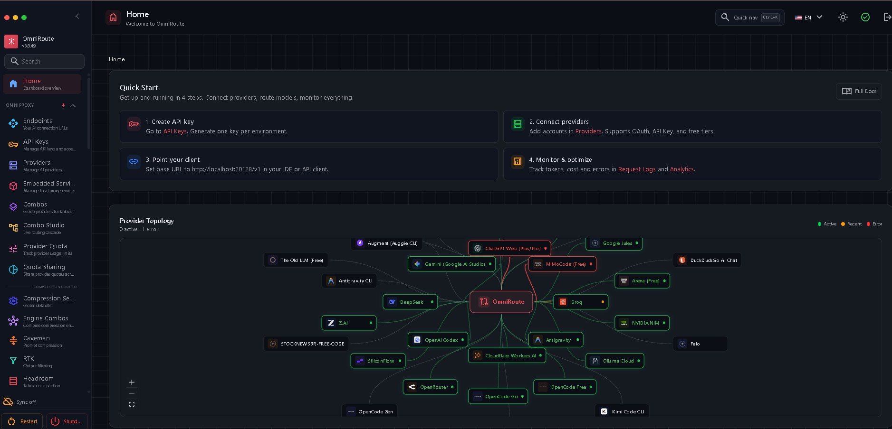
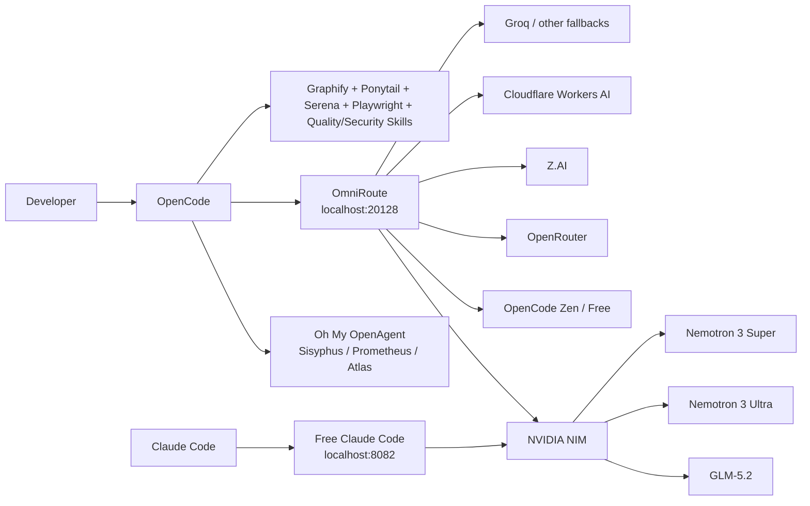
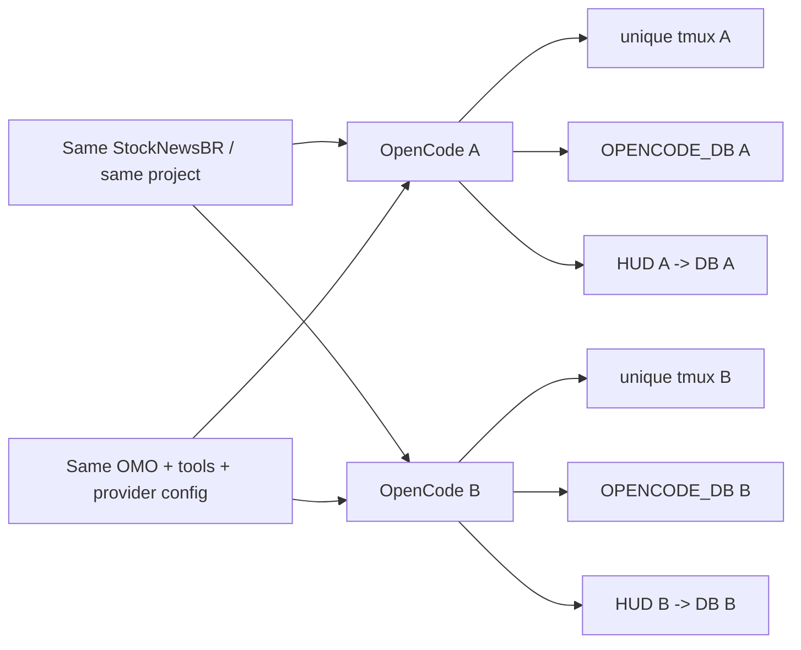
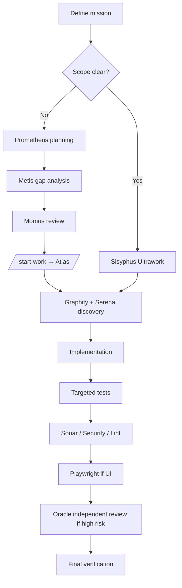

# Бесплатный AI-стек для кодинга: OpenCode + OmniRoute + NVIDIA NIM

<p align="center">
  <b>🌐 Documentation:</b><br>
  <a href="README.md">🇺🇸 English</a> ·
  <a href="README.pt-BR.md">🇧🇷 Português (Brasil)</a> ·
  <a href="README.es.md">🇪🇸 Español</a> ·
  🇷🇺 <b>Русский</b>
</p>

> Практичная, проверенная в бою конфигурация для запуска мощной среды AI-кодинга с **OpenCode как основной платформой кодинга**, **OmniRoute как локальным AI-шлюзом**, **бесплатными моделями или моделями free-tier как fallback'ами** и **NVIDIA NIM** для тяжёлых моделей, таких как **GLM-5.2** и **Nemotron 3 Ultra**.
>
> Последняя проверка: **2026-08-12** в окне релиза OmniRoute **v3.8.49 → v3.8.50**.



## Зачем существует это руководство

Этот репозиторий документирует конфигурацию, для доведения которой до надёжного состояния потребовалось много проб и ошибок, сбоев провайдеров, устаревших маршрутов моделей, проблем с rate limit, ошибок конфигурации и отладки.

Цель проста: избавить других разработчиков от этой боли.

**Хотите самый короткий путь? Начните с [QUICKSTART.md](QUICKSTART.md).**

Это **не** лаборатория бенчмарков, притворяющаяся, что каждый провайдер всегда стабилен. Это воспроизводимое полевое руководство, показывающее:

- что мы реально использовали;
- что работало от начала до конца;
- что было только настроено, но не подтверждено как надёжное;
- что ломалось и как мы это чинили;
- какие модели стоило использовать для кодинга и аудитов;
- как строить fallback'и, чтобы сбой одного провайдера не останавливал вашу работу;
- как сочетать OpenCode, Oh My OpenAgent, Graphify, Ponytail, Serena, Playwright, SonarQube и специализированные skills, не превращая окружение в пожирающий контекст хаос.
- как мы устранили зеркалирование терминалов OpenCode и добились, чтобы каждая параллельная сессия использовала свою базу SQLite и HUD токенов/контекста, сохраняя тот же проект и конфигурацию OMO.

## Протестированное окружение

| Слой | Конфигурация лаборатории |
|---|---|
| Host | Windows + WSL/Linux |
| Окружение Linux | WSL на базе Ubuntu |
| Node | 22.22.2 во время проверенной настройки OmniRoute |
| OmniRoute | Окно релиза v3.8.49 → v3.8.50 |
| Дашборд/API OmniRoute | `127.0.0.1:20128` / `/v1` |
| Основной клиент кодинга | OpenCode |
| Оркестрация | Oh My OpenAgent / Sisyphus Ultraworker |
| Опциональная совместимость с Claude | Free Claude Code на `127.0.0.1:8082` |

Архитектура **не** требует локального GPU NVIDIA. NVIDIA NIM в этом руководстве — это хостируемый API-провайдер; ваше локальное железо в основном влияет на нагрузки редактора/build/тестов, а не на инференс, размещённый у NVIDIA.

---

## Стек



### Два полезных пути

**Основной путь через OpenCode**

```text
OpenCode → OmniRoute → provider/model → automatic fallback → keep coding
```

**Путь совместимости с Claude Code**

```text
Claude Code → Free Claude Code (FCC) → NVIDIA NIM → GLM-5.2 / Nemotron
```

---

## Самый ценный результат: GLM-5.2 через NVIDIA NIM

GLM-5.2 стал одной из самых ценных моделей этой конфигурации для длительного кодинга, архитектуры, агентской работы и сложных рассуждений.

NVIDIA в настоящее время предоставляет `z-ai/glm-5.2` через бесплатный NIM-эндпоинт. NVIDIA называет его флагманской моделью с контекстом 1M для кодинга, рассуждений, использования инструментов и агентских рабочих процессов.

**Наша практическая оценка кодинга:** ★★★★★

Почему он заслужил эту оценку в данном стеке:

- отличное поведение в долгосрочных задачах;
- сильные рассуждения по кодовой базе;
- хорошее соответствие оркестрации в стиле Sisyphus;
- очень полезен для аудитов и архитектуры;
- большая окно контекста;
- доступен через OpenAI-совместимый эндпоинт NVIDIA;
- также может стоять за FCC, поэтому Claude Code может использовать его, не будучи привязанным к моделям Anthropic.


---

# 1. Что мы реально проверили

Оценки ниже — это **практические полевые оценки**, а не научные результаты бенчмарков. Они описывают полезность в рабочих процессах агентов кодинга: исследование репозитория, реализация, отладка, рефакторинг, аудиты, тесты и длительные задачи.

## Карта оценок моделей, проверенных в лаборатории

| Модель / маршрут | Путь провайдера | Кодинг | Рассуждения / аудит | Скорость | Лучшее применение | Статус в лаборатории |
|---|---|---:|---:|---:|---|---|
| **GLM-5.2** (`z-ai/glm-5.2`) | NVIDIA NIM | ★★★★★ | ★★★★★ | ★★★☆☆ | Крупные реализации, архитектура, длинные аудиты, сложные агентские задачи | ✅ От начала до конца |
| **Nemotron 3 Ultra 550B A55B** | NVIDIA NIM | ★★★★☆ | ★★★★★ | ★★★☆☆ | Глубокий аудит, архитектура, исследование длинного контекста | ✅ От начала до конца |
| **Nemotron 3 Super 120B A12B** | NVIDIA NIM | ★★★★☆ | ★★★★☆ | ★★★★☆ | Сильный универсальный fallback, кодинг, ревью | ✅ От начала до конца |
| **DeepSeek V4 Flash Free** | OpenCode Zen / OmniRoute | ★★★★☆ | ★★★★☆ | ★★★★★ | Быстрая реализация, исправления, ежедневный кодинг | ✅ От начала до конца; квота может колебаться |
| **Nemotron 3 Ultra Free** | OpenCode Zen / OmniRoute | ★★★★☆ | ★★★★★ | ★★★☆☆ | Аудиты, исследование, работа с большим объёмом рассуждений | ✅ От начала до конца |
| **Бесплатный маршрут Nemotron 3 Ultra** | OpenRouter → OmniRoute | ★★★★☆ | ★★★★★ | ★★★☆☆ | Резервирование провайдера для тяжёлых рассуждений | ✅ От начала до конца |
| **`auto/best-coding`** | Комбо OmniRoute | зависит от выбранной модели | зависит | зависит | Автоматический fallback, когда вы не хотите выбирать вручную | ✅ От начала до конца |
| **`auto/coding:free`** | Комбо OmniRoute | зависит от выбранной модели | зависит | зависит | Автоматический fallback кодинга с ориентиром на $0 | ✅ От начала до конца |

### Важно: не копируйте вслепую старые маршруты DeepSeek

Во время нашего тестирования в августе 2026 года **маршрут NVIDIA DeepSeek V4 Pro вернул ошибку в стиле EOL/410**. Более старый скриншот в этом руководстве всё ещё показывает его в override FCC, потому что этот скриншот зафиксировал окружение до очистки.

**Не используйте этот скриншот как рекомендуемую текущую конфигурацию.** Для пути NVIDIA предпочитайте GLM-5.2 или Nemotron 3 Super/Ultra.

---

# 2. Бесплатный каталог OpenCode

Текущая документация Zen в OpenCode перечисляет следующие бесплатные модели. Доступность для нескольких из них явно описана как ограниченная по времени, поэтому всегда запускайте `/models`, а не предполагайте, что этот список останется неизменным.


> **Примечание о скриншоте:** изображение выбора — это историческая запись из нашей лаборатории и включает модели, которые с тех пор ротировались. Таблица ниже соответствует текущей официальной документации Zen, проверенной 2026-08-12.

| Бесплатная модель OpenCode | Текущий официальный список Zen | Лично проверена в этом стеке | Рекомендация по кодингу |
|---|---:|---:|---|
| DeepSeek V4 Flash Free | ✅ | ✅ | ★★★★☆ — отличный быстрый вариант по умолчанию |
| MiMo-V2.5 Free | ✅ | Резервный маршрут | Полезная вторичная модель кодинга |
| North Mini Code Free | ✅ | Резервный маршрут | Лёгкий fallback кодинга; проверяйте перед критической работой |
| Nemotron 3 Ultra Free | ✅ | ✅ | ★★★★☆ кодинг / ★★★★★ аудит |
| Big Pickle | ✅ | Не оценена | Скрытная модель: не притворяйтесь, что знаете, что это такое |

> **Правило:** считайте модель "работающей" только после того, как реальный запрос completion завершится успешно. Появление модели в `/models` доказывает только обнаружение, а не успешный инференс.

> **Примечание о конфиденциальности:** несколько бесплатных моделей OpenCode — это явно временные оценочные эндпоинты, и текущая документация Zen в OpenCode говорит, что данные с некоторых бесплатных эндпоинтов могут использоваться для улучшения моделей/сервисов. Бесплатные эндпоинты NVIDIA — это пробные сервисы. Не отправляйте личные, конфиденциальные, производственные секреты или регулируемые данные только потому, что эндпоинт бесплатный.

---

# 3. Матрица валидации провайдеров

Эта таблица разделяет **настроено** и **проверено от начала до конца**. Это различие важно.

| Провайдер | Настроен в нашем окружении | Проверен от начала до конца | Надёжность/ценность в лаборатории | Роль free / free-tier | Примечания |
|---|---:|---:|---:|---|---|
| **NVIDIA NIM** | ✅ | ✅ | ★★★★★ | Основной тяжёлый бесплатный эндпоинт | GLM-5.2, Nemotron Ultra/Super |
| **OpenCode Zen / Free** | ✅ | ✅ | ★★★★★ | Основной бесплатный fallback кодинга | DeepSeek V4 Flash Free + Nemotron Free |
| **OpenRouter** | ✅ | ✅ | ★★★★☆ | Избыточные бесплатные маршруты | Полезный вторичный путь Nemotron |
| **Z.AI** | ✅ | ✅ для тестирования fallback | ★★★★☆ | Альтернативный путь GLM | Держите отдельно от маршрута NVIDIA |
| **Cloudflare Workers AI** | ✅ после исправления | ✅ с корректным Account ID | ★★★★☆ после исправления | Вторичный пул free-tier | Неверный/отсутствующий `accountId` вызывал ошибки 404/502 |
| **Groq** | ✅ | Настроен, не основной | Не оценён глубоко | Быстрый утилитарный провайдер | Полезен, но не централен для этого руководства |
| **Fireworks** | ✅ | Настроен, не основной | Не оценён глубоко | Опционально | Не называйте его бесплатным, если у вашего аккаунта реально нет бесплатной квоты |
| **Mistral** | ✅ | Настроен, не основной | Не оценён глубоко | Опционально | То же правило: проверьте ваш текущий план |
| **DeepSeek напрямую** | ✅ на скриншоте FCC | Не наш предпочтительный бесплатный путь | Не оценён | Опционально | В этой сборке предпочитайте OpenCode Free для V4 Flash |
| OpenCode Go | ✅ | ✅ | ★★★★★ ценность, но платно | **Платно**, не входит в бесплатное ядро | Опциональное недорогое улучшение |
| Gemini | ❌ в зафиксированной настройке FCC | — | — | — | Отсутствует ключ на скриншоте |
| Cerebras | ❌ в зафиксированной настройке FCC | — | — | — | Не входит в эту проверенную сборку |
| Kimi напрямую | ❌ в зафиксированной настройке FCC | — | — | — | Не входит в эту проверенную сборку |
| LM Studio | Offline | — | — | Локально | Опциональный локальный инференс |
| Ollama | Offline | — | — | Локально | Опциональный локальный инференс |
| llama.cpp | Offline | — | — | Локально | Опциональный локальный инференс |


## Дополнительные маршруты free-tier, которые мы успешно проверили

Это были полезные вторичные маршруты после исправления конфигурации конкретных провайдеров. Мы не ставим их так же высоко, как основную таблицу, потому что в этой лаборатории они получили меньше продолжительной работы с репозиторием.

| Модель / маршрут | Провайдер | Кодинг | Практическая роль | Статус в лаборатории |
|---|---|---:|---|---|
| **GLM-4.7 Flash** | Cloudflare Workers AI | ★★★★☆ | Быстрый резерв / утилитарный кодинг | ✅ Completion проверен после исправления Account ID |
| **Qwen2.5-Coder-32B-Instruct** | Cloudflare Workers AI | ★★★★☆ | Fallback кодинга | ✅ Completion проверен после исправления Account ID |
| **GPT-OSS-120B** | Cloudflare Workers AI | ★★★★☆ | Общие рассуждения / fallback кодинга | ✅ Completion проверен после исправления Account ID |
| **Nemotron 3 120B A12B** | Cloudflare Workers AI | ★★★★☆ | Вторичный маршрут семейства NVIDIA | ✅ Completion проверен после исправления Account ID |

Каталог и квоты free-tier Cloudflare могут меняться. Относитесь к этим маршрутам как к **известным хорошим лабораторным маршрутам от 2026-08-12**, а не как к обещанию постоянной бесплатной доступности.

---

# 4. Установка OmniRoute

OmniRoute — это шлюз. Он даёт остальной части стека один стабильный OpenAI-совместимый эндпоинт и управляет маршрутизацией моделей/провайдеров, fallback'ами, квотами, сжатием и мониторингом.

Официальный проект: [diegosouzapw/OmniRoute](https://github.com/diegosouzapw/OmniRoute)


## Требования

Используйте версию Node.js, поддерживаемую релизом OmniRoute, который вы устанавливаете. Для линии релизов v3.8.50 примечания upstream по устранению неполадок явно принимают Node `>=22.22.2 <23` (наряду с поддерживаемыми диапазонами Node 20/24). Наша проверенная настройка WSL использовала Node 22.22.2.

Проверьте:

```bash
node --version
npm --version
```

## Установка

```bash
npm install -g omniroute
omniroute
```

Или с pnpm:

```bash
pnpm add -g omniroute@latest --allow-build=better-sqlite3 --allow-build=@swc/core
omniroute
```

Дашборд:

```text
http://localhost:20128
```

OpenAI-совместимый API:

```text
http://localhost:20128/v1
```

## Первые проверки работоспособности

```bash
curl -I http://127.0.0.1:20128
ss -ltnp | grep ':20128'
omniroute doctor
```

Если вы создали клиентский ключ API OmniRoute:

```bash
curl http://127.0.0.1:20128/v1/models \
  -H "Authorization: Bearer $OMNIROUTE_API_KEY"
```

Полную настройку и инструкции по systemd см. в [docs/02-omniroute.md](docs/02-omniroute.md).

---

# 5. Настройка NVIDIA NIM

Официальный базовый URL эндпоинта NVIDIA:

```text
https://integrate.api.nvidia.com/v1
```

Создайте ключ в NVIDIA Build, затем экспортируйте его локально:

```bash
export NVIDIA_API_KEY="YOUR_NVIDIA_KEY"
```

Никогда не коммитьте это значение.

## Прямой smoke-тест GLM-5.2

```bash
curl https://integrate.api.nvidia.com/v1/chat/completions \
  -H "Authorization: Bearer $NVIDIA_API_KEY" \
  -H "Content-Type: application/json" \
  -d '{
    "model": "z-ai/glm-5.2",
    "messages": [{"role":"user","content":"Reply with exactly: GLM52_OK"}],
    "max_tokens": 32
  }'
```

## Smoke-тест Nemotron Ultra

```bash
curl https://integrate.api.nvidia.com/v1/chat/completions \
  -H "Authorization: Bearer $NVIDIA_API_KEY" \
  -H "Content-Type: application/json" \
  -d '{
    "model": "nvidia/nemotron-3-ultra-550b-a55b",
    "messages": [{"role":"user","content":"Reply with exactly: NEMOTRON_OK"}],
    "max_tokens": 32
  }'
```

Если прямые вызовы к NVIDIA работают, а вызовы через OmniRoute падают, проблема в слое шлюза/провайдера — а не в вашем аккаунте NVIDIA.

Чтобы повторно проверить все три рекомендуемые модели NVIDIA и вывести таблицу Markdown PASS/FAIL:

```bash
./scripts/validate-nvidia-models.sh
```

См. [docs/03-nvidia-nim.md](docs/03-nvidia-nim.md).

---

# 6. Сборка комбо fallback кодинга OmniRoute

Основная идея — **резервирование провайдера**. Не ставьте длительную сессию кодинга на один маршрут.

Полезная схема приоритетов:

```text
1. NVIDIA → GLM-5.2
2. OpenRouter → Nemotron 3 Ultra free
3. OpenCode Free → DeepSeek V4 Flash Free
4. OpenCode Zen alternate DeepSeek route
5. NVIDIA → Nemotron 3 Super
6. auto/coding:free
7. auto/best-coding
```

Почему этот порядок хорошо работает:

- GLM-5.2 справляется со сложной работой;
- Nemotron Ultra — отличный fallback для аудита/рассуждений;
- DeepSeek V4 Flash поддерживает скорость ежедневного кодинга;
- Nemotron Super — сбалансированный fallback NVIDIA;
- автоматические маршруты OmniRoute — финальная страховочная сеть.

**Не** переиспользуйте вслепую ID провайдеров/моделей с другой машины. Используйте ID моделей, возвращённые вашим собственным запросом:

```bash
curl http://127.0.0.1:20128/v1/models \
  -H "Authorization: Bearer $OMNIROUTE_API_KEY"
```

Префиксы провайдеров могут различаться между OmniRoute, FCC и прямыми API провайдеров.

Вы можете проверить любые кандидатные маршруты реальными completions и вывести таблицу Markdown:

```bash
./scripts/validate-omniroute-models.sh \
  auto/coding:free \
  auto/best-coding \
  YOUR_OTHER_ROUTE_ID
```

Это самый безопасный способ сохранить честность таблицы "работает" в README после обновлений провайдеров.

---

# 7. Использование OpenCode как основной платформы кодинга


Установка OpenCode:

```bash
curl -fsSL https://opencode.ai/install | bash
```

Для Windows это руководство использует **WSL**, потому что именно эту среду мы реально проверили от начала до конца. Нативный Windows может работать, но команды и управление сервисами ниже предполагают Linux/WSL.

## Подключение OpenCode напрямую к OmniRoute

OpenCode поддерживает кастомные OpenAI-совместимые провайдеры.

Создайте или объедините это в `~/.config/opencode/opencode.json`:

```json
{
  "$schema": "https://opencode.ai/config.json",
  "provider": {
    "omniroute": {
      "npm": "@ai-sdk/openai-compatible",
      "name": "OmniRoute",
      "options": {
        "baseURL": "http://127.0.0.1:20128/v1",
        "apiKey": "{env:OMNIROUTE_API_KEY}"
      },
      "models": {
        "auto/best-coding": {
          "name": "OmniRoute Best Coding"
        },
        "auto/coding:free": {
          "name": "OmniRoute Free Coding"
        }
      }
    }
  }
}
```

Затем:

```bash
export OMNIROUTE_API_KEY="YOUR_OMNIROUTE_CLIENT_KEY"
opencode
```

Внутри OpenCode:

```text
/models
```

### Настройка OpenCode Free / Zen напрямую

Держите прямой путь OpenCode Free, даже если OmniRoute — ваш основной шлюз. Он даёт полезный аварийный маршрут, когда конфигурация шлюза/провайдера чинится.

```text
/connect
```

Выберите **OpenCode Zen**, завершите поток аккаунта/ключа API, затем:

```text
/models
```

Выберите модель с пометкой **Free** и отправьте реальный крошечный completion. В этой сборке **DeepSeek V4 Flash Free** был нашим быстрым выбором для кодинга, а **Nemotron 3 Ultra Free** — более сильным выбором для аудита/рассуждений. Бесплатный каталог изменчив, поэтому используйте текущий селектор, а не старый скриншот.

Если вы предпочитаете не хранить клиентский ключ OmniRoute в переменной окружения, используйте поток `/connect` OpenCode и убедитесь, что ID кастомного провайдера совпадает с `omniroute`.

### Почему здесь front end — OpenCode

OpenCode дал нам:

- чистый терминальный UX кодинга;
- кастомные OpenAI-совместимые провайдеры;
- плагины;
- поддержку MCP;
- переключение моделей;
- агентов;
- лёгкую интеграцию с Oh My OpenAgent;
- возможность держать OmniRoute за одним локальным эндпоинтом.

См. [docs/04-opencode.md](docs/04-opencode.md).

---

# 8. Добавление Oh My OpenAgent и Sisyphus Ultraworker


Oh My OpenAgent превращает OpenCode из инструмента кодинга с одним агентом в среду мультиагентной оркестрации.

Установка:

```bash
bunx oh-my-openagent install
```

**Позвольте установщику зарегистрировать плагин OpenCode за вас.** Проект находится в переходном периоде переименования/совместимости: текущая конфигурация OpenCode предпочитает запись плагина `oh-my-openagent`, тогда как старые записи `oh-my-opencode` всё ещё могут появляться. Не вставляйте вслепую устаревшее имя плагина из старого dotfile; запустите установщик, а затем проверьте с помощью:

```bash
bunx oh-my-openagent doctor --verbose
```

Затем запустите OpenCode и используйте:

```text
ultrawork
```

или:

```text
ulw
```

## Агенты, которые имеют значение

| Агент | Роль | Когда использовать | Почему это важно |
|---|---|---|---|
| **Sisyphus — Ultraworker** | Основной оркестратор | Чётко определённые миссии, аудиты, исправления, реализация | Планирует/делегирует/выполняет и продолжает вести к завершению |
| **Hephaestus** | Автономный глубокий воркер | Задачи, ориентированные на цель, требующие исследования + выполнения от начала до конца | Хорош, когда вы хотите, чтобы воркер владел задачей, а не следовал рецепту |
| **Prometheus — Plan Builder** | Стратегический планировщик | Большая, неоднозначная или критическая работа | Интервьюирует для выяснения требований и уточняет объём до изменений кода |
| **Atlas — Plan Executor** | Выполняет планы Prometheus | Большие одобренные планы | Запускает `/start-work`, систематически работает по спланированным задачам |
| **Oracle** | Read-only консультант с высоким IQ | Архитектура, безопасность, сложная отладка | Независимое второе мнение без касания кода |
| **Explore** | Быстрое исследование репозитория | Поиск символов, паттернов, вызывающих кода | Экономит токены по сравнению с чтением всего |
| **Librarian** | Внешняя документация / исследование OSS | API, поведение фреймворков, примеры реализации | Обосновывает изменения текущей документацией и внешними доказательствами |
| **Metis** | Консультант по планам / анализ пробелов | Перед финализацией сложных планов | Находит отсутствующие требования, допущения и крайние случаи |
| **Momus** | Критик планов / рецензент | Валидация планов и результатов | Требует явных критериев успеха и доказательств |
| **Multimodal Looker** | Визуальный специалист | Скриншоты, диаграммы, артефакты UI | Добавляет понимание изображений/PDF к инженерной работе |
| **Sisyphus-Junior** | Исполнитель делегированной категории | Малые ограниченные подзадачи, порождённые оркестрацией | Выполняет сфокусированное поручение без рекурсивных циклов делегирования |

Текущий Oh My OpenAgent также внедряет полезные runtime MCP/инструменты: веб-поиск, поиск документации, поиск публичного кода, LSP-инструменты и локальный граф кода. Эти внедрённые плагинами MCP могут **не** отображаться в статическом `mcp list` OpenCode; используйте команду doctor из OmO, чтобы проверить, что реально активно.

### Практическое сопоставление агентов бесплатного стека

Текущая конфигурация OmO поддерживает переопределения моделей для каждого агента в `~/.omo/omo.jsonc`. Полезная отправная точка для этой архитектуры:

```jsonc
{
  "agents": {
    "sisyphus": {
      "model": "omniroute/auto/best-coding",
      "fallback_models": [
        "opencode/nemotron-3-ultra-free",
        "opencode/deepseek-v4-flash-free"
      ]
    },
    "oracle": {
      "model": "opencode/nemotron-3-ultra-free"
    },
    "explore": {
      "model": "opencode/deepseek-v4-flash-free"
    },
    "librarian": {
      "model": "opencode/deepseek-v4-flash-free"
    }
  }
}
```

Это лучше всего работает, когда ваше комбо `auto/best-coding` в OmniRoute ставит **NVIDIA GLM-5.2 первым**. Тогда Sisyphus получает тяжёлый путь для сложной работы, Explore/Librarian используют более быстрые бесплатные модели, а Oracle получает бесплатную модель, ориентированную на рассуждения.

**Не копируйте ID моделей вслепую.** Сначала подтвердите точные ID провайдеров/моделей, которые показывает `/models` в OpenCode на вашей машине. Включённый [`examples/omo.free-stack.example.jsonc`](examples/omo.free-stack.example.jsonc) — это шаблон, а не универсальная конфигурация.

### Наше рабочее правило

```text
Clear task → Sisyphus
Large/ambiguous task → Prometheus → /start-work → Atlas
Hard architecture/debugging → Oracle
Repository discovery → Explore + Graphify + Serena
```

### Почему это имело значение в реальных аудитах

Самым большим улучшением стало не то, что одна модель вдруг стала идеальной. Это было **разделение труда**:

- исследование могло выполняться отдельно от реализации;
- архитектурный консультант мог оставаться read-only;
- планировщик мог добиваться ясности объёма;
- выполнение могло происходить после рецензирования плана;
- независимое ревью и тестирование могли происходить после реализации;
- fallback'и провайдеров поддерживали рабочий процесс, когда одна модель упиралась в квоту или падала.

Эта комбинация существенно улучшила длинные аудиты репозиториев, потому что уменьшила классический режим отказа, когда один гигантский контекст агента пытается сам искать, рассуждать, редактировать, тестировать и помнить всё.

См. [docs/05-omo-agents.md](docs/05-omo-agents.md).

---

# 9. Добавление Graphify, Ponytail и Serena

Эти три инструмента решают разные задачи. Они дополняют друг друга.

## Graphify — понимание кодовой базы как графа

Graphify парсит код локально в граф знаний и может отвечать на вопросы об архитектуре/зависимостях без повторного grep по всему репозиторию.

Установите CLI, затем предпочтите **интеграцию OpenCode с областью проекта**:

```bash
uv tool install graphifyy
graphify install --project --platform opencode
```

Постройте граф внутри OpenCode:

```text
/graphify .
```

Затем сделайте граф-подсказки постоянными для этого проекта:

```bash
graphify opencode install --project
```

Применение высокой ценности:

```text
Which modules call this function?
What tests cover this code path?
What components depend on this provider?
Show the path from API route → service → database.
```

### Одно исправление, которое стоит знать

Пути глобальной интеграции OpenCode менялись между версиями Graphify/OpenCode. Если Graphify установлен, но OpenCode его никогда не использует, предпочтите **установку локально в проект** и убедитесь, что сгенерированные файлы `AGENTS.md` / плагина OpenCode действительно находятся внутри вашего проекта.

## Ponytail — дисциплина YAGNI / маленьких диффов

Объедините Ponytail в существующий массив `plugin` в `opencode.json`:

```json
{
  "plugin": ["@dietrichgebert/ponytail"]
}
```

Если Oh My OpenAgent уже установлен, **сохраните запись плагина, созданную установщиком**, и добавьте Ponytail; не заменяйте весь массив плагинов однострочным примером выше.

Ponytail укрепляет очень ценное инженерное поведение: **не стройте больше, чем требует задача**.

На практике он помог нам подталкивать агентов к:

- меньшим диффам;
- переиспользованию вместо дублирующих абстракций;
- меньшей спекулятивной архитектуре;
- меньшему числу ненужных вспомогательных слоёв;
- явным решениям YAGNI.

## Serena — семантическая навигация по коду

Serena даёт агенту кодинга IDE-подобный семантический поиск: поиск символов, ссылки, объявления и структурированное редактирование.

Это особенно полезно на зрелых репозиториях, где обычный текстовый grep даёт слишком много шума.

### Рекомендуемое разделение труда

```text
Graphify → dependency/architecture map
Serena   → symbol-level semantic navigation
Explore  → fast broad search
Ponytail → keep the eventual fix small
```

Такая комбинация может сэкономить много контекста.

См. [docs/06-tools-and-plugins.md](docs/06-tools-and-plugins.md).

---

# 10. Специализированные skills и MCP, принёсшие реальную ценность

Мы не устанавливали случайные инструменты только потому, что они существуют. Полезный стек был организован вокруг **производительности, безопасности, баз данных, бэкенда, TypeScript, качества UI, тестирования и качества кода**.

## Стек инструментов высокой ценности

| Инструмент / skill | Что добавляет | Где помог больше всего |
|---|---|---|
| **NVIDIA SkillSpector** | Сканирует skills агентов на безопасность перед доверием к ним | Снижает риск supply chain от случайных skills |
| **Playwright MCP** | Автоматизация браузера и структурированное взаимодействие с браузером | Сквозная валидация UI и ревью живого сайта |
| **SonarQube MCP / плагины агентов** | Баги, уязвимости, code smells, quality gates | Независимая проверка качества/безопасности |
| **Vercel React Best Practices** | Паттерны производительности React/Next | Аудиты производительности фронтенда |
| **Vercel Web Design Guidelines** | Проверки UI, доступности, производительности, UX | Визуальное/фронтенд-ревью |
| **FastAPI / Python specialist** | Руководство по реализации под FastAPI | Архитектура бэкенда и корректность API |
| **Database optimizer** | Рассуждения о запросах/схемах/индексах | Работа с PostgreSQL и производительностью |
| **Performance engineer** | Профилирование и исследование производительности | Миссии надёжности/производительности |
| **Error detective** | Систематическая отладка | Сложные сбои runtime |
| **TypeScript specialist** | Экспертиза TypeScript/Next.js | Исправления фронтенда/системы типов |
| **Security Reviewer** | Ревью секретов, инъекций и небезопасного выполнения | Аудиты безопасности |
| **AST Tech Debt Scanner** | Структурное обнаружение технического долга | Обнаружение при рефакторинге/аудите |
| **Brooks-Lint** | Инженерная дисциплина / lint | Снижение излишней сложности |
| **env-doctor** | Диагностика окружения | Отладка несоответствий зависимостей/runtime |

## Полный инвентарь: инструменты, которые мы реально установили, проверили или держим в рабочем стеке

Это та часть, которую мы хотели бы иметь, когда начинали. Таблица ниже разделяет **что реально использовалось/проверялось в нашем окружении** и опциональные предложения экосистемы. Не читайте "установлено" как "должно быть включено в каждой сессии": несколько MCP и skills загружаются намеренно только тогда, когда миссия в них нуждается.

### Основная оркестрация OpenCode / OMO

| Компонент | Тип | Валидация / использование | Что это дало нам |
|---|---|---|---|
| **Oh My OpenAgent (OMO)** | Плагин агента/оркестрации OpenCode | ✅ Использовался постоянно | Делегирование агентов, разделение планирования/выполнения, маршрутизация специалистов |
| **Sisyphus — Ultraworker** | Основной агент OMO | ✅ Основной рабочий агент | Прямая реализация, аудиты, исправления, оркестрация |
| **Prometheus — Plan Builder** | Агент OMO | ✅ Использовался для больших/неоднозначных миссий | Превращает расплывчатую миссию в явный план реализации |
| **Atlas — Plan Executor** | Агент OMO | ✅ Использовался после планирования | Выполняет одобренные планы Prometheus через `/start-work` |
| **Oracle** | Консультант OMO | ✅ Использовался | Read-only второе мнение для архитектуры/отладки/высокорисковых находок |
| **Explore** | Поисковый агент OMO | ✅ Интенсивно использовался | Быстрое обнаружение в репозитории без сжигания контекста основного агента |
| **Librarian** | Исследовательский агент OMO | ✅ Использовался там, где важна внешняя документация | Исследование документации / OSS отдельно от реализации |
| **Metis** | Консультант по планированию OMO | ✅ Использовался в процессе планирования | Анализ пробелов/допущений/крайних случаев |
| **Momus** | Критик OMO | ✅ Использовался в процессе ревью планов | Оспаривает полноту плана и критерии доказательства |
| **Multimodal Looker** | Визуальный агент OMO | ✅ Путь зрения проверен | Скриншоты, артефакты UI и визуальная инспекция |
| **Sisyphus-Junior** | Делегированный воркер OMO | ✅ Доступен/использовался для ограниченного делегирования | Малые ограниченные подзадачи без рекурсивной оркестрации |
| **Hephaestus** | Автономный воркер OMO | ◐ Доступен в стеке | Полезный автономный глубокий воркер; не обязателен для основной рецептуры |

### Слой понимания кода и "маленького безопасного диффа"

| Инструмент | Тип | Валидация / использование | Почему остался |
|---|---|---|---|
| **Graphify** | Skill OpenCode / локальный граф кода | ✅ Установлен и использовался как помощник архитектуры/зависимостей | Рассуждения о вызывающих/вызываемых и blast radius; снижает слепое чтение всего репозитория |
| **Serena** | MCP | ✅ Подключён и использовался | Навигация по символам/ссылкам/объявлениям и точный поиск кода |
| **Ponytail** | Плагин/правила OpenCode | ✅ Установлен/настроен; проверьте активный профиль | YAGNI, переиспользование, давление в сторону минимального безопасного диффа, анти-overengineering |
| **codegraph** | Инструмент графа кода OMO/runtime | ✅ Подключён в рабочих сессиях | Лёгкий локальный контекст графа кода; **отдельно от Graphify** |
| **LSP tooling** | Инструмент OMO/runtime | ✅ Подключён в рабочих сессиях | Диагностика символов/типов от language server |
| **grep_app** | Поисковый инструмент OMO/runtime | ✅ Подключён в рабочих сессиях | Быстрый поиск публичного кода / паттернов |
| **websearch (Exa)** | Исследовательский инструмент OMO/runtime | ✅ Подключён в рабочих сессиях | Актуальные внешние исследования без загрязнения контекста реализации |
| **Context7** | Инструмент документации OMO/runtime | ✅ Подключён в рабочих сессиях | Актуальный поиск документации библиотек/фреймворков |
| **TradingView** | Проектный MCP/инструмент | ✅ Подключён в наших сессиях StockNewsBR | Исследование рынка/домена; опционально для общих стеков кодинга |

> **Graphify vs `codegraph`:** это не одно и то же. В нашем стеке `codegraph` мог внедряться слоем инструментов OMO/runtime, тогда как Graphify был отдельно установленным проектным граф-процессом. Сохраняйте это различие при устранении неполадок.

### Пакет специалистов, который мы проверили и сохранили

| Точный skill / инструмент | Тип | Валидация / использование | Лучшее применение |
|---|---|---|---|
| **NVIDIA SkillSpector** | Инструмент безопасности | ✅ Установлен/проверен | Сканировать сторонние skills агентов перед доверием к ним |
| **ws-fastapi-pro** | Специализированный skill | ✅ Установлен/использован | Архитектура FastAPI, внедрение зависимостей, корректность API |
| **ws-database-optimizer** | Специализированный skill | ✅ Установлен/использован | SQL/PostgreSQL запросы, индексы, схемы и конкурентность |
| **ws-performance-engineer** | Специализированный skill | ✅ Установлен/использован | Исследования производительности и узкие места надёжности |
| **ws-error-detective** | Специализированный skill | ✅ Установлен/использован | Структурированная отладка первопричины |
| **ws-typescript-pro** | Специализированный skill | ✅ Установлен/использован | Работа с типами и архитектурой TypeScript/Next.js |
| **Vercel React Best Practices** | Agent skill | ✅ Установлен/проверен | Ревью производительности и рендеринга React/Next |
| **Vercel Web Design Guidelines** | Agent skill | ✅ Установлен/проверен | Ревью UI/UX/доступности/дизайна |
| **Playwright MCP** | MCP | ✅ Подключён/использован | Доказательства на уровне браузера и E2E-валидация |
| **SonarQube MCP / плагины агентов** | MCP / инструменты качества | ✅ Использовался в процессе аудита | Независимые доказательства багов/уязвимостей/code smells/quality gates |

### Арсенал аудита/ревью, который мы использовали

| Точное имя | Тип | Валидация / использование | Назначение |
|---|---|---|---|
| **code-reviewer** | Skill ревью | ✅ Установлен/использован | Независимое структурированное ревью кода |
| **code-review** | Skill ревью | ✅ Установлен/использован | Второй стиль ревью / read-only проход ревью |
| **Security Reviewer** | Skill безопасности | ✅ Установлен/использован | Секреты, инъекции, небезопасные subprocess/eval, опасные веб-паттерны |
| **AST Tech Debt Scanner** | Skill/скрипт статического анализа | ✅ Установлен/использован | Структурный долг и подозрительные паттерны |
| **Brooks-Lint** | Skill инженерной дисциплины | ✅ Установлен/использован | Давление сложности и ревью анти-overengineering |
| **env-doctor** | Skill окружения | ✅ Установлен/использован | Диагностика несоответствий runtime/зависимостей/окружения |
| **codex-grade-coding** | Skill кодинга/аудита | ✅ Часть проверенного арсенала | Процесс кодинга и ревью с более высокой дисциплиной |
| **Source-Driven Development** | Skill рабочего процесса | ✅ Часть проверенного арсенала | Обоснование изменений доказательствами источника вместо догадок |
| **Debugging & Error Recovery** | Skill рабочего процесса | ✅ Часть проверенного арсенала | Дисциплина отладки: сначала воспроизведение, затем восстановление |

### Проектные skills, оказавшиеся полезными в StockNewsBR

Это примеры **слоя кастомных skills**, а не зависимостей, которые стоит устанавливать всем:

- **stocknewsbr-ai-regression** — проверки регрессий AI/провайдера;
- **security-and-hardening** — проектные инварианты безопасности и руководство по усилению;
- **documentation-and-adrs** — дисциплина документации и архитектурных решений;
- **graphify** — проектное руководство по граф-ориентированному обнаружению;
- **ponytail** — проектные правила YAGNI/переиспользования/маленьких диффов.

### Инструменты аудита на стороне Gemini, которые мы тоже использовали

Часть нашего аудиторского стека работала из Gemini, а не из OpenCode. Они включены сюда, потому что существенно улучшили независимую проверку, но их **не** следует представлять как нативные плагины OpenCode, если вы не настроите их там отдельно:

- **Gemini Docs MCP** — актуальная документация Gemini/API;
- **code-reviewer** и **code-review**;
- **Security Reviewer**;
- **SonarQube MCP**;
- **AST Tech Debt Scanner**;
- **Brooks-Lint**;
- **env-doctor**.

Рабочий принцип был прост: **одной модели не должно быть позволено искать, реализовывать и затем оценивать собственную работу без независимых доказательств.**

## Установка опционального пакета инструментов

### Семантическая навигация Serena

Объедините это в существующий объект `mcp` в OpenCode:

```jsonc
{
  "mcp": {
    "serena": {
      "type": "local",
      "command": [
        "uvx",
        "--from",
        "git+https://github.com/oraios/serena",
        "serena",
        "start-mcp-server",
        "--context",
        "opencode"
      ],
      "enabled": true
    }
  }
}
```

### Playwright MCP

```jsonc
{
  "mcp": {
    "playwright": {
      "type": "local",
      "command": ["npx", "-y", "@playwright/mcp@latest"],
      "enabled": true
    }
  }
}
```

Отключайте его, когда миссии не нужен браузер; каждый постоянно включённый MCP имеет стоимость контекста.

### NVIDIA SkillSpector

```bash
uv tool install git+https://github.com/NVIDIA/skillspector.git
skillspector scan ./path/to/skill --no-llm
```

Используйте семантическое сканирование только после того, как решите, какому внешнему провайдеру разрешено получать содержимое skills.

### Vercel React/UI skills

```bash
npx skills add vercel-labs/agent-skills
```

Выберите skills React Best Practices и Web Design, которые вам действительно нужны.

### Специализированные агенты/skills wshobson для OpenCode

```bash
gh repo clone wshobson/agents ~/agents
cd ~/agents
make install-opencode
```

Просмотрите установленный каталог и вызывайте доменных специалистов выборочно, а не загружайте весь marketplace в каждую задачу.

### SonarQube MCP

Храните учётные данные в переменных окружения, никогда в Git:

```bash
export SONARQUBE_TOKEN="YOUR_TOKEN"
export SONARQUBE_ORG="YOUR_ORGANIZATION"
```

Пример, готовый к merge, для Serena, Playwright и SonarQube включён в:

```text
examples/opencode.mcp-tools.example.jsonc
```

Полные заметки по установке/настройке — в [docs/06-tools-and-plugins.md](docs/06-tools-and-plugins.md).

### Главный урок

Не загружайте каждый skill в каждую задачу. Используйте **прогрессивное раскрытие**:

```text
Security mission  → Security Reviewer + SonarQube + SkillSpector
Performance       → performance engineer + DB optimizer + Graphify
FastAPI backend   → FastAPI specialist + Serena + tests
Next.js UI        → TypeScript + React Best Practices + Web Design + Playwright
Architecture      → Oracle + Graphify + Serena
Minimal bug fix   → Explore + Serena + Ponytail
```

Именно здесь стек инструментов принёс больше всего пользы в серьёзных аудитах: один агент/инструмент обнаруживает проблему, другой реализует точечно, а независимые инструменты доказывают результат вместо того, чтобы доверять одной модели искать, редактировать и оценивать себя саму.

---

# 11. Free Claude Code + NVIDIA NIM

Free Claude Code (FCC) — это прокси, сохраняющий клиентский рабочий процесс Claude Code, но маршрутизирующий запросы к другим провайдерам.

Официальный проект: [Alishahryar1/free-claude-code](https://github.com/Alishahryar1/free-claude-code)

Установка на Linux/macOS:

```bash
curl -fsSL "https://raw.githubusercontent.com/Alishahryar1/free-claude-code/main/scripts/install.sh" | sh
```

Запуск:

```bash
fcc-server
```

Админ-UI обычно открывается по адресу:

```text
http://127.0.0.1:8082/admin
```

Вставьте ваш `NVIDIA_NIM_API_KEY`, нажмите **Validate**, затем **Apply**.


## Рекомендуемая текущая маршрутизация моделей

Скриншот ниже показывает более раннюю конфигурацию. Сейчас мы бы заменили устаревшие override'ы DeepSeek NVIDIA.


Рекомендуемая отправная точка:

| Уровень FCC | Рекомендуемый маршрут |
|---|---|
| Default | `nvidia_nim/z-ai/glm-5.2` |
| Opus override | `nvidia_nim/nvidia/nemotron-3-ultra-550b-a55b` |
| Sonnet override | `nvidia_nim/z-ai/glm-5.2` |
| Haiku override | `nvidia_nim/nvidia/nemotron-3-super-120b-a12b` |

Thinking:

- Глобальное thinking: включено
- Opus: включено
- Sonnet: включено
- Haiku: выключено или консервативно

Затем запустите Claude Code через FCC:

```bash
fcc-claude
```

Или выберите модель явно:

```bash
fcc-claude --model "nvidia_nim/z-ai/glm-5.2"
```

См. [docs/07-fcc-nvidia.md](docs/07-fcc-nvidia.md).

---

# 12. Стабильные настройки runtime

Наш зафиксированный runtime FCC использовал:

| Настройка | Использованное значение |
|---|---:|
| Provider rate limit | 3 |
| Provider rate window | 5 |
| Provider max concurrency | 3 |
| HTTP read timeout | 900 s |
| HTTP write timeout | 120 s |
| HTTP connect timeout | 30 s |
| Port | 8082 |


### Улучшение безопасности

На скриншоте в качестве хоста сервера используется `0.0.0.0`. Это полезно, когда вам намеренно нужен доступ LAN/контейнера, но для обычной настройки одной машины предпочтительнее:

```text
127.0.0.1
```

Не открывайте ваш локальный AI-шлюз для сети, если точно не знаете, зачем вам это нужно.

---

# 13. Изоляция мультисессий OpenCode: ноль зеркалирования + честные счётчики на сессию

Один из самых неприятных багов, с которыми мы столкнулись, не имел никакого отношения к модели ИИ: открытие второго терминала OpenCode могло выглядеть как **зеркалирование** первого.

Подтверждённой причиной был кастомный recovery-обёртка tmux, подключающаяся к управляемой сессии `oc-*`, которая уже была подключена. Критическим исправлением было:

```bash
if [[ "$attached" != "0" ]]; then
  continue
fi
```

Затем мы также ужесточили изоляцию состояния. Каждая параллельная сессия OpenCode получает свой путь к SQLite через `OPENCODE_DB`, а кастомный HUD токенов/контекста читает **именно эту же базу**.

Мы также использовали опциональный **счётчик контекста внутри TUI** (🧠 строка прогресса/статуса), чтобы давление контекста было видно внутри каждого экрана OpenCode. Этот счётчик измеряет использование контекста сессии — **не потребление rate limit провайдера**. Паттерн реализации/тестирования на уровне исходного кода задокументирован в deep-dive.

### Как выглядят раздельные счётчики на практике


Эта запись с нашей рабочей станции показывает три клиента агентов кодинга рядом: **Gemini**, сессию **Codex** и **OpenCode + Oh My OpenAgent / Sisyphus Ultraworker**. Каждый UI отображает контекст по-разному, и именно поэтому мы **не** трактуем видимый процент или количество токенов как универсальную квоту провайдера.

Полезное правило простое: **счётчик должен принадлежать той сессии, на которую вы смотрите**. Для параллельных терминалов OpenCode это означает, что процесс OpenCode и его HUD должны ссылаться на один и тот же посиссионный `OPENCODE_DB`; разные терминалы OpenCode должны ссылаться на разные файлы базы.



Два инварианта:

```text
inside one terminal:    process DB == HUD DB
between two terminals:  session A DB != session B DB
```

Это даёт полный результат:

**независимые сессии + независимые базы + индивидуальные счётчики + тот же проект + тот же OMO + ноль зеркалирования.**

Включён read-only диагностический скрипт:

```bash
bash scripts/verify-opencode-session-isolation.sh
```

Полное описание: [docs/13-opencode-session-isolation.md](docs/13-opencode-session-isolation.md).

---

# 14. Исправления, сэкономившие больше всего времени

## Исправление 1 — Разделяйте "модель обнаружена" и "модель реально работает"

Всегда тестируйте completion.

```bash
curl http://127.0.0.1:20128/v1/models ...
```

— это только обнаружение.

Реальный `POST /v1/chat/completions` доказывает инференс.

## Исправление 2 — Никогда не зависьте от одного провайдера

Красивая модель бесполезна, когда её провайдер в cooldown, с ограниченной квотой, неправильно настроен или временно лежит.

Используйте комбо.

## Исправление 3 — Cloudflare нужен реальный Account ID

Мы видели сбои в стиле 404/502, когда специфичные данные провайдера Workers AI отсутствовали или имели невалидный account ID.

Используйте реальный Account ID Cloudflare и перетестируйте список моделей и completion.

## Исправление 4 — Старые ID моделей NVIDIA могут умирать

DeepSeek V4 Pro был реальным примером в нашем окружении. Он работал, а затем стал невалидным маршрутом.

**Урок:** ID моделей — не постоянная инфраструктура.

## Исправление 5 — Держите GLM-маршруты независимыми

Если GLM-5.2 доступен у NVIDIA и Z.AI, держите их как отдельные маршруты провайдеров. Это реальное резервирование, а не два алиаса, указывающих на один upstream.

## Исправление 6 — Используйте инструменты с малым контекстом перед сырым чтением репозитория

Graphify + Serena + Explore резко снижают потребность в широком поведении `grep/find/read-everything`.

## Исправление 7 — Добавьте слой YAGNI

Ponytail оказался ценным, потому что мощные агенты обожают создавать инфраструктуру. Инженерное правило уровня senior "переиспользуй, минимальный дифф, не изобретай абстракции" удивительно эффективно.

## Исправление 8 — Аудируйте сами инструменты агента

Установка случайного `SKILL.md` может фактически добавить доверенные инструкции вашему агенту кодинга. SkillSpector дал нам формальную контрольную точку перед доверием к новым skills.

## Исправление 9 — Проверка в браузере лучше, чем "выглядит правильно в коде"

Playwright MCP сделал фронтенд-работу гораздо надёжнее, потому что агент мог проверить поведение в реальном браузере.

## Исправление 10 — Независимые quality gates имеют значение

SonarQube, тесты, линтеры и ревью безопасности ловили проблемы, которые успешный агент реализации мог пропустить.

## Исправление 11 — Не путайте клиентский ключ OmniRoute с ключами провайдеров

В OmniRoute два разных слоя учётных данных:

```text
Provider credential -> OmniRoute talks to NVIDIA/OpenRouter/etc.
OmniRoute client key -> OpenCode/your IDE talks to OmniRoute.
```

Ключ, созданный в **API Keys / Endpoints** OmniRoute, защищает локальный шлюз. Это не ваши учётные данные NVIDIA/OpenRouter. Смешение этих двух слоёв создаёт очень запутанную отладку 401/403.

## Исправление 12 — Регрессии комбо, зависящие от версии, реальны

Проект OmniRoute задокументировал регрессию v3.8.49, где длинные разговоры `/v1/responses` могли заканчиваться ошибкой `503 Maximum combo retry limit reached`. Если обновление шлюза внезапно ломает ранее здоровую длинную сессию, запишите точную версию, протестируйте напрямую провайдера, протестируйте другое комбо/`auto` и проверьте текущие releases/issues перед переписыванием конфигурации.

## Исправление 13 — Предпочитайте сервис забытому терминалу

Запуск OmniRoute под пользовательским сервисом `systemd` дал нам стабильную точку перезапуска/логирования. Когда шлюз исчезает, `systemctl --user status` и `journalctl --user` гораздо легче анализировать, чем угадывать, какой старый терминал его запустил.

---

# 15. Рекомендуемый процесс для серьёзной миссии кодинга



### Пример структуры промпта

```text
MISSION
Fix <specific problem> with the smallest production-safe diff.

MODEL
Prefer GLM-5.2 for difficult reasoning; allow configured OmniRoute fallbacks.

AGENTS
Sisyphus Ultraworker as main agent.
Use Explore for repository discovery.
Use Oracle only for architecture/debugging second opinion.

TOOLS
Use Graphify first for dependency/caller mapping.
Use Serena for symbol-level navigation.
Use Ponytail rules: YAGNI, reuse, smallest diff.
Use Playwright for UI verification if applicable.
Use Sonar/Security review before final verdict.

VERIFICATION
Run targeted tests, then the repository quality gate.
Do not claim success from code inspection alone.
```

Более конкретные рецепты для полных аудитов, производственных багов, производительности, безопасности, FastAPI, UI-работы и сбоев провайдеров — в [docs/11-audit-recipes.md](docs/11-audit-recipes.md).

---

# 16. Правила безопасности перед публикацией вашей конфигурации

Никогда не коммитьте:

```text
NVIDIA_API_KEY
NVIDIA_NIM_API_KEY
OPENROUTER_API_KEY
OPENCODE_API_KEY
ZAI_API_KEY
GROQ_API_KEY
FIREWORKS_API_KEY
OMNIROUTE_API_KEY
```

Используйте `.env.example` только с фиктивными значениями.

Включённый `.gitignore` блокирует распространённые файлы секретов/баз данных.

Перед публикацией скриншотов проверяйте их вручную на:

- ключи API;
- bearer-токены;
- account ID, которые вы считаете приватными;
- имена пользователей/пути, которые вы не хотите публиковать;
- вкладки браузера с личной информацией.

См. [docs/09-security.md](docs/09-security.md).

---

# 17. Карта репозитория

```text
.
├── README.md
├── QUICKSTART.md
├── docs/
│   ├── 01-architecture.md
│   ├── 02-omniroute.md
│   ├── 03-nvidia-nim.md
│   ├── 04-opencode.md
│   ├── 05-omo-agents.md
│   ├── 06-tools-and-plugins.md
│   ├── 07-fcc-nvidia.md
│   ├── 08-troubleshooting.md
│   ├── 09-security.md
│   ├── 10-sources.md
│   ├── 11-audit-recipes.md
│   ├── 12-claude-code-field-guide.md
│   └── 13-opencode-session-isolation.md
├── examples/
│   ├── opencode.omniroute.example.json
│   ├── opencode.mcp-tools.example.jsonc
│   ├── omo.free-stack.example.jsonc
│   └── systemd/omniroute.service.example
├── scripts/
│   ├── health-check.sh
│   ├── install-omniroute-service.sh
│   ├── test-nvidia.sh
│   ├── test-omniroute.sh
│   ├── validate-nvidia-models.sh
│   ├── validate-omniroute-models.sh
│   └── verify-opencode-session-isolation.sh
└── assets/screenshots/
```

---

# 18. Быстрая рекомендация

Если вы скопируете из этого репозитория только одну философию конфигурации, используйте эту:

```text
OpenCode
  + Oh My OpenAgent / Sisyphus
  + Graphify / Serena / Ponytail
  ↓
OmniRoute
  1. GLM-5.2 via NVIDIA NIM
  2. Nemotron 3 Ultra via alternate provider
  3. DeepSeek V4 Flash Free via OpenCode
  4. Nemotron 3 Super via NVIDIA
  5. OmniRoute free auto fallback
```

Это даёт сильное сочетание **качества, скорости, резервирования и низкой стоимости**, не прогоняя каждую задачу через одну и ту же модель.

---

## 🚀 Создано StockNewsBR

Это открытое полевое руководство выросло из инженерной работы, стоящей за **[StockNewsBR](https://stocknewsbr.com/)** — платформой торговой аналитики на базе ИИ, созданной, чтобы помочь трейдерам принимать более быстрые и обоснованные решения.

StockNewsBR объединяет **9 специализированных систем ИИ**, финансовую аналитику в реальном времени, продвинутую рыночную аналитику, количественные модели и **расчёты, вдохновлённые квантовыми вычислениями**, для анализа новостей, настроений, рыночного контекста, риска и торговых возможностей.

### Что мы строим

- 🧠 **9 специализированных систем ИИ, работающих вместе**
- 📈 Рыночная аналитика на базе ИИ и поддержка решений
- 📰 Финансовые новости в реальном времени и анализ настроений
- 📊 Оценка рыночного контекста и риска
- ⚡ Мультимодельные рассуждения и независимая валидация
- 🧮 Количественная и квантово-вдохновлённая аналитика
- 🌐 Веб-платформа на **[StockNewsBR.com](https://stocknewsbr.com/)**
- ✈️ Интеграция с Telegram для алертов и рабочих процессов трейдеров
- 📱 Запланированные релизы в **Google Play** и **Apple App Store**

Наша цель — не заменить трейдера. Наша цель — дать трейдеру **более сильное информационное преимущество**, объединяя множество ИИ-перспектив, данные в реальном времени, независимую валидацию и продвинутую аналитику на одной платформе.

> **StockNewsBR — аналитика на базе ИИ для трейдеров, которые хотят получить лучшую информацию до принятия решения.**

**Скоро:** Web + Telegram + Google Play + Apple App Store.

> StockNewsBR предоставляет аналитические инструменты и информацию, а не гарантированные торговые результаты или финансовые советы.

---

## Источники / вышестоящие проекты

Это руководство — независимая документация сообщества. Следующие проекты владеют своим соответствующим ПО и документацией:

- [OmniRoute](https://github.com/diegosouzapw/OmniRoute)
- [OpenCode](https://opencode.ai/docs/)
- [OpenCode Zen](https://opencode.ai/docs/zen/)
- [NVIDIA NIM / GLM-5.2](https://build.nvidia.com/z-ai/glm-5.2)
- [NVIDIA Nemotron 3 Ultra](https://build.nvidia.com/nvidia/nemotron-3-ultra-550b-a55b)
- [NVIDIA Nemotron 3 Super](https://build.nvidia.com/nvidia/nemotron-3-super-120b-a12b)
- [Free Claude Code](https://github.com/Alishahryar1/free-claude-code)
- [Oh My OpenAgent](https://github.com/code-yeongyu/oh-my-openagent)
- [Graphify](https://github.com/Graphify-Labs/graphify)
- [Ponytail](https://github.com/DietrichGebert/ponytail)
- [Serena](https://github.com/oraios/serena)
- [NVIDIA SkillSpector](https://github.com/NVIDIA/SkillSpector)
- [Playwright MCP](https://github.com/microsoft/playwright-mcp)
- [SonarQube MCP Server](https://github.com/SonarSource/sonarqube-mcp-server)
- [Vercel Agent Skills](https://github.com/vercel-labs/agent-skills)
- [wshobson/agents](https://github.com/wshobson/agents)

## Отказ от ответственности

Free-tier'ы, доступность моделей, rate limits и названия провайдеров часто меняются. Слова **free** и **working** в этом репозитории описывают состояние, наблюдаемое или задокументированное на дату проверки, указанную выше. Всегда проверяйте текущие условия вышестоящего провайдера и запускайте собственный smoke-тест, прежде чем полагаться на маршрут.
