# Integrated AI System Architecture

> **Updated:** 2026-08-30  
> **Scope:** current local/lab architecture used to develop, test and operate the integrated product stack.  
> **Security note:** this document intentionally contains no credentials, tokens, webhook secrets, private company names, product names, or `.env` values.

## Overview

The stack is designed as two separate applications connected by a bridge:

- **Financial Intelligence Platform** — financial news, market data, signals and trader intelligence.
- **Marketing Automation Platform** — brand intelligence, campaigns, content, distribution, social publishing, analytics and automation.
- **Integration Bridge** — lets the financial platform consume marketing capabilities without collapsing both products into one codebase.

```mermaid
flowchart TB
    USER[User / Customer]

    subgraph PRODUCTS[Product Plane]
        FINWEB[Financial Platform Web\nlocalhost:3000]
        FINAPI[Financial Platform API\nFastAPI :8000]
        MKTWEB[Marketing Platform Web\nlocalhost:3010]
        MKTAPI[Marketing Platform API\nFastAPI :8010]

        FINWEB --> FINAPI
        MKTWEB --> MKTAPI
        FINAPI <--> BRIDGE[Integration Bridge]
        BRIDGE <--> MKTAPI
    end

    USER --> FINWEB
    USER --> MKTWEB

    subgraph FINCORE[Financial Intelligence Core]
        NEWS[News / Market Data]
        STORY[Story & Signal Intelligence]
        AUTH[Auth / Access / Entitlements]
        TRADER[Trader Experience]
    end

    FINAPI --> NEWS
    FINAPI --> STORY
    FINAPI --> AUTH
    FINAPI --> TRADER

    subgraph MKTCORE[Marketing Automation Core]
        BRAND[Brand Intelligence]
        CAMPAIGNS[Campaigns / Ads]
        DIRECTOR[Marketing Director]
        AUTOPILOT[Autopilot / Scheduler]
        LIFECYCLE[Customer Lifecycle]
        RESILIENCE[Free Provider Resilience]
        SOCIAL[Social Gateway]
        ANALYTICS[Analytics / Attribution]
        RESEARCH[Research / SEO Loop]
    end

    MKTAPI --> BRAND
    MKTAPI --> CAMPAIGNS
    MKTAPI --> DIRECTOR
    MKTAPI --> AUTOPILOT
    MKTAPI --> LIFECYCLE
    MKTAPI --> RESILIENCE
    MKTAPI --> SOCIAL
    MKTAPI --> ANALYTICS
    MKTAPI --> RESEARCH

    subgraph AUTOMATION[Automation / Distribution Plane]
        N8N[n8n\n:5678 / :5679]
        PUBLISHER[Publisher Layer]
        SOCIALAPI[External Social APIs\nInstagram / X / TikTok / YouTube / Facebook / etc.]
        WEBHOOKS[Webhooks / Scheduled Workflows]
    end

    MKTCORE --> N8N
    N8N --> WEBHOOKS
    N8N --> PUBLISHER
    PUBLISHER --> SOCIALAPI
    SOCIAL --> SOCIALAPI

    subgraph AI[Agent & AI Control Plane]
        OC[OpenCode + OMO\nSisyphus / Prometheus / Atlas]
        OR[OmniRoute\nlocalhost:20128]
        HER[Hermes Agent\nDashboard :9119\nA2A :9900\nWebhook :8644]
        HAR[Harness Agent OS\nlocalhost:3080]
        FCC[FCC / NVIDIA compatibility\nlocalhost:8082]
        FREE[FREE / free-tier model routes]
    end

    OC --> OR
    OC --> HER
    OC --> HAR
    OR --> FREE
    FCC --> FREE
    HER <--> WEBHOOKS
    HER <--> HAR

    subgraph DATA[Data & State Plane]
        PG[(PostgreSQL)]
        REDIS[(Redis)]
        SQLITE[(SQLite / local durable state)]
        TRACE[Traces / Cassettes / Eval Artifacts]
    end

    FINAPI --> PG
    MKTAPI --> PG
    MKTAPI --> REDIS
    HER --> SQLITE
    HAR --> TRACE

    subgraph QUALITY[Quality / Safety Plane]
        EVALS[Contract Evals]
        REPLAY[Deterministic Record / Replay]
        MCPPOLICY[MCP Policy\nFail-closed unknown tools]
        STATIC[Ruff / basedpyright / lint / build]
    end

    OC --> EVALS
    EVALS --> REPLAY
    EVALS --> MCPPOLICY
    EVALS --> STATIC
```



## Architecture by responsibility

| Plane | Main responsibility | Primary components |
|---|---|---|
| Product | User-facing products and APIs | Financial Web/API, Marketing Web/API, Integration Bridge |
| Intelligence | Financial/news and marketing reasoning | Story Intelligence, Brand Intelligence, Marketing Director, Research/SEO |
| Automation | Schedulers, workflows and publishing | Autopilot, n8n, webhooks, publisher/social adapters |
| AI control | Model routing and agent orchestration | OpenCode/OMO, OmniRoute, Hermes, Harness, FCC |
| Data/state | Persistence, queues/cache and durable local state | PostgreSQL, Redis, SQLite |
| Quality/safety | Regression, contract verification and policy gates | Contract evals, record/replay, MCP policy, Ruff, basedpyright, frontend gates |

## Main execution paths

### 1. Financial product path

```text
Trader/User
  → Financial Platform Web :3000
  → Financial Platform API :8000
  → news / market data / story intelligence / auth
  → optional Integration Bridge
```

### 2. Marketing product path

```text
Customer
  → Marketing Platform Web :3010
  → Marketing Platform API :8010
  → Brand Intelligence / Campaigns / Director / Autopilot
  → n8n / publisher / social APIs
```

### 3. AI coding / operator path

```text
Developer
  → OpenCode + OMO
  → OmniRoute
  → FREE / free-tier provider route

Developer / automation
  → Hermes + Harness
  → audits / A2A / webhooks / evals / missions
```

## Current development principles

1. **Products remain separate.** The bridge connects capabilities; it does not merge the two products into one monolith.
2. **FREE-first AI routing.** Paid AI is not a mandatory dependency and must not become an automatic fallback.
3. **No required local heavyweight LLM.** Local GPU inference is optional lab work, not a production requirement.
4. **Fail closed on sensitive control paths.** Unknown MCP/tool actions and security-sensitive flows should prefer denial over silent permissiveness.
5. **Deterministic verification before agentic quality judging.** Contract tests, record/replay and static checks form the first gate; model-judge evals are secondary.
6. **Experimental features stay gated.** Research, SEO loops, model arenas and other lab capabilities should remain opt-in until validated.
7. **Secrets and private product/company names do not belong in public architecture docs, traces or committed cassettes.**

## Local development endpoints

| Component | Endpoint |
|---|---|
| Financial Platform Web | `http://localhost:3000` |
| Financial Platform API | `http://127.0.0.1:8000` |
| Marketing Platform Web | `http://localhost:3010` |
| Marketing Platform API | `http://127.0.0.1:8010` |
| OmniRoute | `http://127.0.0.1:20128` |
| Hermes dashboard | `http://127.0.0.1:9119` |
| Harness | `http://127.0.0.1:3080` |
| FCC | `http://127.0.0.1:8082` |
| n8n | `http://127.0.0.1:5678` / `:5679` |

These are **local development endpoints**, not public production URLs.

## Production boundary

The current topology contains local services. A real 24/7 deployment should move public-facing web/API services, schedulers, workers, webhook receivers and required automation services to persistent server/cloud infrastructure. The development laptop should remain a development/test operator, not the production availability dependency.

## Verification status

The architecture is documented from the currently validated lab setup. Individual model routes, provider quotas and external social APIs can change independently and must be revalidated before being described as live production dependencies.
