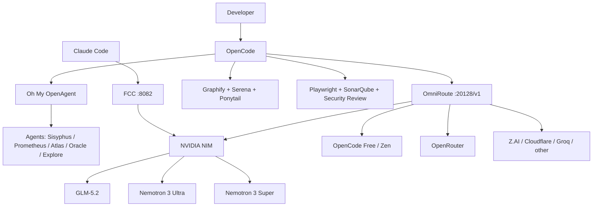

# Architecture

The core design principle is **decoupling**: the coding client, orchestration layer, routing gateway, provider, model, and validation tools should not all be one dependency.



## Why this structure matters

A model outage should not break your editor. A provider outage should not erase your preferred workflow. A plugin failure should not corrupt provider configuration. A second terminal should not attach to the first terminal's tmux session or SQLite DB.

That produces five useful boundaries:

1. **Client boundary** — OpenCode remains usable even if the preferred model changes.
2. **Routing boundary** — OmniRoute chooses/falls back without reconfiguring every client.
3. **Provider boundary** — NVIDIA, OpenCode, OpenRouter and other upstreams remain independent.
4. **Agent/tool boundary** — Sisyphus/OMO, Graphify, Serena, Ponytail and quality tools can evolve separately.
5. **Session boundary** — concurrent OpenCode instances use independent tmux sessions and independent `OPENCODE_DB` files.

## Two primary execution paths

### OpenCode path

```text
OpenCode → OMO/Sisyphus → OmniRoute → provider/model → fallback
```

### Claude Code compatibility path

```text
Claude Code → Free Claude Code (FCC) → NVIDIA NIM → GLM/Nemotron
```

FCC is optional. It is useful when you want Claude Code's client workflow while routing requests to a different provider/model.

## Reliability rule

A fallback is only meaningful when it fails independently. If route A and route B both end at the same upstream account, the chain looks redundant but is not operationally redundant.
