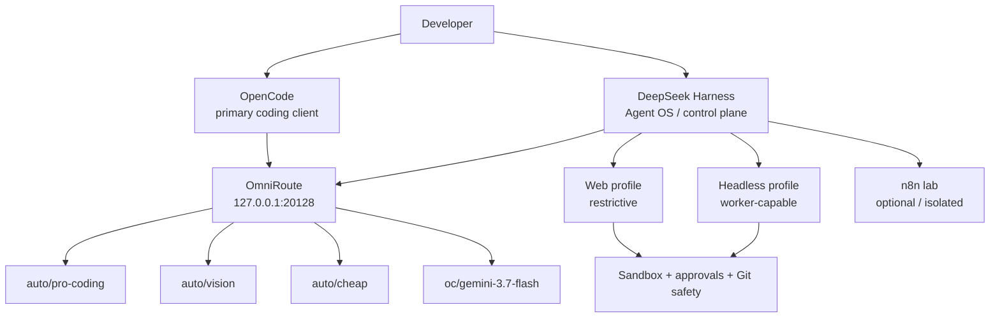

# DeepSeek Harness + OmniRoute: Agent OS field guide

> Lab status: validated on 2026-08-17 with DeepSeek Harness `0.1.0-rc.7`. This is an early release: pin versions, keep rollback paths, and re-test after upgrades.

This guide adds a second agentic execution layer to the OpenCode + OmniRoute stack. The important idea is **not** to replace OpenCode. In our lab, OpenCode remains the primary interactive coding client while DeepSeek Harness is useful as an Agent OS/control plane for isolated workers, QA, research, audits, repeatable workflows, and controlled parallel execution.

## Architecture



## What we validated

Our 2026-08-17 lab run completed successfully with:

| Check | Result |
|---|---|
| Harness health | HTTP 200 |
| Harness bind | loopback only, `127.0.0.1:3080` |
| OmniRoute | HTTP 200 on `127.0.0.1:20128` |
| Harness version | `0.1.0-rc.7` |
| Web composition | 130 entries: 103 ON, 25 OFF, 2 conditional |
| Headless composition | 84 entries: 78 ON, 2 OFF, 4 conditional |
| Model routes exercised by configuration gates | `auto/pro-coding`, `auto/vision`, `auto/cheap`, `oc/gemini-3.7-flash` |
| Shell timeout used in our hardened profile | 180000 ms |
| Optional automation lab | n8n bound to loopback only |
| Git safety test | Agent OS commit isolated from unrelated concurrent working-tree changes |

These numbers describe **our pinned composition**, not a universal recommended count. Plugin inventories and defaults can change between Harness releases.

## Why Harness is interesting

Harness exposes an unusually modular architecture: tools, UI capabilities, agent behavior, compaction, subagents, workflows, model selection and other capabilities are represented through plugins. This makes it possible to build purpose-specific presets rather than giving every agent every capability.

The highest-value features for our workflow are:

- custom agent presets;
- separate web and headless compositions;
- subagents and worker workflows;
- trajectory/session visibility;
- model routing through a local OpenAI-compatible gateway;
- MCP support;
- planning, goals and TODO tooling;
- compaction for long sessions;
- filesystem/shell sandboxing;
- explicit approval boundaries;
- reusable skills and agent instructions;
- Creator Mode for experimenting with custom presets/plugins.

## Do not enable every plugin

A large plugin list is tempting. Resist the temptation to turn everything on.

A plugin may be disabled because it is:

1. a lower-level implementation hidden behind a safer wrapper;
2. mutually exclusive with another composition;
3. intended only for headless execution;
4. redundant with another tool;
5. unsafe for an interactive/web agent;
6. platform-specific;
7. conditional at runtime.

Our rule is **capability by role**, not "maximum number of green switches".

### Web profile

Use the web profile for interactive work. Keep it restrictive:

- workspace-scoped filesystem access;
- sandboxed shell;
- approval gates for sensitive actions;
- Git mutation protection;
- no secret stores exposed to prompts;
- only the tools needed by the preset.

### Headless profile

Use headless for trusted automation/workers. It can expose more worker/workflow capabilities, but should still have:

- explicit workspace roots;
- timeouts;
- bounded parallelism;
- logging;
- secret isolation;
- Git guards;
- narrow task contracts.

## Model routing through OmniRoute

Instead of hard-coding one provider into every Harness preset, we point Harness at OmniRoute's local OpenAI-compatible endpoint.

A practical catalog from our current lab is:

```text
auto/pro-coding   -> heavyweight coding/reasoning route
auto/vision       -> multimodal/vision route
auto/cheap        -> inexpensive utility route
oc/gemini-3.7-flash -> explicit fallback/alternative route
```

The exact provider behind an `auto/*` route may change according to the OmniRoute combo. That is the point: the client gets a stable model ID while the gateway owns provider fallback and routing policy.

Do not assume a model works just because `/v1/models` lists it. Always run a real completion smoke test.

## Safe concurrency with OpenCode

Running Harness and OpenCode against the same repository is powerful, but this is where mistakes become expensive.

**Safe pattern:**

```text
OpenCode session A -> implementation area A
Harness worker B   -> read-only audit / QA / isolated area B
Harness worker C   -> research / report / tests that do not rewrite A
```

**Unsafe pattern:** two agents editing the same files at the same time without coordination.

Before a worker writes:

1. capture `git status --short`;
2. capture current HEAD;
3. record pre-existing modified/untracked paths;
4. forbid reset/clean/restore of unrelated work;
5. stage explicit paths only;
6. inspect `git diff --cached`;
7. scan staged content for secrets;
8. commit only files owned by that mission.

Avoid `git add .` and `git add -A` in a dirty shared working tree.

In our validation, the Agent OS commit was created while unrelated tracked and untracked work already existed. The mission staged only its own directory; the pre-existing work remained intact after the commit. This is exactly the behavior a multi-agent environment needs.

## Secrets

Keep provider credentials outside the repository. A useful pattern is:

```text
repo/                    -> presets, policies, public configuration templates
~/.config or ~/.dsh/     -> local credentials / machine-specific state
.env.local               -> local application secrets when appropriate
```

Never copy real API keys into agent instructions, screenshots, example configs or committed YAML.

Before committing an Agent OS change, scan for at least:

```text
api_key
apikey
token
password
cookie
authorization
private key
.env
sk-
```

Treat matches as leads, not automatic vulnerabilities: strings such as `ask-user` can produce harmless `sk-` substrings.

## Network exposure

For a workstation deployment, bind the control-plane services to loopback unless remote access is intentionally designed and authenticated:

```text
Harness:   127.0.0.1:3080
OmniRoute: 127.0.0.1:20128
n8n lab:   127.0.0.1:5678
```

Check with:

```bash
ss -ltnp | grep -E ':(3080|20128|5678)'
```

Do not expose a development Harness or automation dashboard directly to the public Internet just because it works locally.

## Agent OS layout

We found it useful to keep the reproducible, non-secret part of the Agent OS inside version control:

```text
agent-os/
├── README.md
├── docs/
├── preset/
├── plugins/
├── qa/
└── content-sandbox/
```

Machine credentials, generated session state and backups stay outside Git.

This separation gives you reproducibility without publishing your keys or machine state.

## Workers: start narrow

Do not begin with fifteen autonomous agents that all have shell, Git and production access. Start with narrow contracts:

| Worker | Initial permission |
|---|---|
| QA | read + browser/test output; limited writes to QA artifacts |
| Security | read-only scan first; fixes require explicit approval |
| Dependency/release watcher | read + network; no product writes |
| Documentation | docs-only writes |
| Content/marketing lab | sandbox directory only; no automatic publishing initially |
| Production monitor | telemetry/read-only; no deployment permission |

Promote a worker only after its behavior is repeatable and observable.

## n8n: useful, but isolate it

n8n can complement Harness for deterministic schedules and external integrations. We run it as an isolated local lab rather than making it the brain of the coding system.

Good division of labor:

```text
Harness -> reasoning, coding, QA, agent workflows
n8n     -> schedules, webhooks, deterministic integration chains
OmniRoute -> model/provider routing
OpenCode -> primary interactive implementation
```

For social publishing, payments, credentials or production changes, use approval gates until the workflow has been exercised safely. Automation should not turn an LLM mistake into an automatically published or financially consequential action.

## Creator Mode

Creator Mode is best treated as a development environment for presets/plugins, not as a reason to dynamically rewrite your production agent every session.

Recommended flow:

```text
Creator experiment
  -> inspect generated composition
  -> remove unnecessary capabilities
  -> test in sandbox
  -> dump effective config
  -> version the safe preset
  -> promote to normal use
```

## Operational checks

A minimal health check:

```bash
curl -fsS http://127.0.0.1:3080/health
curl -fsS http://127.0.0.1:20128/v1/models >/dev/null
ss -ltnp | grep ':3080'
```

Dump the effective configuration after every material change and compare it with the previous known-good dump. The effective composition matters more than what the settings UI appears to show.

## OpenCode vs Harness

Our current conclusion is deliberately conservative:

**OpenCode remains the main coding client. Harness is an additional control plane, not a mandatory replacement.**

Harness becomes especially interesting when you need role-specific presets, transparent agent workflows, multiple bounded workers, reusable Agent OS configuration, or a second execution surface sharing the same OmniRoute gateway.

We have validated the architecture and safety controls, but we have **not yet published a controlled quality/cost benchmark claiming Harness beats OpenCode**. That comparison should be based on identical repository tasks, models, acceptance tests and measured token/time/cost data.

## Recommended adoption order

```text
1. Install/pin Harness
2. Bind it to loopback
3. Connect OmniRoute
4. Create a restrictive interactive preset
5. Verify effective plugin composition
6. Add Git/secret/workspace guards
7. Run read-only missions
8. Run QA/browser missions
9. Add narrow headless workers
10. Benchmark against your existing coding workflow
11. Only then automate higher-impact actions
```

## Final rule

A good Agent OS is not the one with the most plugins, models or autonomous workers. It is the one where you can answer four questions at any time:

- Which model is running?
- Which tools can this agent use?
- Which files/services can it change?
- How do I prove what it did?

If those answers are clear, Harness can be a very useful layer in a modern AI coding stack.
