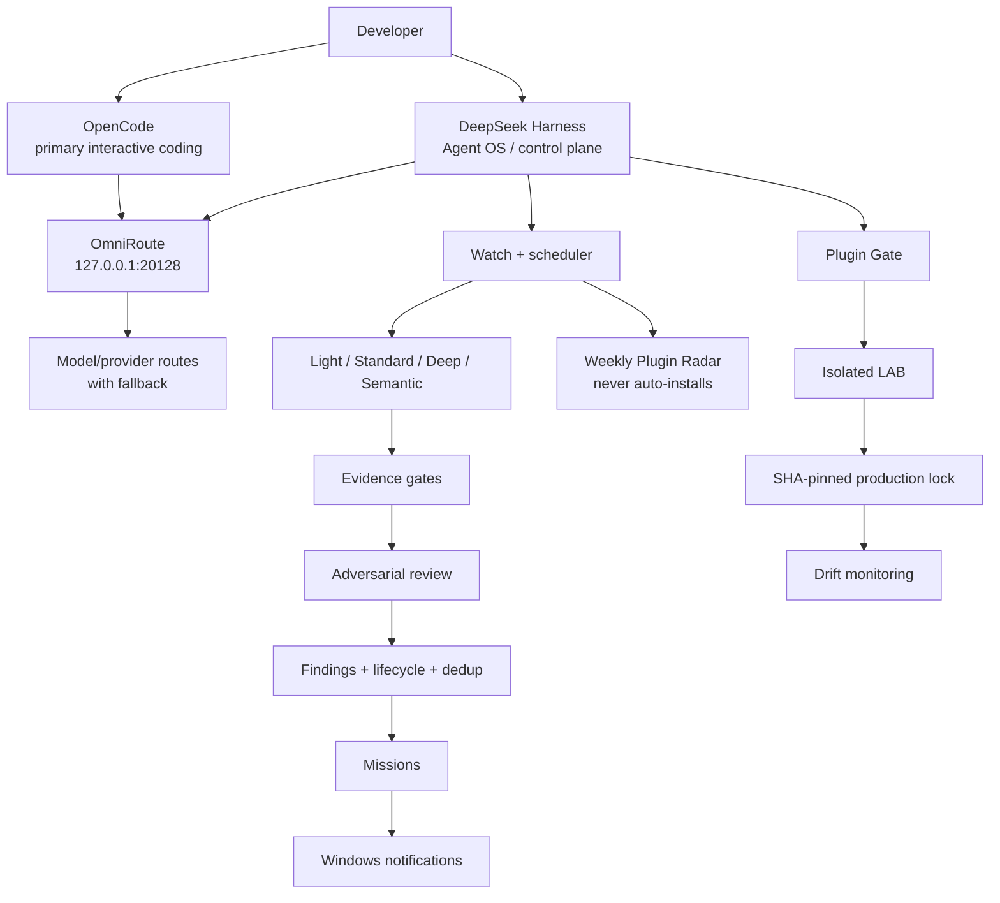

# DeepSeek Harness + OmniRoute: Agent OS field guide

> **Production milestone:** validated on **2026-08-19** with the StockNewsBR Agent OS stack running on Windows + WSL/Linux.
>
> Harness remains pinned to the tested release line (`0.1.0-rc.7` in this lab). It is still early software: keep immutable plugin pins, rollback paths, and re-test after upgrades.

This guide documents the point where DeepSeek Harness stopped being only an experimental second agent surface and became a **real control plane / Agent OS** around the OpenCode + OmniRoute coding stack.

OpenCode remains the primary interactive coding client. Harness adds health monitoring, scheduled audits, semantic review, plugin governance, notifications, bounded automation, safety gates, and mission generation around that workflow.

## Final validated state — 2026-08-19

The final closure run produced:

| Check | Result |
|---|---|
| Harness health | ✅ HTTP 200 on `127.0.0.1:3080` |
| OmniRoute health | ✅ HTTP 200 on `127.0.0.1:20128/v1/models` |
| n8n health | ✅ HTTP 200 on `127.0.0.1:5678/healthz` |
| Agent OS watch service | ✅ `active` + `enabled` |
| Scheduler | ✅ healthy |
| Agent OS test suite | ✅ **76/76 passed** |
| Original regression suite | ✅ **43/43 preserved** |
| Production plugins | ✅ **7 SHA-pinned, zero drift** |
| Plugin Radar | ✅ integrated into the existing watch scheduler |
| Plugin auto-install | ✅ **NEVER** |
| Windows Agent OS notifier | ✅ AUMID + WinRT diagnostics validated |
| Product source auto-modification | ✅ none during audits/tests |
| Secret scan | ✅ no real secrets committed |

The important detail is not the number of plugins. It is that the control plane now has a repeatable answer for **what is running, what is allowed to change, how findings are verified, how plugins are pinned, and how the operator is notified**.

---

## What the Agent OS actually does today

It is not just a dashboard.

### 1. Starts and checks the stack

The local control plane monitors the services used by the coding environment, including:

```text
Harness       127.0.0.1:3080
OmniRoute     127.0.0.1:20128
n8n           127.0.0.1:5678
backend       :8000
frontend      :3000
FCC           :8082 when that optional service is in use
```

The watch loop reports unhealthy services instead of silently assuming the stack is alive.

### 2. Runs scheduled audit tiers

The Agent OS has separate audit cadences for cheap deterministic checks and more expensive semantic work.

The design principle is:

```text
cheap/deterministic first
        ↓
semantic only when useful
        ↓
evidence gate
        ↓
verification
        ↓
finding / mission
```

This keeps model usage bounded and makes a semantic finding prove more than "an LLM said so".

### 3. Runs semantic audits through OmniRoute

Harness can send semantic audit work through the same local OpenAI-compatible OmniRoute gateway used by the rest of the stack.

That means the control plane can use the configured model/fallback policy without hard-coding one provider into the audit engine.

A semantic candidate is not automatically treated as truth. The pipeline can attach deterministic evidence and adversarial verification before promoting important findings.

### 4. Generates findings and missions

The Agent OS keeps structured findings, fingerprints/deduplication, lifecycle state, and generated missions.

Useful lifecycle states include:

```text
open
resolved
refuted
obsolete
```

A refuted candidate should not become an active implementation mission.

### 5. Protects dangerous operations

The production stack includes explicit review/defense layers so the autonomous control plane does not gain unrestricted authority simply because it can call tools.

Examples of behavior covered by the final tests include blocking or escalating destructive operations such as:

```text
rm -rf /
git clean -fdx
```

while allowing normal safe commands and read-only inspection.

### 6. Notifies the operator

There are two separate notification responsibilities:

```text
Harness task / turn / approval events
        ↓
dsh-notify-windows
        ↓
Windows
```

and:

```text
Agent OS findings / missions / scheduler alerts / radar events
        ↓
snbr-agent-notify
        ↓
Windows
```

The Agent OS notifier uses its own AppUserModelID:

```text
StockNewsBR.AgentOS
```

The diagnostics intentionally distinguish **delivery requested/API success** from **visual banner confirmation**. Windows can accept a toast without giving the caller a reliable proof that the user physically saw the banner.

### 7. Watches its own plugin supply chain

The final plugin governance flow is:

```text
GitHub / Plugin Radar
        ↓
Plugin Gate / source review
        ↓
LAB profile
        ↓
compatibility test
        ↓
immutable SHA pin
        ↓
production
        ↓
drift monitoring
```

Production does **not** follow a moving `main` branch.

---

## Production plugin set

The final validated lock contains seven production plugins, all pinned to immutable Git SHAs and checked for drift:

| Plugin | Role | Final status |
|---|---|---|
| `dsh-plugin-gate` | plugin/supply-chain gate | ✅ production verified |
| `dsh-notify-windows` | Harness task/turn/approval Windows notification | ✅ production verified |
| `dsh-auto-review` | bounded approval/review layer | ✅ production verified |
| `dsh-review` | adversarial finding verification | ✅ production verified |
| `dsh-defend` | destructive/prompt/secret defense seam | ✅ production verified |
| `dsh-mcp-panel` | MCP visibility with sanitization | ✅ production verified |
| `dsh-task-notify` | additional task notification integration used by the stack | ✅ production verified |

The exact SHAs belong in the machine/project lockfile, not in prose that will become stale. The operational rule is simple:

```text
installed SHA == expected locked SHA
```

If they differ, the Agent OS reports plugin drift.

### Lab-only components

Not every interesting plugin belongs in production.

The final run deliberately left these outside the production path:

| Component | Status | Reason |
|---|---|---|
| `dsh-workflow-isolate` | 🧪 LAB only | useful isolation experiment; not required for production closure |
| `dsh-plugin-reducer` | 🧪 LAB/external diagnostic | useful for plugin conflict minimization; not a permanent runtime dependency |
| `dsh-windows-notify` | 🧪 LAB only | more complex alternative; `dsh-notify-windows` won the production notifier comparison |

This is intentional. A mature Agent OS should be willing to say **"interesting, but not production"**.

---

## Plugin Radar

The Agent OS now includes a weekly plugin/release radar in the **existing** scheduler rather than creating another daemon.

Validated policy:

```text
cadence: weekly
schedule: Monday 09:00 local
no relevant change: skip LLM
new relevant delta: classify
install automatically: NEVER
```

The radar can inspect Harness/plugin changes and classify candidates without silently modifying the production profile.

Typical outcomes:

```text
INSTALL_CANDIDATE
TEST_IN_LAB
COPY_IDEA
IGNORE
BLOCK
```

Only meaningful events should reach the operator, such as security changes, compatibility breaks, relevant new releases, or genuinely useful install candidates.

---

## Adversarial review: findings must survive disagreement

One of the most useful upgrades is the adversarial verification seam.

Instead of:

```text
LLM finds bug → mission
```

we can use:

```text
semantic candidate
        ↓
deterministic evidence
        ↓
adversarial reviewer tries to refute it
        ↓
refuted ─────────────→ archive / no active mission
        ↓
verified
        ↓
dedup
        ↓
mission
        ↓
notification
```

The final suite also validates graceful degradation when the verifier is unavailable. Unavailability must not magically become `verified` and must not crash the scheduler.

For high-severity findings, this substantially reduces the risk of turning LLM noise into automatic engineering work.

---

## Auto-review: fail closed

The auto-review layer is intentionally conservative.

A good starting policy is:

```text
read-only inspection      → AI review may approve
source edits              → human boundary
commit                    → human boundary
push                      → human boundary
production deployment     → human boundary
secrets                   → never / explicit human handling
destructive operations    → deny or require human
```

Timeouts, malformed review results, provider failures, and exceptions should fail closed instead of becoming accidental approvals.

---

## MCP Panel sanitization

MCP observability is useful only if diagnostics do not become a secret exfiltration path.

The final tests cover sanitization of:

- credentials embedded in URLs;
- query/fragment secret-like values;
- text containing sensitive patterns;
- arbitrary errors/objects without throwing from the sanitizer itself.

A diagnostic UI should show enough to debug the MCP server while withholding tokens, passwords, Authorization values, and other credentials.

---

## Architecture



---

## OpenCode vs Harness

The production conclusion is now clearer than the original lab experiment:

**OpenCode is still the primary interactive coding client. Harness is the autonomous control/guard layer around the project.**

A useful division of labor is:

```text
OpenCode
→ interactive implementation
→ developer-driven sessions
→ Sisyphus/agent orchestration

Harness / Agent OS
→ health and watch loops
→ scheduled audits
→ semantic verification
→ plugin governance
→ drift detection
→ findings/missions
→ notifications
→ bounded autonomous workers
```

They complement each other rather than compete for the same role.

---

## Autostart / persistent operation

The stack is intended to survive normal workstation restarts without requiring the developer to remember a long boot sequence.

The lab uses a Windows logon bootstrap into WSL plus a user service as the persistent scheduler/control loop.

The operational rule is **one scheduler source of truth**. Do not create a second overlapping timer just because a new automation feature is added.

---

## Operational checks

Useful commands:

```bash
snbr-agent-status
snbr-harness-check
snbr-agent-findings --open
snbr-agent-missions --latest
snbr-agent-notify --diagnose
```

Service checks:

```bash
systemctl --user is-active snbr-agent-watch.service
systemctl --user is-enabled snbr-agent-watch.service
```

Harness / OmniRoute checks:

```bash
curl -fsS http://127.0.0.1:3080/health

if [[ -n "${OMNIROUTE_API_KEY:-}" ]]; then
  curl -fsS http://127.0.0.1:20128/v1/models \
    -H "Authorization: Bearer $OMNIROUTE_API_KEY" >/dev/null
else
  curl -fsS http://127.0.0.1:20128/v1/models >/dev/null
fi
```

After any plugin/profile change, dump the effective Harness config and compare it with the previous known-good state.

---

## Git safety in a dirty multi-agent repository

Running Harness and OpenCode against the same repository is powerful, but two agents editing the same files without coordination is not safe.

Before any controlled write mission:

1. capture `git status --short`;
2. capture current HEAD;
3. record pre-existing modified/untracked paths;
4. never reset/clean/restore unrelated work;
5. stage explicit paths only;
6. inspect `git diff --cached`;
7. scan staged content for secrets;
8. commit only files owned by that mission.

Avoid:

```text
git add .
git add -A
git reset --hard
git clean -fdx
```

unless a human explicitly intends the destructive effect and the repository state is known.

Our final closure was performed while unrelated product work existed in the same working tree; the Agent OS commits staged only their own files and preserved the unrelated work.

---

## Secrets and local state

Keep credentials outside version control.

A useful separation is:

```text
repo/                    → reproducible policy/config/docs
~/.config / ~/.dsh/      → machine credentials / local runtime config
agent-os/runtime/        → generated runtime state, logs, findings, missions
.env.local               → local app secrets when appropriate
```

Never copy real provider keys into prompts, screenshots, test fixtures, Markdown examples, or committed YAML.

---

## What is intentionally NOT autonomous yet

The final production milestone does **not** mean "the AI may now do anything it wants".

Important boundaries remain:

- no automatic plugin installation from Plugin Radar;
- no automatic push/deployment merely because a finding exists;
- no unrestricted destructive Git/shell operations;
- `dsh-workflow-isolate` and `dsh-plugin-reducer` remain LAB-only;
- external finding sources such as Jules are **not yet a fully automatic end-to-end ingestion pipeline** in this setup.

That last gap is useful to state explicitly. The current Agent OS can find, classify, verify, persist, deduplicate, create missions, and notify from its own audit pipeline, but third-party sources still need a dedicated ingestion contract before they can safely feed the same lifecycle automatically.

---

## Recommended adoption order

For another developer reproducing this setup:

```text
1. Pin Harness
2. Bind control-plane services to loopback
3. Connect OmniRoute
4. Create restrictive profiles
5. Add Git/workspace/secret guards
6. Add a persistent watch service
7. Add cheap deterministic audits
8. Add semantic audits with evidence gates
9. Add findings + lifecycle + dedup
10. Add notifications
11. Add plugin lock + drift detection
12. Add Plugin Gate and LAB promotion flow
13. Add adversarial review
14. Add weekly Plugin Radar with auto-install disabled
15. Only then consider higher-impact autonomous workers
```

---

## Final rule

A useful Agent OS is not the one with the most models, agents, or green plugin switches.

It is the one where you can answer, at any moment:

- Which model is running?
- Which tools can this agent use?
- Which files/services can it change?
- Which plugins are actually pinned?
- What evidence supports this finding?
- What happens if the reviewer/provider is unavailable?
- How will the operator know something happened?
- How do I prove the system did not touch unrelated work?

At the 2026-08-19 milestone, the StockNewsBR lab can answer those questions with a working Harness-based Agent OS rather than only a design diagram.
