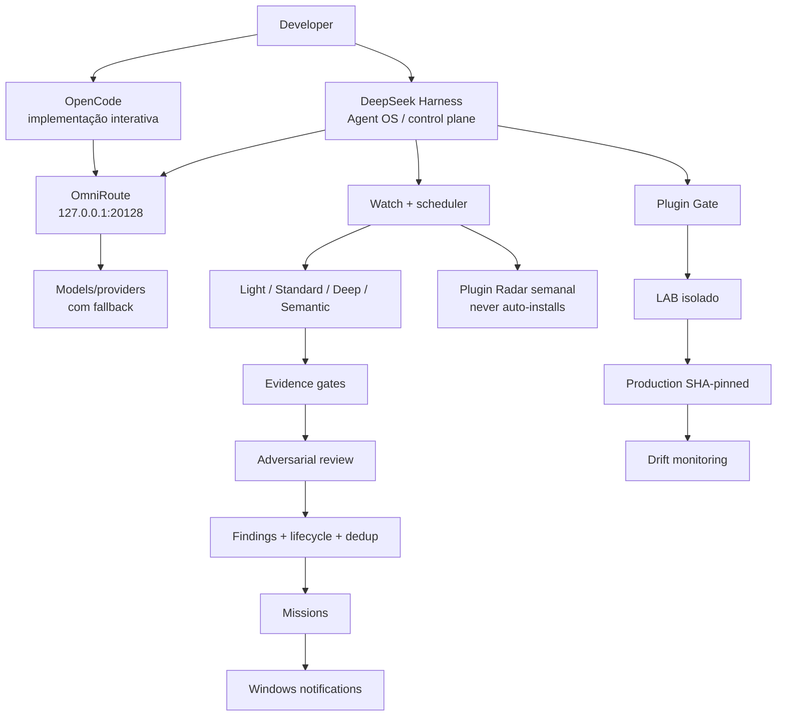

# DeepSeek Harness + OmniRoute: guia final do Agent OS

> **Marco de produção:** validado em **2026-08-19** no ambiente StockNewsBR com Windows + WSL/Linux.
>
> O Harness permanece pinado na linha testada (`0.1.0-rc.7` neste laboratório). Como ainda é software jovem, mantenha versões/SHAs imutáveis, rollback e reteste depois de upgrades.

Este documento registra o ponto em que o DeepSeek Harness deixou de ser apenas uma segunda interface experimental e passou a funcionar como **control plane / Agent OS real** ao redor da stack OpenCode + OmniRoute.

O OpenCode continua sendo o cliente principal de implementação interativa. O Harness acrescenta monitoramento, auditorias agendadas, revisão semântica, governança de plugins, notificações, safety gates e geração de missões.

## Estado final validado — 2026-08-19

| Check | Resultado |
|---|---|
| Harness | ✅ HTTP 200 em `127.0.0.1:3080` |
| OmniRoute | ✅ HTTP 200 em `127.0.0.1:20128/v1/models` |
| n8n | ✅ HTTP 200 em `127.0.0.1:5678/healthz` |
| `snbr-agent-watch.service` | ✅ `active` + `enabled` |
| Scheduler | ✅ saudável |
| Suíte Agent OS | ✅ **76/76 testes PASS** |
| Regressão original | ✅ **43/43 preservados** |
| Plugins de produção | ✅ **7 pinados por SHA, drift zero** |
| Plugin Radar | ✅ integrado ao watch existente |
| Auto-install de plugin | ✅ **NEVER** |
| Notifier Windows | ✅ AUMID + diagnóstico WinRT validados |
| Alteração automática de source do produto | ✅ nenhuma durante auditorias/testes |
| Secret scan | ✅ nenhum segredo real commitado |

O ponto importante não é a quantidade de plugins. É que agora existe uma resposta verificável para: **o que está rodando, o que pode mudar, como um finding é validado, quais plugins estão pinados e como o operador é avisado**.

---

## O que ele faz de verdade hoje

### 1. Sobe e verifica a stack

O control plane acompanha os serviços usados pelo ambiente:

```text
Harness       127.0.0.1:3080
OmniRoute     127.0.0.1:20128
n8n           127.0.0.1:5678
backend       :8000
frontend      :3000
FCC           :8082 quando o serviço opcional está em uso
```

### 2. Executa auditorias em níveis diferentes

A arquitetura separa checks baratos/determinísticos de análise semântica mais cara:

```text
checks baratos/determinísticos
        ↓
semantic quando vale a pena
        ↓
evidence gate
        ↓
verification
        ↓
finding / mission
```

### 3. Usa OmniRoute para auditoria semântica

O Harness usa o mesmo gateway local OpenAI-compatible da stack. Assim, a política de provider/model/fallback continua centralizada no OmniRoute em vez de ficar hardcoded em cada auditor.

### 4. Mantém findings, dedup e lifecycle

O Agent OS persiste findings estruturados, fingerprints e lifecycle. Estados relevantes:

```text
open
resolved
refuted
obsolete
```

Um candidato refutado não deve virar uma missão ativa.

### 5. Protege ações perigosas

Os testes finais cobrem a proteção/escalonamento de operações destrutivas como:

```text
rm -rf /
git clean -fdx
```

enquanto comandos seguros e inspeções read-only continuam permitidos.

### 6. Avisa o operador no Windows

Há responsabilidades separadas:

```text
Eventos do Harness (task / turn / approval)
        ↓
dsh-notify-windows
        ↓
Windows
```

```text
Agent OS (findings / missions / scheduler / radar)
        ↓
snbr-agent-notify
        ↓
Windows
```

O notifier do Agent OS usa o AppUserModelID:

```text
StockNewsBR.AgentOS
```

O diagnóstico diferencia corretamente `delivery requested/API success` de `visual banner confirmation`; o Windows pode aceitar um toast sem fornecer ao chamador uma prova confiável de que a pessoa viu o banner.

### 7. Governa a própria supply chain de plugins

Fluxo final:

```text
GitHub / Plugin Radar
        ↓
Plugin Gate / source review
        ↓
LAB
        ↓
compatibility test
        ↓
SHA imutável
        ↓
production
        ↓
drift monitoring
```

Produção não segue `main` móvel.

---

## Plugins de produção

O lock final validado contém sete plugins de produção, todos pinados por SHA:

| Plugin | Papel | Status |
|---|---|---|
| `dsh-plugin-gate` | gate de plugin/supply-chain | ✅ production verified |
| `dsh-notify-windows` | toast do Harness para task/turn/approval | ✅ production verified |
| `dsh-auto-review` | approval/review com limites | ✅ production verified |
| `dsh-review` | verificação adversarial de findings | ✅ production verified |
| `dsh-defend` | defesa contra operações destrutivas/prompt/secret seams | ✅ production verified |
| `dsh-mcp-panel` | visibilidade MCP com sanitização | ✅ production verified |
| `dsh-task-notify` | integração adicional de notificação da stack | ✅ production verified |

Regra operacional:

```text
installed SHA == expected locked SHA
```

Se divergir, o Agent OS reporta plugin drift.

### LAB-only

Nem tudo que é interessante precisa ir para produção:

| Componente | Status | Motivo |
|---|---|---|
| `dsh-workflow-isolate` | 🧪 LAB | experimento de isolamento; não era necessário para fechar produção |
| `dsh-plugin-reducer` | 🧪 LAB / diagnóstico externo | útil para reduzir conflitos de plugins, sem precisar ficar no runtime |
| `dsh-windows-notify` | 🧪 LAB | alternativa mais complexa; `dsh-notify-windows` venceu a comparação |

---

## Plugin Radar semanal

O radar está integrado no **scheduler que já existia**, sem criar outro daemon.

Política validada:

```text
cadência: semanal
horário: segunda-feira 09:00 local
sem mudança relevante: não chama LLM
mudança relevante: classifica
instala automaticamente: NEVER
```

Classificações típicas:

```text
INSTALL_CANDIDATE
TEST_IN_LAB
COPY_IDEA
IGNORE
BLOCK
```

A ideia é detectar novidade sem transformar novidade em instalação automática.

---

## Review adversarial

O pipeline deixa de ser:

```text
LLM achou bug → mission
```

para virar:

```text
semantic candidate
        ↓
deterministic evidence
        ↓
reviewer adversarial tenta refutar
        ↓
refuted ─────────────→ arquiva / sem missão ativa
        ↓
verified
        ↓
dedup
        ↓
mission
        ↓
notification
```

A suíte final também cobre degradação quando o verifier está indisponível. `Unavailable` não pode virar `verified` por acidente e não pode derrubar o scheduler.

---

## Auto-review fail-closed

Política conservadora recomendada:

```text
read-only               → AI review pode aprovar
source edit              → humano
commit                   → humano
push                     → humano
deploy                   → humano
secrets                  → never / humano explícito
destrutivo               → deny ou humano
```

Timeout, resultado malformado, provider fora e exception precisam falhar fechado em vez de virar aprovação acidental.

---

## MCP Panel sanitizado

O painel MCP só é útil se diagnóstico não virar vazamento de segredo.

Os testes finais cobrem sanitização de:

- credenciais em URLs;
- query/fragment com valores sensíveis;
- texto com padrões de segredo;
- errors/objetos arbitrários sem quebrar o sanitizer.

---

## Arquitetura final



---

## OpenCode vs Harness

A conclusão final é simples:

**OpenCode continua sendo o cliente principal de implementação interativa. Harness virou a camada autônoma de controle/guardião ao redor do projeto.**

```text
OpenCode
→ implementação interativa
→ sessões guiadas pelo desenvolvedor
→ Sisyphus / agentes

Harness / Agent OS
→ health/watch
→ auditorias agendadas
→ verificação semântica
→ governança de plugins
→ drift detection
→ findings/missions
→ notificações
→ workers autônomos limitados
```

Eles se complementam; não precisam disputar o mesmo papel.

---

## Checks operacionais

```bash
snbr-agent-status
snbr-harness-check
snbr-agent-findings --open
snbr-agent-missions --latest
snbr-agent-notify --diagnose
```

```bash
systemctl --user is-active snbr-agent-watch.service
systemctl --user is-enabled snbr-agent-watch.service
```

```bash
curl -fsS http://127.0.0.1:3080/health

if [[ -n "${OMNIROUTE_API_KEY:-}" ]]; then
  curl -fsS http://127.0.0.1:20128/v1/models \
    -H "Authorization: Bearer $OMNIROUTE_API_KEY" >/dev/null
else
  curl -fsS http://127.0.0.1:20128/v1/models >/dev/null
fi
```

---

## Segurança Git em working tree suja

Antes de qualquer missão que escreva:

1. capturar `git status --short`;
2. capturar HEAD;
3. registrar paths preexistentes modificados/untracked;
4. nunca resetar/limpar trabalho alheio;
5. stage apenas paths explícitos;
6. revisar `git diff --cached`;
7. scan de secrets;
8. commitar apenas arquivos da missão.

Evitar especialmente:

```text
git add .
git add -A
git reset --hard
git clean -fdx
```

O fechamento final do Agent OS foi feito com mudanças não relacionadas já existentes na working tree, e os commits do Agent OS preservaram esse trabalho paralelo.

---

## O que ainda NÃO é autônomo

`produção finalizada` não significa `a IA pode fazer qualquer coisa`.

Continuam fora dos limites:

- Plugin Radar não instala nada automaticamente;
- finding não implica push/deploy automático;
- operações destrutivas não ganham aprovação irrestrita;
- `dsh-workflow-isolate` e `dsh-plugin-reducer` continuam LAB-only;
- fontes externas de findings como **Jules ainda não estão integradas num pipeline totalmente automático ponta a ponta**.

Hoje o Agent OS já consegue encontrar, classificar, validar, deduplicar, persistir, gerar missões e notificar a partir das auditorias próprias. A ingestão de terceiros precisa de um contrato dedicado antes de alimentar esse lifecycle de forma segura.

---

## Ordem recomendada para reproduzir

```text
1. Pin Harness
2. Bind em loopback
3. Conectar OmniRoute
4. Criar profiles restritivos
5. Adicionar guards Git/workspace/secrets
6. Criar watch persistente
7. Adicionar checks baratos
8. Adicionar semantic + evidence gates
9. Adicionar findings/lifecycle/dedup
10. Adicionar notifications
11. Adicionar lock de plugins + drift
12. Adicionar Plugin Gate + LAB
13. Adicionar review adversarial
14. Adicionar Plugin Radar semanal com auto-install desativado
15. Só depois aumentar autonomia
```

---

## Regra final

Um Agent OS bom não é o que tem mais modelos, agentes ou plugins verdes.

É o que consegue responder a qualquer momento:

- qual modelo está rodando?
- quais ferramentas ele pode usar?
- quais arquivos/serviços ele pode alterar?
- quais plugins estão realmente pinados?
- qual evidência sustenta o finding?
- o que acontece se reviewer/provider cair?
- como o operador fica sabendo do evento?
- como provar que trabalho não relacionado ficou intacto?

No marco de **2026-08-19**, o laboratório StockNewsBR consegue responder isso com um Agent OS baseado em Harness realmente funcionando — não apenas com um desenho de arquitetura.
