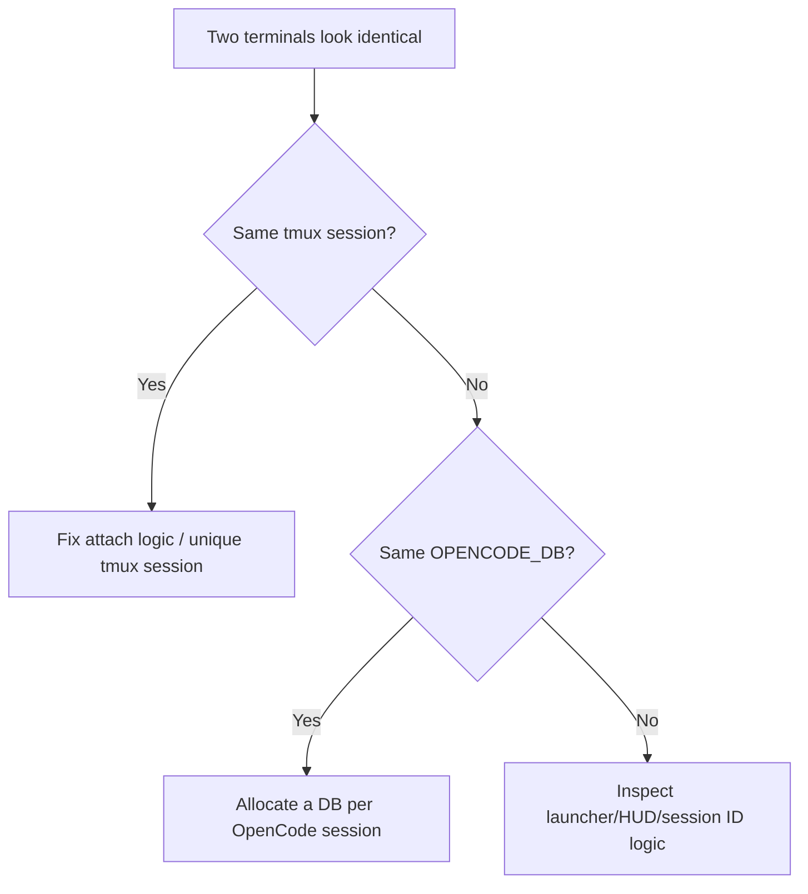
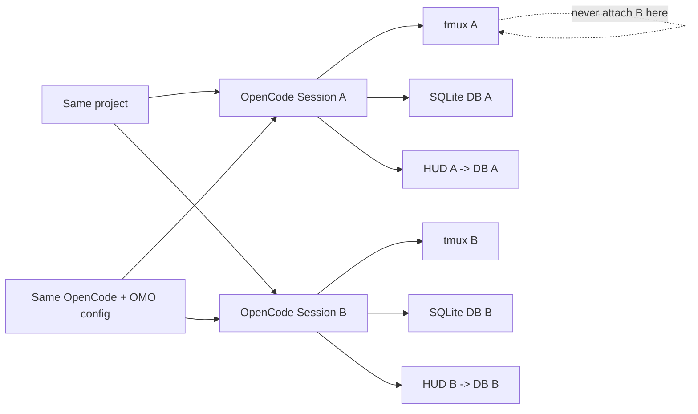

# OpenCode Multi-Session Isolation: tmux, per-session SQLite DBs and an honest HUD

This is one of the most useful fixes in this repository if you run **multiple OpenCode terminals against the same codebase**.

The target state is intentionally strict:

```text
same repository
same OpenCode configuration
same Oh My OpenAgent / Sisyphus stack
same tools and MCPs

BUT

unique tmux session
unique OpenCode process
unique SQLite database
unique token/context HUD
zero mirrored terminals
```

In our WSL/Linux setup, the canonical project stayed the same. The isolation boundary was the **runtime session**, not the repository.

> This is a custom launcher/HUD hardening pattern from our working environment, not an upstream OpenCode requirement. Use it when your own wrappers, tmux workflow or custom HUD need stronger process/session separation.

---

## 1. The two bugs looked similar but were different

We hit two separate failure modes:

1. **tmux mirroring** — a new terminal attached to an OpenCode tmux session that was already attached elsewhere;
2. **shared-state/HUD confusion** — multiple OpenCode sessions could observe the same default SQLite state, so a custom token/context HUD could report the wrong session.

Do not debug them as one problem.



---

## 2. Root cause of the mirrored-session bug

The confirmed root cause in our launcher was a custom `oc-safe` tmux recovery path.

It discovered an existing `oc-*` session and could attach to it even when that session already had a client attached. The result was classic mirroring: two terminal windows were looking at the **same tmux session**, therefore the same TUI.

The critical rule is simple:

> **Never attach a new terminal to a managed OpenCode tmux session that is already attached.**

The fix was to inspect tmux's `session_attached` value and skip occupied sessions:

```bash
if [[ "$attached" != "0" ]]; then
  continue
fi
```

The normal launcher already used a unique tmux session naming pattern similar to:

```bash
tmux new-session -s "oc-${PROJECT}-$$"
```

Using `$$` (the launcher shell PID) gives each fresh launch a distinct session name.

### Why changing CWD did not fix it

Both OpenCode sessions are allowed to work in the **same repository**. Changing working directories merely hides the real issue and breaks the workflow.

The problem was the terminal/session identity, not the project path.

---

## 3. The second isolation boundary: one SQLite DB per OpenCode session

After tmux stopped mirroring, we hardened session state as well.

Each OpenCode session gets its own database:

```text
~/.local/share/opencode/opencode-<session_id>.db
```

Conceptually:

```text
Terminal A
  ├── tmux: oc-project-11111
  ├── OpenCode PID: 11180
  ├── OPENCODE_DB=.../opencode-session-A.db
  └── HUD reads .../opencode-session-A.db

Terminal B
  ├── tmux: oc-project-22222
  ├── OpenCode PID: 22290
  ├── OPENCODE_DB=.../opencode-session-B.db
  └── HUD reads .../opencode-session-B.db
```

The two sessions can still use:

- the same Git worktree;
- the same `OPENCODE_CONFIG_DIR`;
- the same Oh My OpenAgent plugin;
- the same Sisyphus/Prometheus/Atlas agent configuration;
- the same OmniRoute provider;
- the same MCP definitions.

What must differ is **session identity and session state**.

---

## 4. `OPENCODE_DB` is the contract

The most important invariant is:

> **The OpenCode process and the HUD for a given terminal must receive the exact same `OPENCODE_DB` value.**

If the OpenCode process uses DB A while the HUD reads DB B, the counter is untrustworthy even though the TUI itself may look fine.

A launcher should decide the DB path **once**, export it, and only then spawn OpenCode and the HUD.

Reference pattern:

```bash
SESSION_ID="${PROJECT:-project}-$$"
SESSION_DB="$HOME/.local/share/opencode/opencode-${SESSION_ID}.db"

export OPENCODE_DB="$SESSION_DB"

# Every child for this logical OpenCode session must inherit OPENCODE_DB.
# Start tmux/OpenCode/HUD only after the export.
```

Do not generate a second DB name inside the HUD. The launcher owns the decision.

---

## 5. Make the HUD honor `OPENCODE_DB`

A custom HUD must not hard-code the global default database.

Bad:

```python
DB = Path.home() / ".local/share/opencode/opencode.db"
```

Hardened pattern:

```python
import os
from pathlib import Path

DB = Path(
    os.environ.get("OPENCODE_DB")
    or (Path.home() / ".local/share/opencode/opencode.db")
)
```

The default is useful for backwards compatibility, but a managed multi-session launch should always set `OPENCODE_DB` explicitly.

### Counter correctness rule

For every terminal:

```text
OpenCode process DB == HUD DB
```

For two simultaneous terminals:

```text
Terminal A DB != Terminal B DB
```

Those two checks together are what make the per-session counter meaningful.

---

## 6. What the counter is — and is not

We ended up with **two complementary visibility layers**:

1. an in-TUI context status line, so the active OpenCode screen shows context pressure immediately;
2. a DB-backed external HUD, so a managed multi-terminal workflow can associate token/context data with the correct SQLite session.

The DB-backed custom HUD is a **session token/context usage indicator**, backed by the OpenCode session's SQLite data.

It should not be confused with:

- provider quota;
- OpenCode Go billing/rate limits;
- NVIDIA NIM quota;
- OmniRoute provider quota;
- a universal account-wide token meter.

A per-session HUD answers a different question:

> “How much context/token history belongs to *this OpenCode session*?”

That distinction is extremely useful when you have two or more long-running coding/audit sessions open at once.

### Visual example: independent counters are a feature, not a mismatch


This real capture from our setup compares **Gemini**, a **Codex** coding session, and **OpenCode/OMO with Sisyphus Ultraworker**. The displays are intentionally different because the clients expose different context and status semantics. The screenshot is useful as a reminder that:

- a client context meter is not automatically an upstream account quota meter;
- two different coding clients do not need to show the same token total;
- two concurrent **OpenCode** sessions should each show the state for their own session;
- for our DB-backed OpenCode HUD, `HUD DB == OpenCode process DB` is mandatory;
- between concurrent OpenCode terminals, `DB A != DB B` is the isolation invariant.

The local project path in the public screenshot is redacted intentionally.

### Optional in-TUI context counter we used

In one OpenCode build we also added a compact context status line directly to the TUI prompt component. The implementation lived in:

```text
packages/tui/src/component/prompt/index.tsx
```

The patch was deliberately split into small helpers:

```text
formatTokenCount
calculateContextRemaining
renderContextProgress
renderContextStatusLine
```

The session `usage()` memo exposed values such as:

```text
used / total / pct / remaining / cost
```

and the renderer turned them into a compact terminal-safe line with a brain indicator and progress bar.

We added a focused test file:

```text
packages/tui/test/context-status.test.ts
```

with multiple boundary/formatting cases before rebuilding the single OpenCode binary.

**Important public-guide lesson:** treat this as a source-level customization, not a stable upstream API. OpenCode TUI internals can move between versions. Keep the rendering logic isolated, test it, and rebase the patch rather than blindly editing a minified/bundled binary.

And again: a line such as `59% used` describes **context usage for the session/model**, not “59% of your provider rate limit.” Provider quota belongs to the provider/gateway layer.

---

## 7. Verification: prove the process-side DB

On Linux/WSL, inspect the environment of every running OpenCode process:

```bash
for pid in $(pgrep -x opencode); do
  printf 'PID=%s  ' "$pid"
  tr '\0' '\n' < "/proc/$pid/environ" \
    | sed -n 's/^OPENCODE_DB=/OPENCODE_DB=/p'
done
```

A healthy two-session result should show **two different paths**.

Example shape:

```text
PID=11180  OPENCODE_DB=/home/user/.local/share/opencode/opencode-project-11111.db
PID=22290  OPENCODE_DB=/home/user/.local/share/opencode/opencode-project-22222.db
```

If both processes show the same DB, you do not yet have state isolation.

If neither shows `OPENCODE_DB`, the process probably fell back to the default DB.

---

## 8. Verification: prove the tmux side

List managed sessions and whether they are attached:

```bash
tmux list-sessions -F '#{session_name} attached=#{session_attached} clients=#{session_attached}'
```

For more explicit client information:

```bash
tmux list-clients -F 'client=#{client_name} session=#{session_name} tty=#{client_tty}'
```

What you want:

```text
Terminal A -> unique oc-* session A
Terminal B -> unique oc-* session B
```

What you do **not** want:

```text
Terminal A ─┐
            ├─> same already-attached oc-* session
Terminal B ─┘
```

---

## 9. Verification: prove HUD-side DB == process-side DB

The strongest diagnostic is to make the HUD expose the basename of the DB it is reading, at least in a debug mode.

For example:

```text
🧠 41% | DB: opencode-project-11111.db
```

Then compare it with:

```bash
tr '\0' '\n' < /proc/<OPENCODE_PID>/environ | grep '^OPENCODE_DB='
```

The path must match.

### The complete acceptance test

Open two terminals in the same repository and confirm all of the following:

| Check | Terminal A | Terminal B | Pass condition |
|---|---|---|---|
| Working directory | same project | same project | same is OK |
| OpenCode/OMO config | same | same | same is OK |
| tmux session | A | B | **different** |
| OpenCode PID | A | B | **different** |
| `OPENCODE_DB` | DB-A | DB-B | **different** |
| HUD DB | DB-A | DB-B | each matches its own process |
| Counter movement | session A only | session B only | independent |
| Typed input/output | A only | B only | zero mirroring |

That is the full win:

```text
independent sessions
+ independent DBs
+ individual counters
+ same project
+ same OMO
= no mirrored state
```

---

## 10. A diagnostic helper included in this repo

Run:

```bash
bash scripts/verify-opencode-session-isolation.sh
```

It prints:

- running OpenCode PIDs;
- each process command;
- each process `OPENCODE_DB` value;
- current tmux sessions and attached state;
- current tmux clients;
- warnings when multiple OpenCode processes share the same explicit DB.

It is intentionally read-only.

---

## 11. Common mistakes

### Mistake: “Two terminals mirror, so SQLite must be broken”

Not necessarily. In our case the confirmed mirror bug was tmux attaching to an already-attached session.

### Mistake: “I gave every terminal a unique tmux name, so the HUD must be correct”

No. A HUD can still read a global/default SQLite DB while the process uses a different DB.

### Mistake: “I gave the HUD a unique DB, so OpenCode is isolated”

Also no. The **process and HUD must agree on the same DB** for that session.

### Mistake: “I need a different clone/worktree for every terminal”

Not for session isolation. Separate worktrees are useful when two agents are intentionally editing conflicting branches in parallel, but they are not required merely to prevent TUI mirroring or DB cross-talk.

### Mistake: “Reuse any old detached tmux session automatically”

Only reuse a session when you are certain that is the user's intent. A launcher should never silently hijack an already-attached OpenCode session.

---

## 12. Why this matters for agentic coding

This becomes much more important with orchestration frameworks such as Oh My OpenAgent.

You may want, at the same time:

```text
Terminal A: Sisyphus implementing a fix
Terminal B: Oracle / audit investigation
Terminal C: UI verification or another scoped mission
```

They can share the same toolchain and project configuration while keeping session state and counters independent.

That makes parallel work much easier to reason about and makes a token/context HUD genuinely useful rather than decorative.

---

## 13. Back up launchers before touching them

Launcher bugs can lock you out of an otherwise healthy OpenCode installation. Before editing a working wrapper or HUD:

```bash
cp ~/.local/bin/oc ~/.local/bin/oc.backup-$(date +%Y%m%d-%H%M%S)
cp ~/.local/bin/oc-safe ~/.local/bin/oc-safe.backup-$(date +%Y%m%d-%H%M%S)
cp ~/.local/bin/opencode-token-hud ~/.local/bin/opencode-token-hud.backup-$(date +%Y%m%d-%H%M%S)
```

Then change **one isolation layer at a time** and run the acceptance test above.

---

## Final mental model

Keep this picture in your head:



**Share the codebase and tooling. Isolate the runtime session and its state.**
